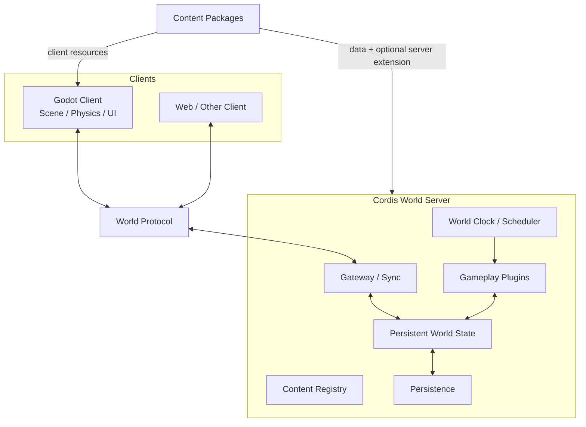

# Architecture

## Overview

游戏由 Godot Client 与 Cordis World Server 共同组成。

Godot 是实际的游戏运行时，负责场景、移动、碰撞、动画、输入、界面和即时交互。World Server 不重新实现 Godot，而是负责保存和同步需要跨客户端共享、需要持久化或需要脱离客户端继续存在的世界状态。

单机模式下，打开世界会同时启动本地 World Server；其他客户端也可以通过同一套 World Protocol 访问这个世界。

## Principles

- Godot 负责正常游戏运行，不把物理、动画和逐帧状态搬到 World Server。
- World Server 只对持久化和共享的世界状态负责，并作为同一世界多个客户端之间的存档与同步服务。
- Godot 的运行时状态与 World Server 的世界状态不是一一镜像关系。
- World Server 内部仍采用 Entity + Component 组织状态，并在需要聚合计算时由 System 处理一组 Component，而不是逐对象执行 `update()`。
- System 是服务器世界规则的实现方式之一，不要求所有普通交互都经过统一的全局调度管线。
- Cordis 负责 Plugin、Service、依赖和生命周期；游戏状态和计算规则建立在这些能力之上。
- 植物、角色和其他可扩展内容通过 Content Package 提供数据与客户端资源，并可以按需附带服务端 Cordis 扩展。
- 单机与远程世界使用相同的 World Server 模型，仅连接方式不同。
- 生长、加工和自动化等长期过程按世界时间和事件推进，不依赖整个世界的高频固定 tick。

## Architecture details

- [Client Runtime](./client-runtime.md)
- [World Runtime](./world-runtime.md)
- [World Protocol](./world-protocol.md)
- [World Model](./world-model.md)
- [World Simulation](./simulation-model.md)
- [Content System](./content-system.md)
