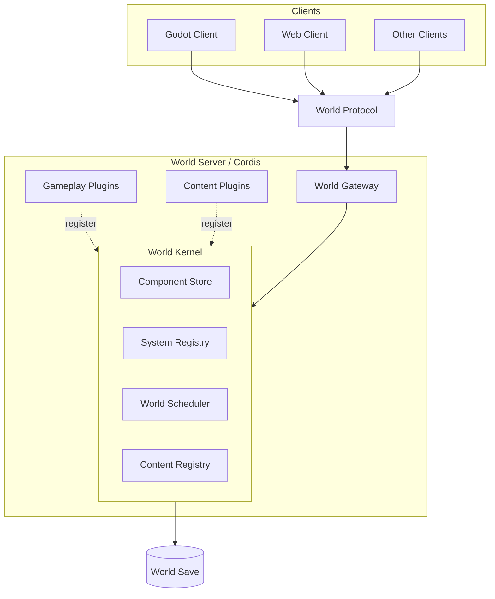

# Architecture

## Overview

游戏采用独立的世界服务架构。

一个世界对应一个由 Cordis 驱动的 World Server。Godot、Web 和其他客户端通过统一的 World Protocol 与世界交互。

Cordis 负责插件、Service、依赖和生命周期。世界状态采用 Entity + Component 组织，世界计算由 System 按 Schedule 聚合执行，而不是由各个对象自行更新。

## Principles

- 一个世界对应一个独立的 World Server。
- World Server 持有世界的权威状态。
- 客户端只通过 World Protocol 操作世界。
- Cordis 管理模块生命周期和模块依赖，不承担世界计算顺序。
- Entity 只是世界对象的标识，Component 保存状态，System 负责行为和计算。
- 世界计算按 System 聚合执行，不采用逐对象 `update()` 模型。
- System Schedule 与 Cordis dependency graph 相互独立。
- 时间推进以世界时间、事件和计划任务为基础，不依赖高频固定 tick。
- 单机与远程世界使用相同的服务端模型。

## Architecture details

- [World Runtime](./world-runtime.md)
- [World Protocol](./world-protocol.md)
- [World Model](./world-model.md)
- [Simulation Model](./simulation-model.md)
- [Content System](./content-system.md)
