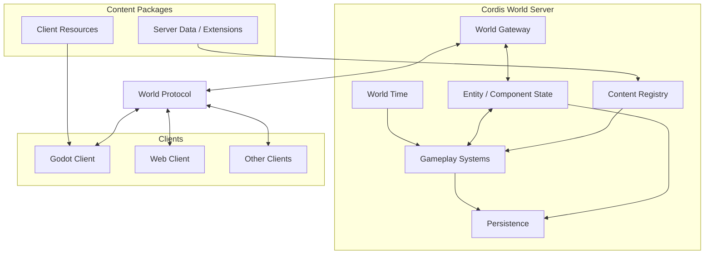

# Architecture

## Overview

游戏采用独立的世界服务架构。

一个世界对应一个由 Cordis 驱动的 World Server。World Server 运行并持久化权威游戏世界，负责世界时间、世界实体、游戏规则、长期状态和客户端同步。

Godot 是进入世界的游戏客户端，负责玩家输入、场景、渲染、动画、音频、界面以及客户端侧的物理与即时表现。Web 和其他客户端可以通过同一套 World Protocol 访问同一个世界。

单机模式与在线模式使用同一套架构。单机游戏只是先在本地启动一个 World Server，再由 Godot 连接 localhost。

## Responsibilities

### World Server

World Server 是世界的权威运行环境。

它负责：

- 推进世界时间
- 保存世界中的 Entity 与持久 Component
- 执行 Farming、Processing、Restaurant、Automation 等世界规则
- 调度持续、定时和事件驱动的世界计算
- 加载服务端内容定义与可选 Cordis 扩展
- 持久化世界存档
- 向客户端同步权威世界状态

World Server 不需要重新实现 Godot 的渲染、动画、Scene Tree 或完整客户端物理。

### Godot Client

Godot 是完整的游戏客户端运行时。

它负责：

- 输入
- 场景和节点
- 渲染与 texture
- 动画、音频、粒子与摄像机
- 碰撞和客户端侧物理表现
- UI 与即时交互反馈
- 加载 Content Package 提供的客户端资源
- 将玩家操作提交给 World Server，并表现服务端同步的世界状态

### Cordis

Cordis 负责 World Server 内部模块的加载、卸载、Service、依赖和生命周期。

Cordis 不替代世界状态模型，也不要求每个 Entity 成为插件。Gameplay Plugin 和 Content Package 可以通过 Cordis 扩展 World Server 的能力。

## Principles

- 一个世界对应一个独立的 World Server。
- World Server 运行并持久化权威游戏世界，而不是仅作为存档同步工具。
- Godot 是世界的客户端，而不是世界状态的唯一来源。
- 单机模式通过本地启动同一套 World Server 实现，不维护另一套单机逻辑。
- Godot Scene Tree 与服务端 Entity 不要求一一对应；只有具有世界语义的状态需要进入服务端模型。
- 服务端世界状态采用 Entity + Component 组织，跨对象计算优先由 System 聚合处理。
- 不要求所有 System 使用同一种更新频率；实时、定时和事件驱动计算可以并存。
- World Server 不为了权威性重新实现 Godot 的渲染和完整客户端物理。
- Content Package 同时可以向 Server 提供数据与可选逻辑，并向 Godot 提供表现资源。
- Web、Godot 和其他客户端通过同一 World Protocol 操作同一个世界。

## Architecture details

- [World Runtime](./world-runtime.md)
- [Client Runtime](./client-runtime.md)
- [World Protocol](./world-protocol.md)
- [World Model](./world-model.md)
- [Simulation Model](./simulation-model.md)
- [Content System](./content-system.md)
