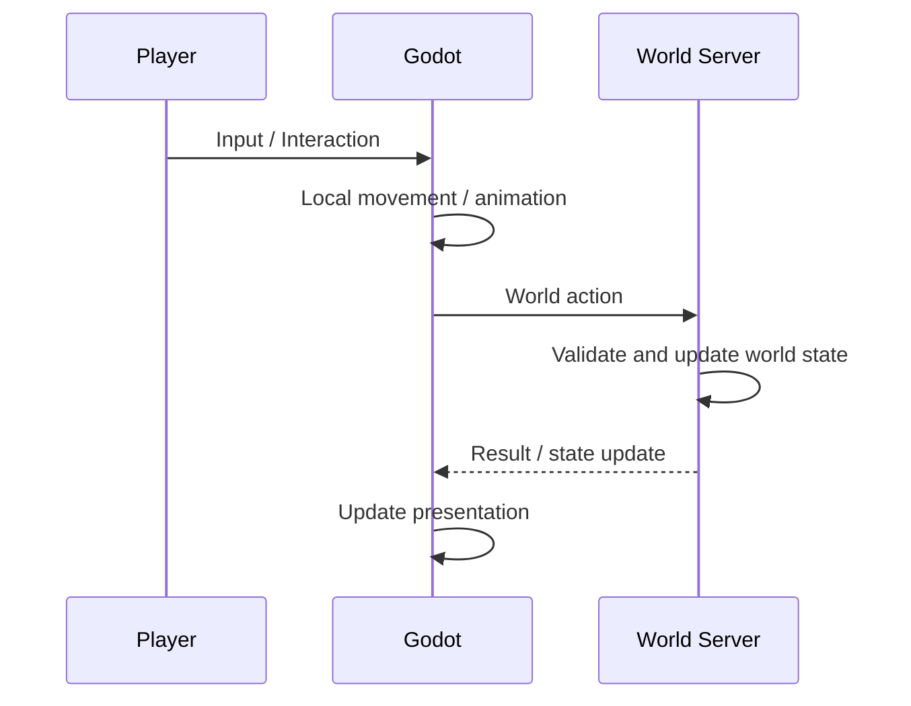

# Client Runtime

## Overview

Godot Client 是完整的游戏运行时。

玩家移动、碰撞、动画、场景节点、即时交互表现、界面和音效等都由 Godot 正常实现。World Server 不替代这些能力，只接收和返回具有世界语义的状态。

## Responsibilities

Godot 负责：

- Scene Tree 与场景加载
- Avatar 移动与碰撞
- 动画、粒子、音频与摄像机
- 输入和交互界面
- 本地导航和即时表现
- Client Content Registry 与资源加载
- 将需要保存或共享的操作提交给 World Server

这些状态不要求全部同步到 World Server。

## Runtime state and world state

客户端运行时状态与世界状态分离。

例如以下内容通常只存在于 Godot：

- velocity
- animation frame
- physics contact
- navigation path
- hover / selection
- camera state
- temporary UI state

以下内容在需要持久化或跨客户端共享时进入 World Server：

- Inventory
- 植物和加工状态
- Guest / Order 状态
- 货币、分数等世界数据
- 需要保存的场景与位置

Avatar 的逐帧 Transform 不需要通过服务器计算。MVP 中 Godot 可以自行处理移动，只在保存、切换场景、重要交互或其他必要时机同步持久位置。

## Interaction

普通即时交互先在 Godot 中完成输入与表现；当交互会改变世界状态时，再提交给 World Server。

例如移动本身不需要逐帧发送到服务器，但种植、收获、开始加工、服务客人、清理和拾取报酬都会修改世界状态，应通过 World Protocol 提交。

## Client content

Godot 根据当前世界的 Content Package 加载客户端资源，并通过稳定的 Content ID 将世界状态映射到 texture、animation、sound 或其他表现资源。

资源应在进入主场景前完成挂载。具体内容包结构见 [Content System](./content-system.md)。

## Other clients

Web 和其他轻量客户端不需要实现 Godot 的场景运行时。

它们可以直接通过 World Protocol 查看或操作同一份世界状态，例如检查植物、加工任务或库存。它们对世界的修改会在下一次 Godot 同步时反映到游戏中。

## MVP boundary

MVP 是单机优先，因此不要求服务器重新计算 Avatar 物理或进行反作弊式位置验证。

多人环境下是否将移动、碰撞或更多实时状态迁移到服务端，不属于当前架构范围。
