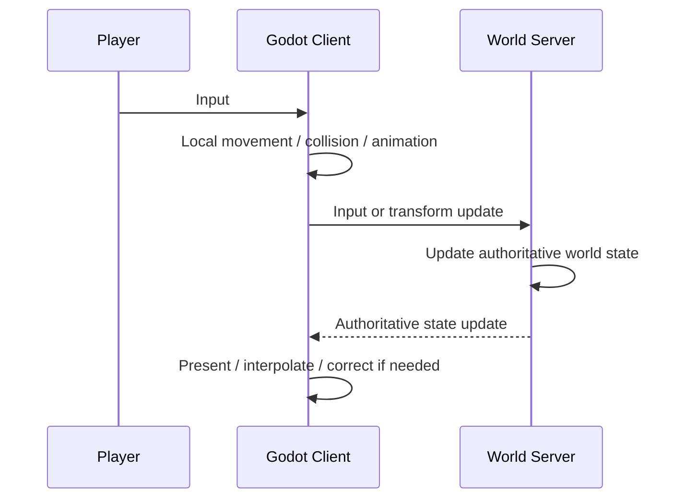

# Client Runtime

## Overview

Godot Client 是游戏世界的主要可视化客户端。

World Server 负责运行权威世界状态，Godot 负责让玩家进入这个世界：接收输入、运行场景、表现实体、执行客户端侧物理与动画，并把玩家操作提交给 Server。

Godot 可以连接远程 World Server，也可以在单机模式下连接本地启动的 World Server。两种模式使用相同的协议和世界模型。

## Responsibilities

Godot 负责：

- Scene Tree 与场景加载
- Avatar 输入和客户端侧移动表现
- 碰撞与客户端侧物理
- texture、动画、粒子、音频和摄像机
- UI 与即时交互反馈
- 将服务端 Entity / Component 状态映射为场景表现
- 加载当前世界 Content Package 提供的客户端资源
- 将玩家输入和 Gameplay Action 提交给 World Server
- 接收并应用服务端的权威世界状态更新

Godot 不负责独立维护另一份完整世界规则。

## Runtime state

客户端存在大量只用于表现和即时运行的状态。这些状态不需要同步到 World Server，例如：

- animation frame
- particle lifetime
- camera state
- hover / selection
- 临时 UI 状态
- 插值状态
- 客户端导航路径
- 仅用于表现的节点和辅助数据

这些状态可以完全由 Godot 管理。

## World state

具有世界语义、需要持久化或需要被其他客户端观察的状态由 World Server 维护，例如：

- Character 的身份和世界位置
- Inventory
- 植物及其生长状态
- 加工任务
- 物品和容器
- Guest / Order 状态
- 报酬、货币和其他世界数据
- 世界时间

Godot 根据服务端状态创建或更新对应的客户端表现，但 Godot Scene Tree 不要求和 Server Entity 一一对应。

## Movement

Avatar 移动仍由 Godot 使用正常的角色控制、碰撞和动画能力实现。

为了保持操作响应，客户端可以先进行本地移动表现，再把输入或位置变化同步给 World Server。World Server 保存并同步具有世界意义的 Transform 状态。

MVP 不要求在 Node.js 中重写 Godot 的完整物理引擎，也不要求立即实现复杂的预测、回滚或反作弊系统。多人同步精度和服务端位置验证可以在需要时继续加强。

## Gameplay interaction

种植、收获、加工、服务、清理、拾取物品等会修改世界状态的行为需要提交给 World Server。

Godot 可以立即播放交互动画和反馈，但最终结果由 World Server 的 Gameplay Plugin 根据当前世界状态执行并同步。

## Client content

Godot 自身提供基础客户端能力，例如通用 Character、Plant、Item 等表现逻辑。

Content Package 可以为新的植物、Character、物品和其他内容提供：

- texture
- animation
- sound
- scene fragment
- presentation metadata

Godot 通过稳定的 Content ID 将 Server Entity 映射到这些资源。

具体机制见 [Content System](./content-system.md)。

## Other clients

Web 和其他客户端不需要实现 Godot 的场景运行时。

它们通过同一 World Protocol 连接相同的 World Server，可以查看或执行其支持的世界操作。它们修改的是同一个权威世界，因此结果也会同步到 Godot Client。
