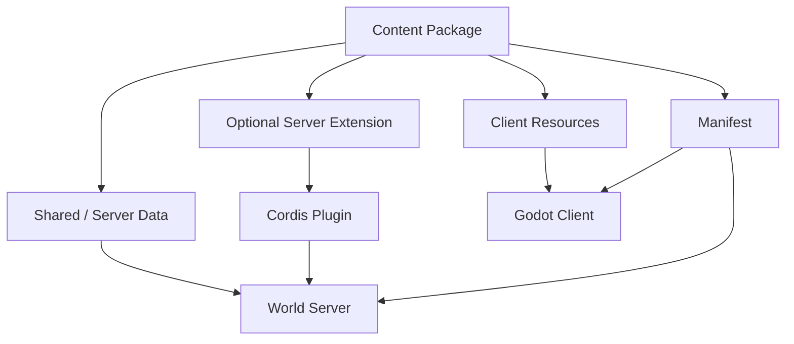
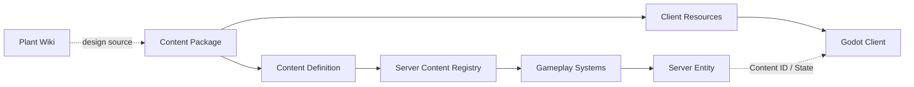

# Content System

## Overview

Content System 负责扩展一个世界能够理解和表现的游戏内容。

游戏内容以可挂载的 Content Package 组织。一个 Content Package 可以同时向 World Server 提供静态数据和可选 Cordis 扩展，并向 Godot Client 提供 texture、animation、sound 等表现资源。

这种结构类似于 Server Mod 与 Client Resource Pack 的组合，但普通内容优先使用数据定义和已有 Gameplay System，不要求每个植物、物品或 Character 都拥有独立代码插件。



## Content Package

Content Package 是内容的交付和挂载单位。

概念上一个 Package 可以包含：

```text
base.aquamelon/
├── manifest
├── data/
│   └── content definitions
├── server/
│   └── optional Cordis extension
└── client/
    └── textures / animations / sounds / other resources
```

具体文件格式和目录结构在实现 Spec 中确定，Architecture 只规定这些职责必须可以分离。

## Manifest

Manifest 描述 Package 的稳定身份和加载信息，例如：

- package id
- version
- 提供的 Content ID
- Server Extension 是否存在
- Client Resources 是否存在
- 必要依赖

MVP 不需要完整的通用 Mod dependency solver。世界可以先使用明确的 Package 版本集合。

## Content Definition

Content Definition 描述 World Server 运行该内容需要知道的静态信息。

例如水瓜可以声明：

- Content ID
- 类型为 plant
- 重量
- 生长时长
- 生长阶段
- 阶段产物
- 可交互能力
- 创建实例时需要的 Component 和默认值
- 所依赖的通用 Gameplay 能力

这些数据由 Content Registry 加载，并被 Farming、Processing、Inventory 等 Gameplay System 使用。

Content Definition 不保存某一株水瓜当前的生长状态。具体实例状态属于 Server Entity / Component。

## Gameplay Plugins

Gameplay Plugin 提供一类内容共享的世界规则。

例如 Farming Plugin 可以提供：

- Growth Component
- Hydration Component
- Planting / Watering / Harvest 规则
- Growth System
- 与植物相关的查询和 Service

新的植物通常只需要声明自己的 Content Definition，再复用 Farming 已有能力。

只有通用 Component + System 无法表达的特殊机制，才需要增加新的 Server System 或可选 Cordis Extension。

## Server Extension

Content Package 可以附带可选的 Server Extension。

Server Extension 是普通 Cordis Plugin，用于增加数据定义无法表达的服务端能力，例如：

- 新的 Component
- 新的 System
- 特殊 Gameplay Rule
- 新的 Service
- 对已有系统的扩展

World Server 加载 Package 时可以通过 Cordis 管理这些扩展的依赖和生命周期。

Server Extension 是可选能力，不应该成为普通内容包的默认成本。

## Client Resources

Content Package 可以向 Godot 提供该内容的表现资源，例如：

- texture
- animation
- sound
- model
- scene fragment
- presentation metadata

Godot 自身提供基础客户端运行能力和通用表现逻辑。客户端通过稳定 Content ID 找到当前 Entity 对应的资源。

例如 Server 只需要知道：

```text
ContentRef = plant.aquamelon
Growth.stage = mature
```

Godot 可以据此在当前 Package 中找到成熟水瓜对应的 texture 或 animation。

MVP 不要求 Content Package 可以注入任意客户端脚本。是否开放 Client Extension API 可以在后续有明确需求时再设计。

## Characters

Character 使用与植物和物品相同的内容机制。

例如 `character.slime` 可以由 Package 提供：

Server 侧：

- Character Content Definition
- 默认世界 Component
- 移动或交互参数
- 可选的特殊 Server Extension

Godot 侧：

- texture
- animation set
- sound
- presentation metadata

因此 Godot Client 不需要把“史莱姆”硬编码成唯一角色类型。新的 Character 可以通过新的 Content Package 挂载到游戏中。

## Adding a plant

新增一种普通植物的基本路径为：

1. 在 `docs/` 中维护该植物的设定 Wiki。
2. 在 Content Package 中提供对应 Content Definition。
3. World Server 将定义注册到 Content Registry。
4. Farming Plugin 根据该定义创建和处理植物 Entity / Component。
5. Godot 加载 Package 的客户端资源，并根据 Content ID 表现植物。
6. 如果植物存在通用 Farming 无法表达的特殊规则，再增加 Server Extension。



## World Content Lock

世界存档需要记录自己使用的 Content Package 集合。

Content Lock 至少需要保证 Server 和 Client 对世界中的 Content ID 使用兼容的内容版本。

进入世界时：

1. World Server 按 Content Lock 加载服务端内容和扩展。
2. Client 连接 Server 并取得 Content Lock。
3. Godot 确认并挂载对应客户端资源。
4. Client 完成内容准备后再加载 World Snapshot。

具体版本、hash、下载和缓存规则在实现 Spec 中定义。

## Separation

内容系统保持以下几类信息分离：

- `docs/`：面向人阅读的设定 Wiki
- Content Definition：Server 可读取的静态游戏数据
- Server Entity / Component：某个世界中的实例状态
- Gameplay System：对这些实例执行的通用世界规则
- Server Extension：Content Package 可选的 Cordis 代码扩展
- Client Resources：Godot 用于表现该内容的资源

这种分离允许游戏通过 Package 增加新的内容，同时保持 World Server、Godot Client 和普通 Gameplay Plugin 的核心结构稳定。
