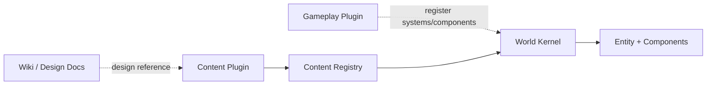
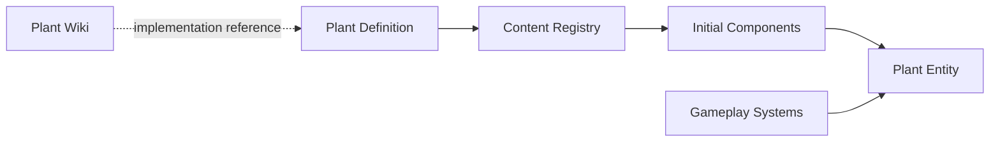

# Content System

## Overview

Content System 负责把植物、物品和其他游戏内容注册到世界中。

内容定义与具体世界实例分离。Wiki 文档描述内容是什么，Content Plugin 提供运行时定义，Content Registry 保存当前世界已经加载的内容，Gameplay Plugin 向 World Kernel 注册共享的 Component 和 System。

Wiki 文档不会被 World Server 直接加载，它是设计和实现的参考来源。

## Content Registry

Content Registry 保存当前世界可用的静态内容定义，例如：

- 植物
- 物品
- 可加工产物
- 其他可注册内容

世界 Entity 通过稳定的内容标识引用这些定义。

Content Registry 不保存某一株植物当前长到什么阶段。这类可变状态属于 Component Store。

## Gameplay Plugins

Gameplay Plugin 提供一类内容共享的状态与计算能力。

一个 Gameplay Plugin 可以向 World Kernel 注册：

- Component 类型
- System
- System 的调度关系
- 该系统需要的其他世界能力

例如 Farming 可以提供 Growth、Hydration 等 Component，以及对应的 Growth System、Hydration System 和 Harvest System。

Gameplay Plugin 通过 Cordis 管理加载、依赖和卸载。System 的实际执行顺序由 World Scheduler 管理，而不是由 Cordis 插件依赖决定。

## Content Plugins

Content Plugin 用于向 Content Registry 注册具体内容。

一个插件可以注册一个或多个植物、物品或其他内容，不要求每个内容对象都拥有独立插件。

内容定义声明实例需要的静态配置和 Component 初始结构，并复用已经存在的 Gameplay System。只有无法由通用 Component + System 表达的规则，才需要额外注册内容特有的 System。

## Adding a plant

新增植物的基本流程是：

1. 在 `docs/` 中记录植物的设定、形态、生长和用途。
2. 在 Content Plugin 中实现对应的运行时内容定义。
3. 将植物注册到 Content Registry。
4. 组合 Farming 等 Gameplay Plugin 已提供的 Component。
5. 复用通用 System，只为确实特殊的机制增加新的 Component 或 System。
6. 世界创建植物 Entity 时引用该内容标识，并在 Component Store 中保存实例状态。

## Separation

四类信息保持分离：

- `docs/`：面向人阅读的世界和内容设定
- Content Definition：World Server 可加载的静态内容定义
- Component State：具体世界实例的可变状态
- System：对一组 Component 进行聚合计算的行为

具体注册 API、Schema 和调度声明在进入实现阶段后继续细化。
