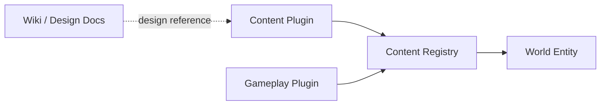
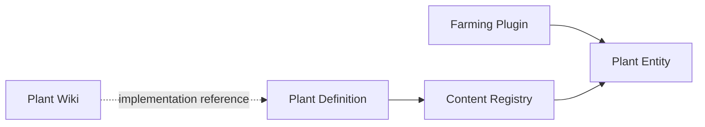

# Content System

## Overview

Content System 负责把植物、物品和其他游戏内容注册到世界中。

内容定义与具体世界实例分离。Wiki 文档描述内容是什么，Content Plugin 提供运行时定义，Content Registry 保存当前世界已经加载的内容，Gameplay Plugin 提供共享的游戏规则。

Wiki 文档不会被 World Server 直接加载，它是设计和实现的参考来源。

## Content Registry

Content Registry 保存当前世界可用的内容定义，例如：

- 植物
- 物品
- 可加工产物
- 其他可注册内容

世界实体通过稳定的内容标识引用这些定义。

Content Registry 保存的是定义，不保存某一株植物当前长到什么阶段。这类可变状态属于 World Model。

## Gameplay Plugins

Gameplay Plugin 提供一类内容共享的规则。

例如 Farming 负责植物通用的种植、生长和收获机制。具体植物只需要声明自己的内容定义，以及必要的特殊行为，不需要重复实现整套 Farming 系统。

Gameplay Plugin 可以依赖 World Services，也可以向 Content Registry 提供内容所需的能力。

## Content Plugins

Content Plugin 用于向 Content Registry 注册具体内容。

一个插件可以注册一个或多个植物、物品或其他内容，不要求每个内容对象都拥有独立插件。

例如水瓜和核果可以分别注册自己的内容定义，并依赖 Farming 提供的通用植物机制。它们特有的生长或处理规则由对应内容实现补充。

## Adding a plant

新增植物的基本流程是：

1. 在 `docs/` 中记录植物的设定、形态、生长和用途。
2. 在 Content Plugin 中实现对应的运行时内容定义。
3. 将植物注册到 Content Registry。
4. 复用 Farming 提供的通用机制，并只实现该植物需要的特殊行为。
5. 世界创建植物 Entity 时引用该内容标识，并把实际生长状态保存在 Entity Store 中。

## Separation

三类信息保持分离：

- `docs/`：面向人阅读的世界和内容设定
- Content Definition：World Server 可加载的静态内容定义
- Entity State：具体世界中某个内容实例的可变状态

这使 Wiki 可以继续作为内容设计文档，而客户端和 World Server 只依赖明确的运行时定义与协议。

具体插件 API、注册接口和内容 Schema 在开始实现时继续细化。
