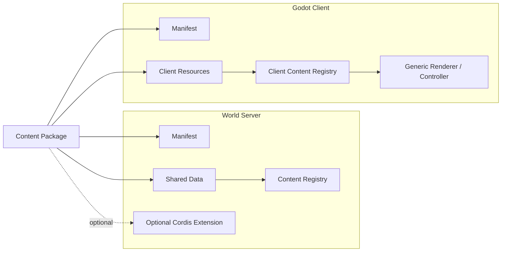
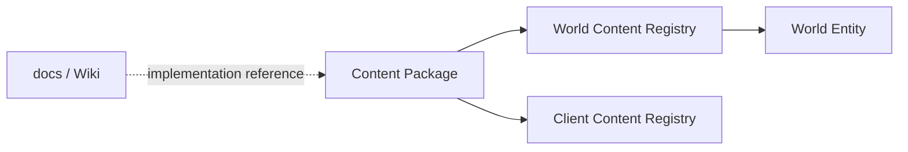

# Content System

## Overview

植物、角色、物品和其他可扩展内容通过 Content Package 挂载到游戏中。

Content Package 是内容的交付单元，不等同于 Cordis Plugin。普通内容优先由数据定义和客户端资源组成；只有数据与现有 Gameplay System 无法表达的特殊规则，才附带服务端 Cordis 扩展。

同一个 Package 同时为 World Server 和 Godot Client 提供各自需要的信息。



## Package structure

概念上的 Package 可以包含：

```text
content-package/
├── manifest.json
├── data/
├── server/        # optional Cordis extension
└── client/        # Godot resources
```

`manifest.json` 至少标识稳定的 Package ID、版本和包含的内容。

具体目录格式和 Schema 在进入实现阶段后定义。

## Content Definition

Content Definition 保存静态游戏数据。

以植物为例，可以包含：

- Content ID
- 重量
- 生长时长
- 生长阶段
- 阶段产物
- 初始 Component 配置
- 可使用的交互能力
- 客户端表现资源标识

这些数据由 World Server 注册到 Content Registry。世界中的具体植物 Entity 只保存自身可变状态，并通过 Content ID 引用定义。

交互定义优先声明已有能力，例如 `water`、`harvest` 或 `process`，由对应 Gameplay Plugin 处理，而不是让每个 Content Definition 自带任意对象回调。

## Server extension

普通内容不要求拥有自己的 Cordis Plugin。

如果某种内容具有通用数据和已有 Gameplay System 无法表达的规则，可以在 Package 中附带服务端扩展。该扩展可以通过 Cordis 注册额外 Service、System、事件处理或其他世界能力。

因此：

- 数据差异使用 Content Definition 表达
- 通用玩法使用 Gameplay Plugin 表达
- 真正特殊的服务器规则才使用 Package Server Extension

## Client resources

Godot Client 从 Package 的客户端部分加载 texture、animation、sound 或其他表现资源，并通过 Client Content Registry 将稳定的 Content ID 映射为表现资源。

World Server 不需要理解 texture 或动画；Godot 也不根据贴图决定游戏规则。

MVP 中客户端资源包只提供数据和资源，不开放任意客户端脚本插件。植物、角色、物品和客人由游戏内置的通用 Renderer / Controller 根据 Content ID 和资源描述进行表现。

## Plant example

水瓜可以作为一个独立 Content Package 挂载：

```text
base.aquamelon
├── manifest
├── plant definition
└── client resources
```

World Server 从定义中得到水瓜的重量、生长参数、阶段产物和交互能力；Godot 从同一个 Package 的客户端资源中得到各阶段 texture 等表现内容。

创建一株水瓜时，World Server 创建引用 `plant.aquamelon` 的 Entity，并保存该实例的 Growth 等 Component。Godot 收到 Content ID 与持久状态后，从 Client Content Registry 选择对应资源进行渲染。

如果水瓜全部规则都能由 Farming Plugin 表达，它不需要服务端扩展。

## Character example

Character 也使用同一机制。

例如 `character.slime` 可以定义服务器需要保存的角色内容信息和初始世界 Component，同时提供 Godot 需要的角色 texture、animation set 和其他表现资源。

Avatar 的移动、碰撞和动画仍由 Godot 实现；World Server 只保存需要持久化或共享的角色状态。

## World content lock

世界存档必须记录自己依赖的 Content Package。

MVP 中使用精确版本或内容 hash 即可，不需要实现复杂依赖解析器。

```text
World Save
└── Content Lock
    ├── base.core
    ├── base.slime
    └── base.aquamelon
```

World Server 在读取存档前加载并校验这些 Package；Godot 在进入主场景前加载对应客户端资源。这样服务端和客户端可以围绕同一个 Content ID 与版本解释世界。

## Wiki and runtime content

`docs/` 中的 Wiki 描述游戏设定和设计事实，不由运行时直接加载。

从设定进入游戏实现时：



## MVP scope

MVP 需要验证：

- Content Package 可以在不修改 World Server 核心代码的情况下注册新植物或角色
- World Server 可以读取 Package 数据并创建对应世界状态
- Godot 可以读取对应客户端资源并渲染相同 Content ID
- Package 可以选择性附带 Cordis Server Extension
- 世界存档可以记录并重新加载自己依赖的内容包

MVP 不包含运行中热装卸、在线 Mod 下载、复杂依赖求解、资源覆盖优先级或任意客户端脚本扩展。
