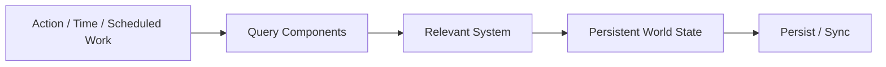

# World Simulation

## Overview

World Server 只计算属于持久世界状态的规则。

Component + System 仍然是服务器内部组织计算的主要思想：当一类世界状态需要统一计算时，由 System 查询相关 Component 并聚合处理，而不是让每个 Entity 自己运行 `update()`。

这套模型不替代 Godot 的逐帧游戏循环，也不要求所有普通交互都转换成 System。

## Direct actions and systems

服务器世界逻辑分为两类。

### Direct actions

一次明确的玩家操作可以由对应 Gameplay Plugin 直接验证并修改世界状态，例如：

- 种植
- 收获
- 开始加工
- 服务客人
- 清理餐具
- 拾取报酬

这类操作不需要为了形式统一而进入全局 System Schedule。

### Systems

当规则天然需要对一组状态进行聚合、按时间推进或由多个来源共同触发时，使用 System。

例如：

- Growth System：根据世界时间更新需要生长的植物
- Processing System：推进或完成加工任务
- Automation System：批量处理自动化生产
- 其他需要统一查询一组 Component 的长期世界规则

## Scheduling

World Server 不需要一个模拟整个游戏的固定高频 tick。

System 可以由以下条件触发：

- 世界时间推进
- Scheduler 中的任务到期
- 某个世界操作使相关状态需要重新计算
- 明确的周期性世界任务

一次服务器计算只运行相关 System，不要求扫描或推进所有 Entity。

System 之间如果存在真实的计算先后关系，可以声明顺序；不需要预先建立覆盖所有 Gameplay 的大型固定 Phase 图。

## State changes

服务器中的世界修改通过统一的状态存储接口完成，以便持久化和客户端同步。

实现内部可以使用 transaction、change record 或 Change Set 聚合变化，但这些只是实现手段，不是所有 Gameplay Plugin 必须遵循的额外领域抽象。

System 不直接管理数据库，也不直接向某个具体客户端发送消息。

## Events

Gameplay Plugin 可以通过普通事件表达已经发生的世界事实，例如收获完成、加工完成或服务完成。

事件主要用于解耦其他插件的附加反应，不是世界状态的替代品。

MVP 的 Score 功能可以监听这些事件并加分；以后任务、教程或其他触发器也可以监听同类事件。它本质上仍然只是事件机制，不构成独立的核心架构层。

## Cordis boundary

Cordis 负责 Plugin、Service、依赖和生命周期。

Gameplay Plugin 可以通过 Cordis：

- 提供世界操作
- 注册 Component 类型
- 注册 System
- 监听或发出事件
- 使用其他世界 Service

System 的计算顺序只表达游戏规则本身，不应为了排序而滥用 Cordis 插件依赖。
