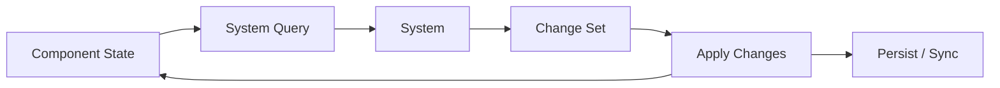
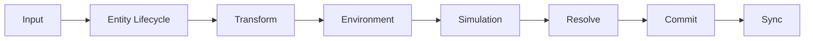

# Simulation Model

## Overview

世界计算采用 Component + System + Schedule 模型。

Entity 和 Component 只描述世界当前状态。System 负责读取一组 Component、执行计算并产生状态变化。World Scheduler 按阶段和依赖顺序执行 System。

世界不会让每个对象独立运行 `update()`。一次世界计算以 System 为单位聚合处理满足条件的 Entity。

## System

System 是世界计算的基本单位。

一个 System 声明自己需要读取或修改的 Component，并查询满足条件的 Entity。System 对这批数据统一计算，而不是调用每个对象自己的行为方法。

例如：

- Entity Lifecycle System 处理 Entity 创建、销毁和 Component 增减
- Transform System 处理位置变化
- Environment System 计算环境状态
- Growth System 处理植物生长
- Hydration System 处理水分变化
- Processing System 处理加工进度

具体 Gameplay Plugin 可以注册一个或多个 System。

## Schedule

System 的执行顺序由 World Scheduler 管理，与 Cordis 插件依赖分离。

Cordis dependency graph 描述一个模块需要哪些 Service 才能存在。System Schedule 描述一次世界计算中哪些 System 先执行、哪些后执行。

初始阶段划分为：

阶段保持少量和稳定。Farming、Processing、Restaurant、Automation 等具体游戏逻辑作为 System 挂载到相应阶段，而不是各自成为顶级阶段。

同一阶段内的 System 可以声明必要的先后关系。具体调度 API 在实现时定义。

## World Step

World Step 是一次完整的世界计算。

World Step 可以由玩家 Command、计划任务到期、世界时间推进或其他需要重新计算世界状态的事件触发。

System-based 不意味着世界需要持续高频 tick。对生长和加工等慢速过程，System 可以直接根据经过的世界时间计算变化。

例如世界时间从 10:00 推进到 14:00 时，Growth System 可以直接使用这段时间差计算植物状态，而不需要执行大量固定间隔 tick。

## Change Set

System 的计算结果先表示为状态变化，再由 World Kernel 统一应用。

Change Set 可以包含：

- Component 创建、修改或删除
- Entity 创建或删除
- Gameplay Event

统一提交变化可以让持久化、客户端同步和后续调试使用同一份世界变化结果。

System 不直接向客户端发送状态，也不各自负责持久化。

## Query and aggregation

System 根据 Component 组合查询需要处理的 Entity。

世界计算以 System 聚合为主，但不要求每次扫描全部 Entity。Component Store 可以根据需要维护查询索引、变更集合或计划时间索引，只让相关 System 处理需要重新计算的数据。

具体优化策略不属于当前架构约束。

## Cordis boundary

Cordis 负责：

- Plugin 的加载与卸载
- Service 的提供与依赖
- System、Component 和 Content 注册的生命周期

World Kernel 负责：

- Component 状态
- System Registry
- Schedule
- World Step
- Change Set 的应用

Gameplay Plugin 通过 Cordis 加载，再向 World Kernel 注册自己的 Component、System 和内容能力。Cordis 的模块生命周期不会替代 World Scheduler 的计算顺序。
