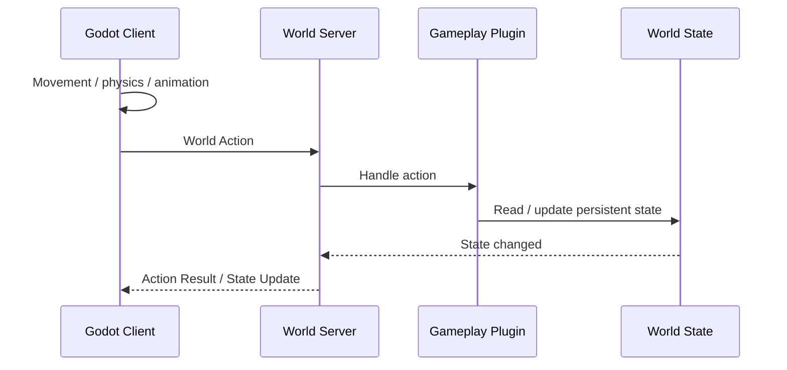

# World Protocol

## Overview

World Protocol 是客户端与 World Server 之间的共享世界边界。

协议不承载 Godot 的逐帧输入、物理和动画。它只用于读取世界状态、提交会修改持久或共享状态的操作，以及接收其他客户端或服务器长期计算产生的变化。

## Data types

协议主要处理：

- World Snapshot：客户端进入世界时需要的当前状态
- World Action：客户端请求执行的世界操作
- Action Result：操作是否成功及必要返回值
- State Update：持久世界状态的变化
- World Event：需要通知客户端的世界事件
- Content Information：当前世界使用的 Content Package 信息

具体消息 Schema 在进入实现阶段后定义。

## Gameplay flow

Godot 的普通游戏循环不经过 World Server。只有当行为跨越世界边界时才发起 World Action。

例如玩家在 Godot 中走到农田不需要通知服务器；真正执行种植时才提交 `plant` 操作。之后植物的持久状态由 World Server 保存。

## Server-driven changes

植物生长、加工完成或其他长期世界规则可以在没有 Godot 输入的情况下改变世界状态。

World Server 保存这些变化，并在客户端连接时通过 Snapshot 或 State Update 同步。

## Transform sync

MVP 不同步 Avatar 的逐帧移动。

Godot 可以在保存、切换场景、重要交互或其他必要时机提交需要持久化的位置。World Server 保存的是可恢复的 Persistent Transform，而不是每一帧物理结果。

## Transport

MVP 可以使用：

- HTTP：世界连接、Snapshot、普通查询和资源信息
- WebSocket：持续的 State Update、World Event 和需要低延迟返回的操作

具体 Transport 可以在不改变世界语义的情况下替换。

## Multiple clients

Godot、Web 和其他客户端共享同一个 World Server，因此看到的是同一份持久世界状态。

轻量客户端可以执行其支持的 World Action。由这些操作造成的变化会被 World Server 保存，并在 Godot 下次同步时反映到游戏中。

多人实时移动、预测和反作弊同步不属于当前 MVP 协议范围。
