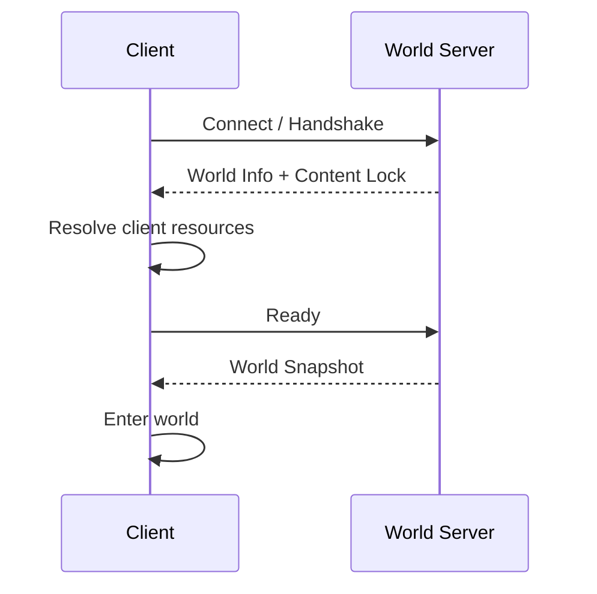

# World Protocol

## Overview

World Protocol 是 Client 与 World Server 之间的边界。

Godot、Web 和其他客户端通过同一套协议连接世界、获取内容信息、读取权威状态并提交操作。单机和在线模式使用相同协议，只改变 Server 地址。

协议不要求复制 Godot 的全部内部状态，只传递 Server World Model 和客户端操作所需要的信息。

## Connection

客户端进入世界时需要先建立连接并确认当前世界使用的内容。

基本流程为：



如果客户端缺少当前世界需要的 Content Package，具体下载、安装或报错策略在后续实现规格中定义。

## Message categories

协议至少需要覆盖以下几类信息。

### Connection and content

用于建立世界连接和确认内容环境，例如：

- handshake
- world metadata
- Content Lock
- client readiness
- initial Snapshot

### Realtime state

用于需要较及时同步的世界状态，例如：

- Character input 或 movement information
- Transform update
- nearby Entity state

具体同步频率、插值和预测策略由实现阶段确定，不要求复制 Godot 的逐帧内部物理状态。

### Gameplay actions

用于客户端请求修改世界，例如：

- interact
- plant
- water
- harvest
- start processing
- serve
- clean
- pickup

World Server 根据当前权威状态验证并执行这些操作。

### World updates

用于 Server 向客户端同步已经确认的世界变化，例如：

- Entity spawn / remove
- Component state update
- Inventory update
- world time
- processing / growth state
- Guest state
- Gameplay Event

## Authority

Client 可以立即进行本地表现，但不能通过本地状态直接覆盖 Server World Model。

例如 Godot 可以先表现 Character 移动，再将输入或位置变化同步给 Server；Server 返回的世界状态仍然是其他客户端和持久化使用的权威状态。

对于种植、收获、加工、服务等离散操作，Server 可以接受或拒绝客户端请求，并返回最终结果。

## State synchronization

客户端首次进入世界时获取 Snapshot，之后接收增量状态更新。

不同 Component 可以使用不同同步策略：

- 高频状态按较短间隔同步
- 普通状态仅在变化时同步
- Server 内部状态可以只同步客户端真正需要的投影结果

具体 revision、ack、delta 格式和断线恢复策略在协议 Spec 中定义。

## Events

World Protocol 可以传递 Gameplay Event，用于表现或通知，例如加工完成、Guest 完成消费或新的世界提示。

Event 是辅助同步机制，不代替持久 Component 状态。客户端不能只依赖事件流重建所有权威世界状态。

## Local and remote worlds

本地 World Server 和远程 World Server 对 Client 暴露相同的 World Protocol。

因此 Godot Client 不需要维护两套 Gameplay 接口：

```text
Single-player: Godot -> localhost World Server
Online:        Godot -> remote World Server
```

Web 和其他客户端也可以连接同一 Server，只实现各自需要的协议能力。
