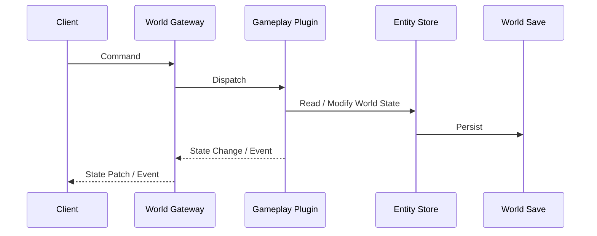

# World Protocol

## Overview

World Protocol 是客户端与 World Server 之间的边界。

客户端不直接访问 Gameplay Plugin、Cordis Service 或世界存储，只通过协议读取世界状态并提交操作请求。

协议主要包含两类数据：

- Command：客户端请求世界执行操作
- State / Event：服务端返回状态变化和世界事件

## Data flow

一次操作的基本过程是：

1. 客户端发送 Command。
2. World Gateway 将 Command 分发给对应的 Gameplay Plugin。
3. Gameplay Plugin 读取并修改世界状态。
4. 状态由 World Server 持久化。
5. World Server 将状态变化或事件发送给客户端。

客户端不需要知道具体游戏规则如何计算结果。

## Transport

MVP 可以使用：

- HTTP：连接、初始数据和普通查询
- WebSocket：持续的 Command、Event 和状态更新

具体消息格式和版本策略后续单独定义。

## Client boundary

Godot、Web 和其他客户端共享同一套 World Protocol。

客户端可以有不同的交互方式和表现形式，但不能各自实现独立的世界规则。任何会改变权威世界状态的行为都必须经过 World Server。
