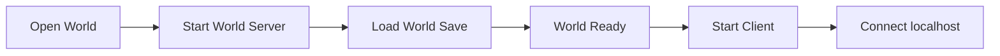

# World Runtime

## Overview

World Runtime 定义一个世界如何启动、运行、推进时间和持久化。

一个世界对应一个独立的 World Server。MVP 中可以理解为：

- 一个 World Server 进程
- 一个 Cordis Context
- 一份独立的世界存档

World Server 内部由 World Kernel 持有 Component 状态、System Registry、World Scheduler 和 Content Registry。

## Single-player

单机模式下，打开世界等同于启动一个本地 World Server，再由客户端连接该服务。

Godot 或桌面启动器可以负责拉起本地服务进程。Web 客户端本身只连接已经运行的 World Server。

远程服务器使用相同的运行模型，只改变连接地址。

## Time

World Clock 维护世界时间，Scheduler 管理未来需要发生的任务和事件。

玩家操作、计划任务到期和世界时间推进都可以触发 World Step。World Scheduler 在一次 World Step 中按既定阶段执行相关 System。

生长、加工、富集和自动化等慢速过程可以根据经过的世界时间直接计算变化，不要求使用高频固定 tick 驱动所有状态。

世界重新加载时，各系统根据存档中的世界时间和任务状态恢复运行。

具体计算模型见 [Simulation Model](./simulation-model.md)。

## Persistence

World Server 负责持久化世界状态，客户端不持有权威存档。

System 产生的状态变化由 World Kernel 统一应用，再进入持久化和客户端同步流程。Gameplay Plugin 不直接依赖具体存储实现。

MVP 可以使用本地 SQLite 和资源目录保存世界数据。具体存档结构后续单独定义。
