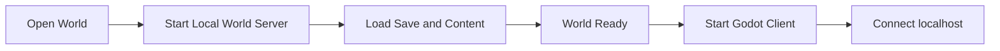

# World Runtime

## Overview

World Runtime 定义一个世界如何启动、运行、推进时间、执行游戏规则和持久化。

一个世界对应一个独立的 World Server。MVP 中可以理解为：

- 一个 World Server 进程
- 一个 Cordis Context
- 一份独立的世界存档
- 一份该世界使用的 Content Lock

World Server 是世界本身的运行环境，而不是单纯的存档代理。客户端可以离开或重新连接，世界状态仍由 Server 和存档持续定义。

## Single-player

单机模式下，打开世界等同于启动一个本地 World Server，再由 Godot Client 连接该服务。

在线模式不改变 World Server 的运行模型，只是 Godot 连接远程地址。

## World authority

World Server 维护具有世界语义的权威状态，包括：

- World Time
- Entity 与持久 Component
- Character 的世界身份和位置
- Inventory、Item 和 Container
- 植物、生长和收获状态
- 加工任务
- Guest / Order 等经营状态
- 自动化和其他长期世界过程

Godot 可以进行本地预测和表现，但这些世界状态最终由 Server 同步和持久化。

## World update

World Server 持续执行和更新游戏世界，但不同规则不要求使用相同的更新节奏。

### Frequent updates

需要较高频率同步的世界状态可以更频繁地处理，例如：

- Character Transform
- 与实时交互有关的位置或状态
- 其他需要及时同步给多个客户端的状态

这不意味着 Server 必须以 Godot 的渲染帧率运行全部 Gameplay System。

### Time-driven updates

与世界时间有关的逻辑可以根据时间差或计划任务推进，例如：

- 植物生长
- 加工和发酵
- Guest 等待
- 自动化生产

这些系统可以直接根据经过的世界时间计算结果，不需要高频空转。

### Event-driven updates

由玩家操作或其他世界事件触发的逻辑可以即时执行，例如：

- 种植
- 浇水
- 收获
- 开始加工
- 服务客人
- 清理
- 拾取物品

具体计算组织见 [Simulation Model](./simulation-model.md)。

## World time

World Clock 维护权威世界时间。

世界时间用于生长、加工、客人行为、自动化以及其他长期过程。Server 根据具体系统需求推进或结算这些状态。

客户端显示时间，但不独立决定世界时间。

## Cordis lifecycle

Cordis 管理 World Server 内部插件和 Service 的生命周期。

Gameplay Plugin、Content Package 的 Server Extension 以及基础世界能力都可以通过 Cordis 加载和卸载。Cordis 的插件依赖用于表达模块依赖，不替代游戏世界自己的更新顺序。

## Persistence

World Server 负责持久化权威世界状态。

MVP 可以使用本地 SQLite 和资源目录保存世界数据。具体存储方式不应该泄漏到普通 Gameplay Plugin 中；Gameplay Plugin 面向世界状态和服务接口工作。

世界加载时，Server 先恢复 Content Lock 和必要内容，再恢复对应的世界状态。

## Client lifecycle

客户端连接不是世界生命周期本身。

Godot 或 Web Client 可以断开后重新连接。重新连接时，客户端通过 World Protocol 获取当前世界内容信息和必要的 Snapshot，再继续操作同一个世界。
