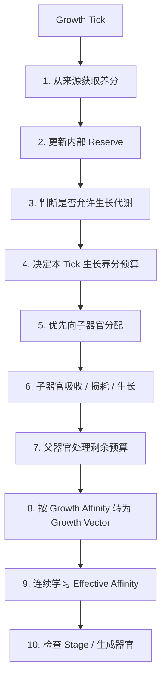

# Growth Tick

Growth Tick 是植物养分—生长系统的统一离散结算周期。

它用于把“吸收养分、内部储备、向子器官输送、环境损耗、Growth Vector 累积和 Stage 变化”放进一个可重复、可离线补算的过程。

本文件只定义 Tick 内发生什么；具体植物的 Tick 间隔、Stage 阈值、吸收量和器官参数由对应植物设计决定。

## 总览



## 1. 从来源获取养分

器官先读取其来源。

来源可以是：

- 土壤；
- 植株内部储备；
- 茎；
- 叶；
- 其他上级器官。

根据当前 Stage 获取：

```text
MaxAbsorbPerTick(stage)
```

对每种养分，提取亲和限制为：

```text
ExtractionAffinity[i] = min(Affinity[i], 1)
```

因此高于 1 的 Affinity 不会让器官从来源中提取超过实际供给的养分。

总吸收量还必须受当前 Stage 的 `MaxAbsorbPerTick` 限制。

## 2. 更新内部 Reserve

如果器官拥有内部储备：

```text
Reserve[i] += Absorbed[i]
Source[i]  -= Absorbed[i]
```

如果器官没有内部储备，则本 Tick 吸收到的养分直接成为本 Tick 可用养分，不跨 Tick 保存。

例如：

- 植株通常拥有内部 Reserve；
- 叶片可以采用无 Reserve 模式，从茎 / 树体吸多少就处理多少；
- 花也可以采用无 Reserve 模式；
- 果实可以拥有独立的汁液 / 内容物累积状态。

## 3. 判断是否允许生长代谢

某些器官可能因为内部储备过低、休眠、未激活或其他状态而暂停把养分转换成 Growth。

暂停生长不必等同于暂停吸收。

因此可以存在：

```text
仍在吸收
但不进行 Growth Conversion
```

的恢复阶段。

## 4. 决定本 Tick 生长养分预算

拥有 Reserve 的器官，从 Reserve 中决定本 Tick 用于生长的养分。

基线可以使用：

```text
GrowthConsumeRatePerTick
```

例如：

```text
Consume[i] = Reserve[i] × 1%
```

具体植物可以根据 Stage、状态或其他机制覆盖这一比例。

无 Reserve 器官则直接把本 Tick 获得的可用养分作为其生长预算。

## 5. 优先向子器官分配

父器官先把生长预算的一部分分配给当前正在生长的子器官。

例如：

```text
ParentBudget
├── Child A Allocation
├── Child B Allocation
└── Parent Remainder
```

分配比例可以由：

- 子器官数量；
- 子器官 Stage；
- 固定权重；
- 亲和；
- 其他具体作物规则

决定。

## 6. 子器官处理自己的份额

子器官依次处理：

1. 按 Extraction Affinity 接受自己真正能吸收的部分；
2. 不能吸收的部分按照具体规则退回父器官预算；
3. 对实际吸收的养分应用该 Stage 的环境损耗；
4. 剩余养分按照完整 Growth Affinity 转换成自身 Growth Vector；
5. 更新自己的连续学习状态；
6. 检查自己的 Stage。

### 示例：成叶 + 花

父级本 Tick 向一片成叶提供 10 单位养分。

如果花先获得 50%：

```text
花预算 = 5
叶自身预算 = 5
```

叶片 Stage 的保留率为 0.6：

```text
叶片用于 Growth = 3
叶片向环境逸散 = 2
```

之后这 3 单位再按叶片的 Growth Affinity 转换为 Growth Vector。

## 7. 父器官处理剩余预算

子器官处理后：

```text
ParentRemaining
=
原始生长预算
- 子器官实际拿走并使用的养分
- 明确进入环境的损耗
```

没有被子器官吸收的部分，如果规则没有指定损耗，则继续回到父器官本 Tick 的生长预算。

系统不设置统一的隐藏“转换损耗”。

## 8. 转换为 Growth Vector

父器官对每种剩余养分进行：

```text
GrowthGain[i]
=
GrowthNutrient[i] × FullAffinity[i]
```

这里使用完整 Affinity，不限制为 1。

因此：

```text
1 nutrient × 1.3 affinity
→ 1.3 growth
```

Growth Vector 累积：

```text
Growth[i] += GrowthGain[i]
```

## 9. 连续学习

未定型 Stage 根据当前内部养分组成 / Growth 组成持续更新 Effective Affinity。

本系统只规定：

- 学习是连续的；
- 高占比养分会提高对应 Effective Affinity；
- 不产生离散阶段奖励；
- 具体函数由植物 Spec 决定。

## 10. Stage 与器官生成

Tick 末检查当前 Stage 的成长条件。

若满足：

```text
Stage -> NextStage
Growth = zero vector
BaseAffinity = current EffectiveAffinity
```

如果当前已经是不会继续升级的成熟植物 Stage，则可以改为检查器官生成条件：

```text
GrowthTotal >= OrganSpawnCost
→ Spawn Organ
→ 扣除对应 Growth
```

植物 Stage 本身不会因为扣除 Growth 而回退。

## Tick 与离线结算

Growth Tick 是离散逻辑，但不要求玩家在线时逐 Tick 永久运行。

如果系统记录：

```text
LastGrowthTickAt
```

则重新进入世界时可以根据 UTC 时间计算错过了多少 Tick，并进行批量补算或等价近似。

具体离线补算策略由各玩法版本的 Spec 决定。

## 与气候的接口

任何明确标记为：

```text
EnvironmentLoss
```

的养分，未来都可以被气候系统消费，例如影响局部湿度、元素环境或其他生态状态。

在气候系统未实现前：

```text
EnvironmentLoss
→ 直接丢弃
```

接口说明见 [气候系统占位](climate-system.md)。
