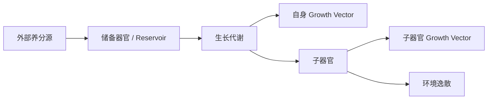

# 植物养分—生长系统

本文件定义项目中植物生长的通用模型。它不依赖某一种具体作物，也不依赖“七元素”这一表现层概念。

在不同世界或玩法中，本系统中的 `Nutrient` 可以被映射为矿物质、水分、魔力、元素力或其他可被植物吸收和转化的资源。千星奇域版本的水瓜树将 `Nutrient` 映射为七元素力。

## 核心思想

植物不是把“浇灌”直接换算成生长进度，而是通过一条连续的养分流完成生长：



每个器官都可以同时扮演两种角色：

- 从上游来源吸收养分的**消费者**；
- 向下游子器官提供养分的**来源**。

从这个角度看，植物本身也可以被视为土壤的一个“器官”：土壤是植物的养料接口，植物从土壤吸取养分；叶、花、果又继续从植物或上级器官获取养分。

## 两类向量

### Nutrient Reserve

拥有内部储备的器官保存一组养分向量：

```text
Reserve[N]
```

它描述当前实际储存在器官内部、仍可继续被代谢和输送的养分。

并非所有器官都必须拥有 Reserve。某些器官可以采用“吸多少、当次用多少”的即时流模型。

### Growth Vector

生长度不是单一标量，而是同样具有养分维度：

```text
Growth[N]
```

某种养分被用于生长时，会按照该器官对这种养分的生长亲和度转换为对应维度的 Growth。

例如：

```text
1 草养分 × 1.3 生长亲和
→ +1.3 草生长度

1 冰养分 × 0.2 生长亲和
→ +0.2 冰生长度
```

因此两个器官即使拥有相同的总生长度，也可能因为 Growth Vector 的组成不同形成不同颜色、形态或其他变种性状。

阶段判定可以使用 Growth Vector 的总量：

```text
TotalGrowth = Σ Growth[i]
```

而器官的最终表现则可以继续读取 Growth Vector 的组成。

## Stage

植物和器官可以拥有多个 Stage。

Stage 升级时：

1. 当前 Stage 的生长条件成立；
2. 进入下一 Stage；
3. 清空 Growth Vector；
4. 当前连续学习得到的亲和度被固定下来，成为下一 Stage 的 Base Affinity；
5. 下一 Stage 从新的基准亲和和空 Growth Vector 重新开始积累。

Stage 不因为 Growth 被消耗或清零而回退。

例如植物可以是：

```text
Seedling
→ Sapling
→ Mature
```

进入 `Mature` 后，植物不再通过 Growth 回退到 `Sapling`，而是把之后的 Growth 用于产生新的器官。

## Stage-specific Absorption

不同 Stage 拥有不同的单 Tick 最大吸收量：

```text
MaxAbsorbPerTick(stage)
```

这用来表现根系、输导系统和器官规模的成长。

典型方向：

```text
幼苗：少量吸收
小树：中量吸收
成树：大量吸收
```

最大吸收量控制的是总量；Affinity 控制的是在可吸收的不同养分中偏向吸取什么。

## Affinity 的两种用途

同一组 Affinity 在系统中承担两种不同作用，但规则不同。

### 1. 从来源提取养分

提取时：

```text
ExtractionAffinity[i] = min(Affinity[i], 1)
```

Affinity 超过 1 不允许凭空多拿养分。

因此：

```text
Affinity = 1.3
```

在“从来源拿多少”这一步只按 1 计算。

### 2. 把养分转化成 Growth

转化时使用完整 Affinity：

```text
GrowthGain[i]
=
GrowthNutrient[i] × Affinity[i]
```

因此 `Affinity > 1` 的价值主要体现在“同样 1 单位养分能够形成更多对应形态的生长度”，而不是突破来源实际拥有的养分数量。

这使高亲和既能表现培养优势，又不会破坏质量守恒式的养分流。

## Continuous Learning

未定型器官会根据自身当前的养分组成持续调整 Effective Affinity。

原则：

```text
当前体内某种养分占比越高
→ 对该养分的 Effective Affinity 越容易提高
```

这种变化是连续的，不在每个 Tick 产生离散“天赋点”。

进入下一 Stage 时，当前 Effective Affinity 被固定为新 Stage 的 Base Affinity，然后在新 Stage 中继续学习。

第一版先固定这一行为关系，具体学习函数和最大偏移量由具体植物 / Spec 决定。

## 子器官分流

一个器官进入生长代谢时，先确定本 Tick 准备用于生长的养分预算。

这些养分不是立刻全部转换为自己的 Growth，而是先向正在生长的子器官分流。

```text
Parent Growth Nutrient Budget
→ Child Allocation
→ Child Actual Absorption
→ Parent Remaining Budget
→ Parent Growth Conversion
```

子器官实际吸收量取决于：

- 分配给它的养分；
- 子器官当前 Stage；
- 子器官 Extraction Affinity；
- 子器官自身吸收上限。

未被子器官吸收的部分仍可继续留在父器官的本次生长预算中，由父器官转化为自身 Growth，除非某个具体器官规则明确把它损耗到环境。

因此子器官本身就是父器官生长速度的重要调节器。

## 器官损耗与环境逸散

系统不再设置统一的“养分 → Growth 转换损耗”。

默认情况下：

> 未被子器官拿走的养分都可以继续参与父器官自己的 Growth 转换。

只有特定器官 / Stage 才拥有明确的环境损耗。

例如叶片可以具有蒸发损耗：

```text
LeafOwnBudget
× RetentionRate
→ Leaf Growth

LeafOwnBudget
× (1 - RetentionRate)
→ Environment
```

这些逸散未来可以进入气候系统。在气候系统实现前，只作为明确的资源损耗处理。

## 叶片示例

假设一片成叶本 Tick 获得 10 单位生长养分，并带有一个花器官。

花先分走 50%：

```text
Flower = 5
Leaf own budget = 5
```

如果成叶自身保留率为 0.6：

```text
Leaf growth nutrient = 3
Environment loss = 2
```

之后这 3 单位养分再按照叶片自己的 Growth Affinity 转换成 Growth Vector。

嫩叶可以没有这类蒸发损耗，因此嫩叶阶段能够更快完成自身发育；进入成叶后，更多养分会用于环境交换和下游器官。

## 花与果是同一器官的不同 Stage

花和果不必建模为两类完全独立的器官。

```text
Flower Stage
→ Fruit Stage
```

Flower Stage：

- 继续学习 Affinity；
- Growth Vector 决定花 / 未来果皮的颜色和变种形态；
- 存在环境蒸发；
- 可以继续从来源获取养分。

进入 Fruit Stage 时：

- Affinity 固定；
- 花期形成的颜色 / 形态信息成为果实外层性状；
- 不再进行新的亲和学习；
- 不再以花期方式蒸发；
- 后续输入重点转为累积汁液和果实内容物，直到成熟。

## 表型与隐藏亲和

器官是否呈现明显的元素 / 养分形态，可以由 Affinity 或 Growth Vector 是否超过表现阈值决定。

例如：

```text
Affinity[i] >= VariantThreshold
→ 显示对应颜色 / 变种形态

否则
→ 保持普通形态
```

即使没有达到表现阈值，Affinity 仍然存在于器官内部。

因此“看起来普通”的器官也可能携带隐藏的培养信息。

## 遗传

完整游戏中，能够作为繁殖材料的成熟果实 / 种子可以在采摘时锁定其 Affinity。

后续以该果实作为种子时，新植株继承这组 Affinity 作为初始遗传信息。

因此长期培育可以形成：

```text
上一代基础亲和
+
本代环境连续学习
→ 成熟器官锁定
→ 下一代基础亲和
```

这允许“隔代培养”以及环境与遗传共同塑造品种。

具体遗传扰动、混合、突变与稳定机制留待育种系统单独设计。

## 通用实现原则

- 养分、储备和生长都优先使用向量，而不是把复杂性压成单一标量。
- Stage 控制吸收上限、损耗率、子器官关系和成熟行为。
- 吸收总量与元素 / 养分构成分开控制。
- Extraction Affinity 不超过 1；Growth Conversion 可以使用大于 1 的完整 Affinity。
- 连续学习只改变未定型阶段的 Effective Affinity。
- Stage 变化时冻结当前学习结果，清空 Growth Vector。
- 子器官优先从父器官本次生长预算中获取养分。
- 特定器官的环境逸散必须显式定义，不使用全局隐藏损耗。
- 具体植物的数值、Stage 和器官关系由各自设计文档定义。

具体每个 Growth Tick 的执行顺序见 [Growth Tick](growth-tick.md)。
