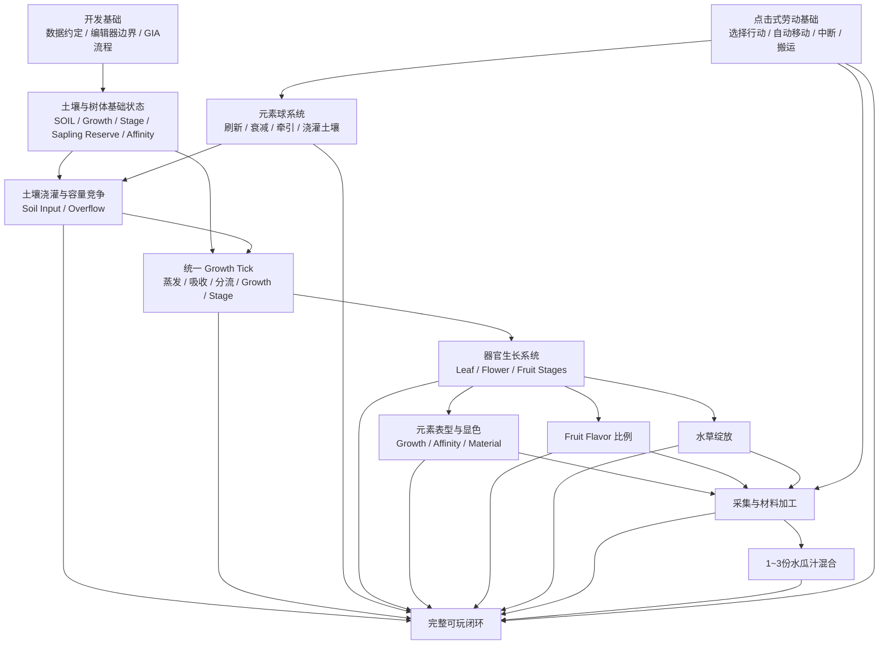
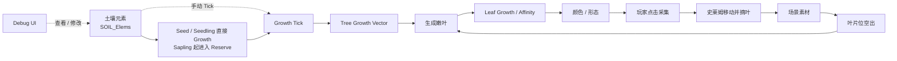
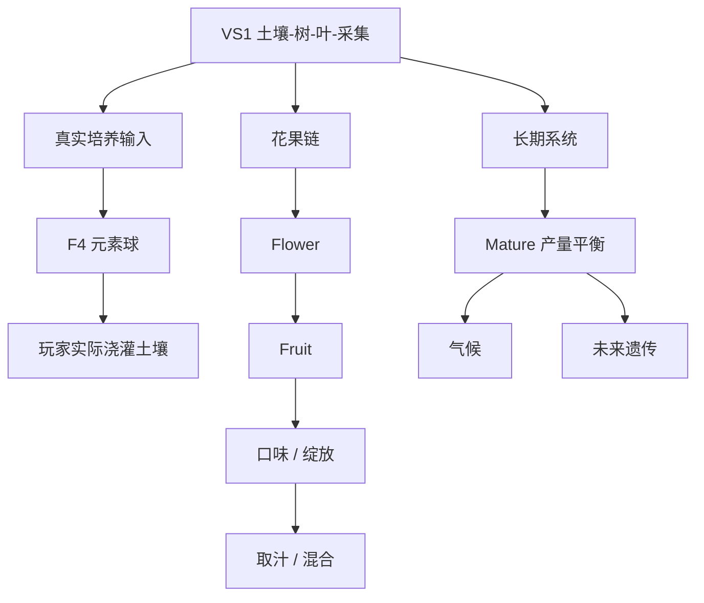

# 水瓜厨房 MVP：实现路线图与 Spec 工作流

所有模型速率和时长遵照 [uh 等效小时规范](../../docs/plants/uh-time-unit.md)，`Tick` 仅是可以细分的结算事件，不是速率或成长年龄单位。

本文件把当前 MVP 拆成可以逐项选择和实现的功能点，并规定从“选择功能”到“开始编码”的 SDD 工作流。

它回答两个问题：

1. **当前还有哪些功能需要实现？**
2. **选中一个功能后，怎样拆成流程块、文件和可验收的 Issue / Spec？**

本文件只组织已经进入当前设计范围的内容，不擅自补充尚未确定的玩法规则。具体数值和玩法语义仍以 `requirements.md`、`development-conventions.md`、`elemental-cultivation.md`、`interaction.md` 以及对应已确认 Issue 为准。

---

## 一、功能依赖总图



说明：

- 箭头表示**实现依赖或集成依赖**，不是强制的开发顺序。
- 一个功能点可以拆成多个简单 Flow Block；一个 Flow Block 也可以需要多份源码、复合节点、编辑器绑定和测试文件。
- 通用养分规则见根目录 `docs/plants/nutrient-growth-system.md` 与 `docs/plants/growth-tick.md`；千星奇域映射见 `growth-system.md`。

---

## 二、当前功能 Checklist

### F0 — 开发基础与数据约定

- [x] 七元素固定索引顺序已经确定。
- [x] `CFG`、树体七元素列表和锁定列表的数据方向已经确定。
- [x] 已验证 TypeScript → genshin-ts → `.gia` → 编辑器手动导入的服务器节点图流程。
- [x] 已确定“算法代码优先 + 编辑器手动绑定 + 必要时人工复合节点”的开发边界。
- [ ] 为后续正式节点图统一命名规则、文件组织和手动接入标记方式。
- [ ] 确定一个不会改变运行语义的“MANUAL: connect compound node ...”占位实现方式。

**状态：基础可用，仍有少量工程规范需要在实际功能开发中收敛。**

---

### F0-Debug — 开发调试 UI

目标：为早期垂直切片提供一个**非玩家玩法 UI**，能够直接观察和修改关键运行时状态，并手动推进 Growth Tick。

需要至少覆盖：

- [ ] 显示 / 修改 `SOIL_Elems[7]`。
- [ ] 显示 / 修改 `TREE_Elems[7]`。
- [ ] 显示 `TREE_Stage`。
- [ ] 显示 / 修改 `TREE_Growth[7]`。
- [ ] 显示 Tree Base / Effective Affinity。
- [ ] 显示最后 Growth Tick 时间、当前服务器时间和待补算 Tick 数。
- [ ] 提供“执行一次 Growth Tick”的调试入口。
- [ ] 对当前叶片显示 Stage、Growth Vector、Base / Effective Affinity。
- [ ] 能够直接调整关键 Growth 值以跨越 Stage / 器官生成阈值。
- [ ] Debug UI 修改的是测试运行状态，不包装成正式玩家能力。
- [ ] 非调试场景可以隐藏或禁用。

花 / 果加入实现后，再把对应器官状态接入同一调试 UI，不在第一条叶片闭环中预先实现。

**用途：开发验证工具，不属于正式玩法 Feature。**

---

### F1 — 土壤与树体基础运行时状态

目标：建立 Growth Tick 所需的最小持久状态。

需要至少覆盖：

- [ ] `SOIL_Elems : float[7]`。
- [ ] `TREE_Elems : float[7]`，语义为 Sapling 起的树体内部 Reserve；Seed / Seedling 不使用 Reserve。
- [ ] `TREE_Growth : float[7]`。
- [ ] Seed 前置状态 + `TREE_Stage`：Seedling / Sapling；Mature 最终设计延后。
- [ ] Tree Base Affinity / Effective Affinity。
- [ ] `LastGrowthTickAt`。
- [ ] 状态初始化、读取、保存边界。
- [ ] Debug UI 可直接观察和修改上述关键状态。

**预期实体：Soil / Plot、Aquamelon Tree、Level / Stage Config。**

---

### F2 — uh 结算与离线一致性

目标：模型以 [uh](../../docs/plants/uh-time-unit.md) 推进真实 `Δuh`；所有养分速率统一为 V/uh，千星服务端与 Web 仅改变现实秒数/uh映射。

- [ ] F2.1 计算上次状态到当前时刻的 `Δuh`，支持1 uh及其分数步长，不能通过增加结算次数提高养分吞吐。
- [ ] F2.2 Soil超容量同比缩放，按 `0.99 ** Δuh` 自然蒸发；元素球按 uh 计龄与半衰。
- [ ] F2.3 Soil → RootPreference / Affinity 通道上限 / 根系总上限 `MaxRootAbsorbVPerUH × Δuh`。
- [ ] F2.4 Seed / Seedling 的吸收量直接转换到自身 Growth[7]；到45/90才升阶段。
- [ ] F2.5 Sapling 将根系吸收实际写入 TreeReserve[7]，按 **Reserve×TreeAffinity 动态**生成本次 GrowthNutrientBudget[7]；生成函数参数需设计确认。
- [ ] F2.6 叶片优先实际取用各自名义30%预算，其未使用额度返还 Tree；每片叶本次预算内部再独立向附属 Flower/Fruit 分流，不抢其他叶预算。
- [ ] F2.7 Tree 剩余预算结算为 TreeGrowth，若有 Active Bud 则写入 BudGrowth[7]。
- [ ] F2.8 Growth 达标才进行器官形态变化；Stage跨越时保证亲和与 Growth 的连续性/固化点。
- [ ] F2.9 出芽概率必须按统一的 uh 机会频率进行判定，不将一次技术 Tick 等价于一次抽奖；待确认后实现。
- [ ] F2.10 离线事件回放跨 Growth 阈值分段，不机械模拟无必要的所有小时间步，也不跳过真实生长事件。
- [ ] F2.11 调度和页面 UI 可以更高频更新，但不得另创 GameTime 与模型分叉。

不增加独立计时器服务或新仿真框架；坚持现有平台内的单一权威状态。

### F3 — 土壤浇灌与容量竞争

目标：所有外部元素输入先进入土壤，再由 F2 的 Growth Tick 吸收到树体。

需要覆盖：

- [ ] F3.1 土壤总容量基线 100。
- [ ] F3.2 元素球捕获时直接累加到 `SOIL_Elems`，允许临时超过 100。
- [ ] F3.3 下一 Soil Growth Tick 开头计算 `SoilTotal`。
- [ ] F3.4 若 `SoilTotal > 100`，对当前全部七元素统一乘 `100 / SoilTotal`。
- [ ] F3.5 新旧元素没有优先级；连续加入单元素形成递推残留和逐步替换。
- [ ] F3.6 Overflow 当前直接丢弃，未来可接气候系统。
- [ ] F3.7 边界测试覆盖空土、未满、刚好满、超量输入和单元素极端。

---

### F4 — 主动元素球富集、收集与衰减

- [ ] F4.1 玩家按「富集」主动生成一个七元素等概率的纯元素球，数值范围按统一的材料参数。
- [ ] F4.2 球以 `Δuh` 为年龄持续半衰，剩余总量低于销毁阈值则消失。
- [ ] F4.3 「收集」将当前球的剩余元素量立刻写入 Soil，球从场地移除；不能等下一次结算才接收。
- [ ] F4.4 「清空场地」只影响未收集球，不回退已收集 Soil[7]。
- [ ] F4.5 普通模式**不自动生成元素球**；不建立额外玩家在线刷新收益或离线补偿球。
- [ ] F4.6 调试中可以选择元素、推进 `Δuh` 或清理状态；与普通模式真实数据隔离。
- [ ] F4.7 Web 的球富集区保留独立可操作栏，千星输入由服务端世界/实体与 UI 分离实现。

### F5 — Growth 驱动的生命阶段与器官分流

所有阶段转换只检查对应向量累计 Growth，不使用必须待满指定时间的年龄门槛。具体体验以 uh 计量，是正常供养下的阈值校准参考。

#### F5-Tree — Seed / Seedling / Sapling

- [ ] Seed Growth45 → Seedling Growth90 → Sapling长期循环；Sapling主干 Growth100 只塑形 Affinity，不升 Mature Tree。
- [ ] Sapling前无 Tree Reserve；Sapling开始采用 Reserve×Tree Affinity 的动态生长预算。
- [ ] RootPreference、单元素30%×Affinity吸收 cap和最终 `V/uh` 根系总上限按统一模型使用；4/5/6 V/uh仍在校准中。
- [ ] Active Bud 将 Tree 本次自身 GrowthGain 转入 BudGrowth，达到20出生 SmallLeaf；掐芽返还 Bud 全部 Growth。
- [ ] 最多3片叶，0/1/2/3叶的原出芽概率为80%/40%/1%/0%；其每uh机会频率待统一确认，不能随技术 Tick 增加抽奖次数。
- [ ] 每片叶首次形成时根据当时父器官亲和继承偏移，自此自行塑形，不实时跟随 Tree。

#### F5-Leaf — 叶片与花苞

- [ ] 每片叶第一层名义份额30%，Tree对应剩余100%/70%/40%/10%；叶片无法实际取用的额度返还 Tree。
- [ ] SmallLeaf 自身 Growth 0→26形成 LargeLeaf，并固化当前亲和。
- [ ] LargeLeaf 自身新的阶段 Growth 0→18生成附属 FlowerBud，母叶继续存活并按自己预算成长。
- [ ] 嫩叶无额外组织损耗，肥厚叶自身 Growth 保留效率60%，与 Tree Reserve 取用无关。
- [ ] FlowerBud从自身独立于母叶的生殖 Growth=0开始积累，与后续 Flower/GreenFruit/Aquamelon共享同一向量。
- [ ] 典型嫩叶12 uh、肥厚叶12 uh、花苞24 uh只用于校准实际 Growth 速率，不做倒计时或年龄门槛。
- [ ] 果实成熟 Growth90 时，母叶与果同步转换为可采纤维化 AquamelonLeaf。

#### F5-FlowerFruit — 一条连续的生殖 Growth

- [ ] FlowerBud→Flower 总 Growth26；Flower→GreenFruit 总 Growth40；GreenFruit→成熟水瓜 总 Growth90；**不在开花或结果时清零**。
- [ ] 花期预期约12 uh，真实转换依累计 Growth 达到40而非经过12 uh。
- [ ] 花苞/花从所属母叶当次预算内拿50%，GreenFruit拿85%（80%～90%参考范围），成熟果继续按20%富集，不跨叶分流。
- [ ] 只有结果时锁定当前 Affinity；`FruitElementAmount[7]` 从此开始按实际进入果实的 V 累积，FlavorRatio按组成比例派生。
- [ ] GreenFruit可早摘；成熟水瓜仍继续低效富集元素，不锁 Flavor，不自动采收。
- [ ] 采果后母叶留在树上可以再次生成花苞，但需要基于采收后**新增 Growth** 达到待确定阈值；不得使用固定等待门槛或直接沿用历史 Growth。
- [ ] 材料采收身份、最小加工路线和完整 Affinity 继承遵照现有材料设计，不引入背包/通用配方系统。

**共同时间/数值体验目标**：规律维护者约24 uh到 Seedling、72 uh到 Sapling、168 uh内首颗成熟水瓜，稳定期每168 uh约4～6果；其他上线频率只经实际 Soil 供给差异影响成长速度。

### F6 — 元素表型、颜色与隐藏亲和

目标：让 Growth Vector / 固定亲和产生玩家可观察的外观差异，同时保留未显性的隐藏培养信息。

需要覆盖：

- [ ] 未成熟器官可随着连续学习和 Growth 构成改变表现。
- [ ] Seed / Seedling 与仍在学习的 Leaf 阶段继续遵守既有 Affinity 固化语义；生殖器官例外是 生殖 Growth 达40结果时锁定 Affinity，Growth40→90 的青果期继续富集实际果实元素。
- [ ] 某元素 Affinity 达到表现阈值时，可以进入对应颜色 / 变种形态。
- [ ] 未达到阈值时保持普通形态，但隐藏 Affinity 仍然保留。
- [ ] 多元素同时超过阈值时的视觉选择规则由表现 Spec 决定。
- [ ] 颜色资源仍使用既定七元素主题色和编辑器材质绑定。
- [ ] Debug UI 能同时观察 Growth Vector、Base Affinity、Effective Affinity 与最终表型。

旧版“一次性 OrganElement 快照 → argmax → 永久颜色”的规则不再作为所有器官的通用模型。

---

### F7 — Fruit Flavor Ratio

目标：让果实结果后的七元素实际累计量直接成为 v0 Flavor 的事实源，不引入第二套味道转换。

需要覆盖：

- [ ] F7.1 持久化 `FruitElementAmount[7]`，只累计 Fruit 形成以后实际进入果实的七元素量。
- [ ] F7.2 `ΣFruitElementAmount = 0` 时，Flavor 尚未形成。
- [ ] F7.3 总量大于 0 时派生 `FlavorRatio[e] = FruitElementAmount[e] / ΣFruitElementAmount`。
- [ ] F7.4 不额外持久化重复 `FlavorRatio` 向量，除非后续实现出现明确必要性。
- [ ] F7.5 Growth=100 后仍允许元素继续累计，因此 FlavorRatio 可以继续变化。
- [ ] F7.6 本 Feature 不实现六维 Taste、Affinity→Flavor efficiency、Flavor decay / cap、催化或精炼。

当前不建立通用 Flavor conversion pipeline。未来具体料理如何解释这个比例，在对应 Feature 重新形成 Spec。

---

### F8 — 水 + 草绽放

目标：实现 MVP 唯一元素反应。

需要覆盖：

- [ ] F8.1 触发条件：Hydro ≥ 25。
- [ ] F8.2 触发条件：Dendro ≥ 25。
- [ ] F8.3 Hydro + Dendro ≥ 60。
- [ ] F8.4 计算 `BloomStrength`。
- [ ] F8.5 保存 `Bloom` / `BloomStrength`。
- [ ] F8.6 应用绽放口味修正。
- [ ] F8.7 编辑器侧草种子性状体表现。

复合节点候选：

- [ ] `bloom_calc`
- [ ] `bloom_taste_modifier_calc`

是否合并由该功能 Spec 决定。

---

### F9 — 采集、世界材料与最小加工

目标：把已确认的活体器官转换为场景中的独立 world Material，并实现 Green Fruit / Mature Aquamelon 当前已经锁定的最小材料拆分。这个 Feature 不建立传统背包、堆叠系统、通用 Item framework 或 recipe engine。

需要覆盖：

- [ ] F9.1 SmallLeaf 采摘后生成独立 `TenderLeaf` / 嫩叶材料。
- [ ] F9.2 LargeLeaf 采摘后生成独立 `ThickLeaf` / 肥厚的叶片材料。
- [ ] F9.3 Fruit 生殖 Growth=90 的同一成熟事件把 parent Leaf 转成纤维质 Aquamelon Leaf；采摘后生成 `AquamelonLeaf` / 水瓜树叶。
- [ ] F9.4 Green Fruit 在 `40 <= Growth < 90` 可采摘为 `GreenFruit` / 青果。
- [ ] F9.5 Mature Fruit 在 `Growth >= 90` 可采摘为 `Aquamelon` / 水瓜。
- [ ] F9.6 Living Organ -> world Material 后退出 Tree / Leaf nutrient allocation、organ Growth 与 on-tree enrichment。
- [ ] F9.7 每个具体材料至少携带 `MaterialType`、`ElementAmount[7]`、`Affinity[7]` 语义；`FlavorRatio` 继续由 ElementAmount 比例派生，不要求统一 generic 数据框架。
- [ ] F9.8 `GreenFruit -> GreenFruitPeel + GreenFruitFlesh`；青果皮与青果肉都是独立材料。
- [ ] F9.9 `Aquamelon -> AquamelonShell x2 + AquamelonJuice x1`；两个水瓜壳与一份水瓜汁都是独立材料实体。
- [ ] F9.10 `AquamelonShell -> AquamelonFlesh + remaining shell material`；当前只确认可剥出一份水瓜肉，不定义剩余壳命名、总产量、工具、耗时或损耗。
- [ ] F9.11 `GreenFruitFlesh != AquamelonFlesh`，`GreenFruitPeel != AquamelonShell`；不建立 generic `AquamelonPeel`，也不把解剖学“果肉膜”强制定义为 `AquamelonPulpMembrane` 掉落。
- [ ] F9.12 Processing 产物拥有独立 `ElementAmount / Affinity` 数据能力，但本 Feature 不定义元素量分配、Affinity 继承 / 变化、yield 或 mass conservation 公式。

依赖点击劳动和搬运基础；材料仍以世界对象存在，可直接放置在场景中。

---

### F10 — 1～3 份等体积水瓜汁混合

目标：实现第一版唯一料理。

需要覆盖：

- [ ] F10.1 选择 1～3 份水瓜汁。
- [ ] F10.2 每种元素取算术平均。
- [ ] F10.3 从最终元素重新计算主元素颜色。
- [ ] F10.4 从最终元素重新计算口味。
- [ ] F10.5 从最终元素重新检测水草绽放。
- [ ] F10.6 相同最终元素组成得到相同基础结果。
- [ ] F10.7 第一版不支持自定义比例、糖、水、冰和其他配料。

---

### F11 — 点击式劳动基础

目标：提供上述玩法真正可操作所需的最小交互框架。

需要覆盖：

- [ ] F11.1 点击 / 选择可交互对象。
- [ ] F11.2 单一可执行行动时直接执行。
- [ ] F11.3 多个可执行行动时显示行动选择。
- [ ] F11.4 史莱姆自动移动到交互位置。
- [ ] F11.5 到达后开始劳动。
- [ ] F11.6 行动可中断。
- [ ] F11.7 按具体行动决定中断后保留还是重置进度。
- [ ] F11.8 世界物品拾取 / 搬运 / 放下。
- [ ] F11.9 一次搬运一个物品。
- [ ] F11.10 搬运重量影响移动速度。

不实现任务队列和自动化调度。

---

### F12 — 植物活性 / 休眠

目标：让树在内部 Reserve 不足时停止正常生长，但仍能继续吸收并在恢复后苏醒。

当前基础规则已经确定：

- [ ] `TreeReserveTotal = Σ TREE_Elems`。
- [ ] Growing 状态下，`TreeReserveTotal < 30` → Dormant。
- [ ] Dormant 状态仍允许从土壤吸收。
- [ ] Dormant 状态暂停正常 Growth Conversion。
- [ ] `TreeReserveTotal >= 80` → 恢复 Growing。
- [ ] 长期不浇灌不会让树死亡。
- [ ] 使用 30 / 80 两个阈值形成迟滞，避免临界值反复抖动。
- [ ] 最终阈值仍允许通过 Debug UI 调整。

休眠的视觉表现、音效和更细的低速成长表现可以后续追加，不阻塞基础逻辑实现。

---

### F13 — 完整 MVP 集成

目标：把已经独立验证的功能串成完整培养与料理闭环。

- [ ] 元素资源出现并进入土壤。
- [ ] 土壤执行容量竞争与蒸发。
- [ ] 树按 RootPreference、总吸收上限和单元素 Cap 从 Soil 吸收。
- [ ] Seed / Seedling 直接把吸收结果转换为 Growth；Sapling 起才进入 Reserve → Growth / 子器官分流。
- [ ] 叶 / 花 / 果按各自 Stage 生长并形成不同形态。
- [ ] 玩家能够观察元素带来的颜色 / 生长速度 / 形态差异。
- [ ] 玩家采集器官和果实。
- [ ] 采摘后的器官进入 world Material 与最小加工；其中 Mature Aquamelon 可产出 AquamelonJuice，再进入水瓜汁混合。
- [ ] 制作结果能够反向影响下一轮培养选择。
- [ ] 完成一次端到端人工验收。

---

## 三、暂不进入当前实现的内容

以下内容即使未来重要，也不应因为实现某个相邻功能而顺手加入：

- 第二种及之后的元素反应；
- 元素精确数值 UI；
- 多元素综合色；
- 茎秆、叶片料理；
- 草种子性状体独立 Item；
- 更复杂料理；
- 顾客经营；
- 自动化生产；
- 正式仓储与物流；
- 多人跨世界访问；
- 元素锁定能力的获得 / 解除玩法；
- 亲和遗传、重新播种与多代育种；
- 气候系统对环境逸散的进一步反馈；
- Flower / Fruit 之外尚未设计的复杂器官链。

---


## 四、最小可见闭环：土壤 → 生长 → 显色 → 采集

第一条垂直切片不再使用测试 TREE_Elems 直接跳过培养链，而是尽量覆盖新的最小真实数据流。

### 4.1 闭环目标



这条切片优先验证：

> **土壤能供给树；树按 Tick 生长；树会生成叶片；叶片会根据真实养分与亲和变化成长和变色；玩家可以摘下叶片；叶片位重新进入生长。**

### 4.2 当前最小 Feature 组合

```text
F0-Debug
+ F1
+ F2 的最小 Growth Tick
+ F3 的调试土壤输入
+ F5-Tree / F5-Leaf
+ F6
+ F9-Harvest 的叶片采集子集
+ F11-Min
```

F4 元素球不是第一条垂直切片的前置条件。测试阶段可以通过 Debug UI 直接修改土壤元素，等基础生长闭环稳定后再接真实元素球浇灌。

### 4.3 第一条闭环暂时只做叶片

第一条端到端链优先选择叶片，而不是同时做茎、花、果。

需要看到：

- [ ] Seed / Seedling / Sapling 的阶段链可运行。
- [ ] 土壤元素按 RootPreference、统一根系 `V/uh` 总吸收上限和七元素通道 Cap 被吸收。
- [ ] Seed / Seedling 直接形成 Growth；Sapling 起 Tree Reserve 和 Tree Affinity 联合产生动态生长预算，精确转换系数仍待确认。
- [ ] Tree Growth Vector 累积并触发 Stage / 叶片生成。
- [ ] Sapling 当前最多出现 3 片叶；大多数长期处于2叶，少量进入3叶。
- [ ] 每片叶获得约 0.3 的分流预算；3叶时 Tree 仅保留约0.1。
- [ ] 叶片前半段按 SmallLeaf → LargeLeaf → FlowerBud 的已确认 elapsed-time boundary 推进；第一条切片仍可在进入 Flower runtime 前收口。
- [ ] 叶片 Effective Affinity 持续学习。
- [ ] 按各阶段合同处理 Affinity：Leaf 学习阶段独立塑形；Flower→Fruit 在 Growth=30 锁定；不要用一个通用规则覆盖所有阶段。
- [ ] 叶片表现可以随培养方向产生差异。
- [ ] 玩家点击成熟可采叶片。
- [ ] 史莱姆移动并完成摘叶。
- [ ] 生成场景素材。
- [ ] 叶片位空出后，树后续可以再次生成叶片。

### 4.4 Debug UI 在本切片中的职责

第一条切片必须能通过 Debug UI 快速完成：

```text
修改 SOIL_Elems
查看 TREE_Elems
查看 / 修改 TREE_Growth
查看 TREE_Stage
查看叶片 Stage / Growth / Affinity
执行单次 Growth Tick
跨越阈值
观察颜色 / Stage / 器官生成变化
```

Debug UI 是测试入口，不属于玩家正式玩法。

### 4.5 验收画面

最小端到端验收：

```text
1. 进入世界，打开 Debug UI
2. 给土壤设置一组明确的七元素组成
3. 手动执行 / 等待 Growth Tick
4. 在 Seed / Seedling 阶段观察土壤减少、Tree Growth 直接增加；进入 Sapling 后观察 Tree Reserve
5. 观察 Tree Growth Vector 累积
6. Seed / Tree Stage 正确升级，升级时 Growth 清空
7. Sapling 开始生成嫩叶
8. 叶片从树体分得养分并累积自己的 Growth
9. 叶片阶段变化，亲和和颜色产生可观察变化
10. 玩家点击成熟可采叶片
11. 史莱姆自动移动并完成采集
12. 场景中出现叶片素材
13. 叶片位空出
14. 后续 Growth Tick 再次推进新叶生成
```

至少还要用两组明显不同的土壤元素组成，证明：

```text
SOIL_Elems
→ TREE_Elems
→ Growth / Affinity
→ Leaf Growth / Affinity
→ Visual
```

整条链成立。

### 4.6 本切片不要求

- 元素球真实刷新与牵引；
- 花 / 果；
- 果实口味；
- 绽放；
- 取汁；
- 水瓜汁混合；
- 气候反馈；
- 遗传；
- Mature 最终设计；
- 正式多器官生态。

### 4.7 后续扩展



---

# 五、从功能点到 Issue / Spec 的 SDD 流程


选中一个功能点后，**不要直接开始写代码**。


## 5.1 Feature

Feature 是玩家或系统层能够独立描述的一项能力，例如：

- “Growth Tick 与离线补算”
- “土壤浇灌与容量竞争”
- “果实六维口味”
- “元素球离线恢复”

Feature 不要求只对应一张图。

---

## 5.2 Flow Block

一个 Feature 可以拆成多个 Flow Block。

Flow Block 应尽量满足：

- 单一入口；
- 单一职责；
- 输入输出明确；
- 可以独立测试；
- 可以用一句话描述。

例如“Growth Tick 与离线补算”可以拆成：

```text
计算错过 Tick 数
土壤蒸发
树体按 RootPreference / Cap 吸收
生成本 Tick 生长预算
Tree / Leaf 第一层分流
各 Leaf 内部的生殖器官第二层分流
Growth Vector 转换
连续学习
Stage / 器官生成判定
更新时间戳
```

复杂流程优先拆块，而不是生成一张巨型节点图。

---

## 5.3 Files

一个 Flow Block 可以包含多个需要提交的文件。

可能包括：

```text
src/.../*.ts                  节点图源码
dist/.../*.gia                本地生成产物，通常不手工修改
docs/...                      手动绑定或设计说明
tests / fixtures              测试数据或验证样例
editor manual work            编辑器中的结构体、复合节点、资源和组件绑定
```

是否提交生成产物，以项目当时的版本控制策略为准；**Spec 必须列出预期产物，但不要因为“一流程一文件”的形式主义强行拆分。**

---

## 5.4 Complex Calculation / Compound Node

复杂数学公式优先独立成专用节点图：

```text
xxx_calc.ts
→ xxx_calc.gia
→ 编辑器手动导入
→ 打包为复合节点 xxx_calc
```

主流程只保留一个明确的手动接入点：

```text
MANUAL: connect compound node xxx_calc
```

文件名、导入图名和复合节点名保持一致。

---

# 六、GitHub Issue = SDD Spec

每次选择一个具体 Feature 开发时，先创建 Issue。Issue 是该次开发的 **Spec 与验收合同**。

如果 Feature 太大，可以拆成多个 Issue；如果多个 Flow Block 高度耦合，也可以放在同一个 Issue 中。判断标准是能否形成明确、可独立验收的开发边界。

## Issue 推荐结构

```markdown
# [Spec] Feature Name

## Context
为什么需要这个功能，它依赖什么现有设计。

## Goal
本次开发结束后必须成立的行为。

## Non-goals
明确这次不做什么，防止范围膨胀。

## Entities
### Entity A
- Responsibility
- Runtime Properties
- Editor Bindings

## Flow Blocks
### Flow A
- Trigger / Input
- Steps
- Output / Side Effects

### Flow B
...

## Files / Artifacts
- src/...
- compound_calc.ts
- expected .gia
- manual editor bindings

## Manual Editor Work
- 要创建 / 导入 / 绑定什么
- 要打包哪些复合节点
- 哪些 MANUAL 接入点需要人工连接

## Data / Invariants
- 数据结构
- 固定索引
- 范围
- 必须始终成立的条件

## Acceptance Criteria
- [ ] ...
- [ ] ...

## Test Plan
### Nominal
- ...

### Boundary
- ...

### Persistence / Offline
- ...

### Editor Integration
- ...

## Open Questions
仅记录真正仍未决定、且不阻塞本次开发的问题。
```

---

## 七、开发开始条件

只有当一个 Issue / Spec 至少明确以下内容后，才进入实际开发：

- [ ] Feature 的目标。
- [ ] 明确的 Non-goals。
- [ ] 涉及的实体和状态所有权。
- [ ] Flow Blocks。
- [ ] 预期源码 / 产物 / 编辑器工作。
- [ ] 手动复合节点接入点。
- [ ] 数据不变量和边界。
- [ ] Acceptance Criteria。
- [ ] Test Plan。
- [ ] 没有会改变当前实现方向的阻塞性 Open Question。

如果上述内容在开发过程中发生变化，应先更新 Issue，再修改实现。

---

## 八、当前推荐的可选择起点

为了尽快得到第一条可见闭环，当前优先顺序改为：

- [ ] **F1 土壤与树体基础运行时状态**
- [ ] **F0-Debug 开发调试 UI**
- [ ] **F2 统一 Growth Tick 的最小版本**
- [ ] **F3 土壤浇灌与容量竞争**
- [ ] **F5-Tree / F5-Leaf**
- [ ] **F6 元素表型与显色**
- [ ] **F11-Min 点击采集所需劳动**
- [ ] **F9-Harvest 叶片采集子集**

已有设计入口、但不阻塞第一条垂直切片：

- [ ] **F4 元素球刷新、衰减与牵引浇灌**

第一条闭环之后再进入：

- [ ] **F5-FlowerFruit**
- [ ] **F7 Fruit Flavor Ratio**
- [ ] **F8 水 + 草绽放**
- [ ] **F9 采集与材料加工**
- [ ] **F10 水瓜汁混合**
- [ ] **F12 长期休眠 / 生长平衡深化**
- [ ] **F13 完整 MVP 集成**

后续仍由开发者选择具体 Feature，再按“实体 → Flow Blocks → Files → Issue / Spec → 开发 → 验收”的流程推进。
