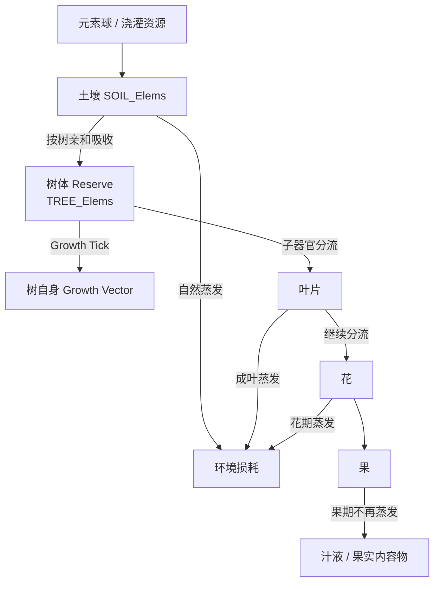

# 水瓜厨房 MVP：七元素养分与生长系统

本文件把根目录通用的 [植物养分—生长系统](../../docs/plants/nutrient-growth-system.md) 映射到千星奇域水瓜树。

本版本中：

```text
Nutrient        = 七元素力
Soil Reservoir  = 土壤七元素储备
Plant Reserve   = 树体内部七元素储备
Affinity        = 七元素亲和
Growth Vector   = 七元素生长度向量
```

具体每个生长结算周期内发生什么，以根目录 [Growth Tick](../../docs/plants/growth-tick.md) 为统一规则；本文件只定义水瓜树的器官关系、阶段、当前调试参数和体验目标。

---

## 1. 总体养分流



玩家浇灌的是**土壤**，不是直接给树体写入元素。

土壤承担植物与外部世界之间的“养料接口”。从更广义的生长模型看，树本身可以被视为土壤的一个下游器官。

---

## 2. Growth Tick 与时间尺度

Growth Tick 现在只表示“一次生长结算事件”，不再把 Tick 自身当作固定自然时间单位。

自然规律统一使用：

```text
RatePerHour + dt
```

在线更新周期只决定反馈频率：

```text
CFG_GrowthUpdateIntervalSeconds
```

当前第一版倾向：

```text
CFG_GrowthUpdateIntervalSeconds = 60
```

即在线约每分钟结算一次。以后可以改成 30 秒或其他值，而不需要重新调整植物每小时的成长速度。

当前时间速率基线：

```text
SoilRetentionPerHour = 0.99
TreeGrowthRetentionPerHour = 0.99
```

含义分别是：

- 土壤在 1 小时后保留约 99% 当前元素；
- 树体在 1 小时内约拿出当前 Reserve 的 1% 用于生长代谢。

任意 dt 使用连续时间等价公式，例如：

```text
SOIL_Elems[i]
*= SoilRetentionPerHour ^ dtHours

Consumed[i]
=
TREE_Elems[i]
× (1 - TreeGrowthRetentionPerHour ^ dtHours)
```

Stage 吸收能力也改用：

```text
MaxAbsorbPerHour(stage)
```

当前结算量：

```text
MaxAbsorbThisUpdate
=
MaxAbsorbPerHour(stage) × dtHours
```

在线与离线应尽量共享同一套公式。离线时直接按真实经过时间计算；只有遇到 Stage 升级、器官生成等离散事件时才分段处理。

Debug UI 需要提供“立即推进下一次 Growth Tick”的能力。Debug 强制 Tick 使用一个标准在线更新步长：

```text
dt = CFG_GrowthUpdateIntervalSeconds
```

这样可以在游戏内连续测试生长，而不必真实等待一分钟。

具体结算顺序见根目录 [Growth Tick](../../docs/plants/growth-tick.md)。

---

## 3. 土壤七元素储备

土壤保存：

```text
SOIL_Elems : float[7]
```

七元素顺序继续遵循：

```text
Fire / Hydro / Anemo / Electro / Dendro / Cryo / Geo
```

当前总容量：

```text
MaxSoilElementLoad = 100
```

### 3.1 浇灌时的容量竞争

当加入新元素导致总量超过容量时，超出部分按照**浇灌前已有土壤元素的当前比例**从整个旧储备中挤出，包括与本次输入同种的旧元素。

例如：

```text
浇灌前：
雷 50
火 30
水 20
总量 100

输入：
雷 +10

需要挤出 10：
雷 -5
火 -3
水 -2

再加入新雷 10：

结果：
雷 55
火 27
水 18
总量 100
```

因此反复追求单一元素会产生自然的边际递减。

这一规则替代旧版“新输入元素完全受保护、只挤出其他元素”的设计。

### 3.2 土壤蒸发

土壤蒸发使用单位时间保留率，不再写成“每 Tick 固定减少 1%”。

当前基线：

```text
SoilRetentionPerHour = 0.99
```

任意结算周期：

```text
SOIL_Elems[i]
*= 0.99 ^ dtHours
```

第一版先把蒸发视为直接损耗。

未来这些逸散可以进入气候系统，但当前不实现，见 [气候系统占位](../../docs/plants/climate-system.md)。

---

## 3.3 Growth 驱动的亲和学习

水瓜树当前 Stage 的 Effective Affinity 只由本阶段已经形成的 `TREE_Growth[7]` 决定，不读取 `TREE_Elems[7]` 的当前储备比例。

当前配置：

```text
ExtraAffinity = 1
CFG_AffinityInherifanceRate = 0.5
```

计算：

```text
GrowthTotal = Σ TREE_Growth[i]

GrowthShare[i]
= TREE_Growth[i] / GrowthTotal

AffinityOffset[i]
= ExtraAffinity × GrowthShare[i]

TREE_EffectiveAffinity[i]
= TREE_BaseAffinity[i] + AffinityOffset[i]
```

当 `GrowthTotal = 0`：

```text
AffinityOffset[i] = 0
TREE_EffectiveAffinity[i] = TREE_BaseAffinity[i]
```

因此：

> Reserve 表示“当前体内还储存着什么”，Growth 表示“这些元素已经把植物长成了什么”。

只有 Growth 会塑造当前亲和。

### Stage 升级

Tree 自身进入下一 Stage：

```text
TREE_EffectiveAffinity
→ 下一 Stage TREE_BaseAffinity

TREE_Growth
→ 清零
```

### 未来生成叶片

当 Tree 未来生成叶片时，Tree 自身 Affinity 不改变。

父体当前偏移：

```text
ParentOffset[i]
=
TREE_EffectiveAffinity[i]
-
TREE_BaseAffinity[i]
```

叶片继承：

```text
LEAF_BaseAffinity[i]
=
CFG_LeafAffinity[i]
+
ParentOffset[i] × CFG_AffinityInherifanceRate
```

当前继承率为 0.5。

Sapling 阶段“Tree 自身长大”与“生成 / 培养叶片”如何竞争同一份 Growth，当前暂不设计，不阻塞本轮 Tree 三阶段基础流程。

---

## 4. 树从土壤吸收

水瓜树拥有内部储备：

```text
TREE_Elems : float[7]
```

树从土壤吸收时：

- 总吸收量由当前 Tree Stage 的 `MaxAbsorbPerHour` 限制；
- 七元素之间的吸收构成由土壤组成和当前树体亲和共同决定；
- 提取时 Affinity 超过 1 按 1 处理，不允许从土壤拿走超过实际供给的元素；
- Growth 转换时则使用完整 Affinity，允许 `Affinity > 1` 产生更高的对应元素生长度。

### 4.1 Stage-specific MaxAbsorb

不同树阶段使用不同单 Tick 总吸收上限：

```text
Seedling : 少量
Sapling  : 中量
Mature   : 大量
```

数值暂不在本文件锁死，由实际平衡 Spec 确定。

这一增长用来表现根系和植株规模的扩大。

---

## 5. 种子激活与树体 Stage

正式进入 Tree Stage 之前，水瓜以半埋在土中的 Seed 状态存在。

Seed 本身暂不视为 Tree 的三个成长 Stage 之一，而是一个发芽前状态：

```text
Seed
→ 满足土壤激活条件
→ Germination Progress
→ Seedling
→ Sapling
→ Mature
```

发芽所需时间作为可配置参数，例如第一版体验目标约 1～2 天，但不在当前文档锁死具体数值。

发芽进度按实际经过时间累计，而不是依赖 Tick 次数：

```text
GerminationProgress
+= GerminationRatePerHour × dtHours
```

土壤达到怎样的“浇够水”条件才开始 / 继续发芽，仍留给基础生长链需求逐条确认。

### 5.1 三个 Tree Stage

树有三个主要阶段：

```text
Seedling 水瓜幼苗
→ Sapling 水瓜树苗
→ Mature 水瓜树
```

每个 Stage 都有独立的：

- Base Affinity；
- Effective Affinity；
- Growth Vector；
- MaxAbsorbPerHour；
- GrowthThreshold。

### 5.2 Stage 升级

达到当前阶段 GrowthThreshold 后：

```text
进入下一 Stage
→ 清空 TREE_Growth[7]
→ 当前 Effective Affinity 固定为下一阶段 Base Affinity
→ 下一阶段重新累积
```

Stage 永不因为 Growth 被清空、扣除或子器官分流而回退。

### 5.3 幼苗体验目标

普通玩家应当能够在**一周内**从 Seedling 长成 Sapling。

幼苗吸收量较低，主要作用是建立“浇灌—吸收—颜色—成长”的第一层反馈。

### 5.4 小树体验目标

Sapling：

- 最多拥有 **2 个叶片位**；
- 每片正在生长的叶片分走约 `0.3` 的生长预算；
- 两片叶同时存在时，树自身只保留约 `0.4` 的生长预算。

当前可按：

```text
0 片叶：Tree 1.0
1 片叶：Tree 0.7 / Leaf 0.3
2 片叶：Tree 0.4 / Leaf A 0.3 / Leaf B 0.3
```

理解第一版分流。

Sapling 的体验目标：

- 普通玩家：每周约成熟 2 片可收获叶；
- 勤劳玩家：每周约成熟 4 片；
- 元素使用正确时可以进一步提高；
- 正常约 2～3 周成长为 Mature；
- 玩家如果主动掰掉叶片、减少子器官分流并持续催长，可以探索出约 **1 周进入 Mature** 的快速路线。

这不是独立“加速按钮”，而是养分分流模型自然产生的策略。

### 5.5 成树

进入 Mature 后：

- 不再升级回其他树 Stage；
- 后续 Growth 用于持续生成嫩叶等器官；
- 生成器官会扣除对应 Growth，但不会使树回退阶段；
- 成树拥有明显更高的 `MaxAbsorbPerHour`。

当前方向仍保留成树拥有更多叶片位；具体上限与单叶分流比例在 Mature Spec 中再平衡。

---

## 6. 树体内部储备、休眠与生长

树内部储备总量：

```text
TreeReserveTotal = Σ TREE_Elems[i]
```

树体颜色直接以当前 Reserve 的组成作为表现来源之一，因此植株本身可以持续显示当前内部营养倾向。

### 6.1 休眠迟滞

沿用当前方向：

```text
Growing:
TreeReserveTotal < 30
→ Dormant

Dormant:
TreeReserveTotal >= 80
→ Growing
```

Dormant 状态：

- 仍允许继续从土壤吸收；
- 不进行正常 Growth Conversion；
- 不死亡；
- 达到恢复阈值后重新启动生长。

具体阈值仍可在平衡阶段调整。

### 6.2 树体生长消耗

树体生长消耗使用单位时间比例，不再使用“每 Tick 固定消耗 1%”。

当前基线：

```text
TreeGrowthRetentionPerHour = 0.99
```

任意结算周期：

```text
Consumed[i]
=
TREE_Elems[i]
× (1 - 0.99 ^ dtHours)
```

这些养分先向子器官分流，剩余部分再按完整 Tree Affinity 转换成：

```text
TREE_Growth[7]
```

不再设置统一“转换损耗”。

---

## 7. 叶片

叶片有三个 Stage：

```text
Tender 嫩叶
→ Thick 肥厚叶
→ Mature 成叶
```

叶片**没有独立 Reserve**。

它每 Tick 从树体本次生长预算中获得养分，吸多少就当次用于：

- 向自己的子器官继续分流；
- 环境蒸发；
- 转换为 `LEAF_Growth[7]`。

### 7.1 嫩叶

Tender：

- 当前不设置环境损耗；
- 获得的有效养分可以快速转换为 Growth；
- 亲和仍处于连续学习状态；
- 颜色 / 形态可以随着 Growth 与 Effective Affinity 改变。

### 7.2 肥厚叶

Thick：

- 继续进行连续学习；
- 继续积累自己的 Growth Vector；
- 可以作为后续 Mature 前的过渡阶段；
- 具体蒸发参数在叶片 Spec 中确定。

### 7.3 成叶

Mature：

- 当前叶片自身保留率基线为 `0.6`；
- 即自身预算的约 `40%` 逸散到环境；
- 仍可继续承担下游花 / 果的供给；
- 自身 Growth 累积明显慢于嫩叶；
- 外观阶段稳定，但内部隐藏 Affinity 仍可作为后续系统数据存在。

例如一片成叶本 Tick 得到 10 单位养分，并带有一朵吸收 50% 预算的花：

```text
10
→ 花 5
→ 叶剩 5

叶自身：
5 × 0.6 = 3 用于 Growth
5 × 0.4 = 2 逸散到环境
```

### 7.4 叶片 Stage 升级

每次叶片进入下一 Stage：

```text
清空 LEAF_Growth[7]
当前 Effective Affinity
→ 固定为下一 Stage 的 Base Affinity
```

只保留**连续学习**。

不再额外设置“阶段跃迁时给某元素一次离散双倍奖励”。

### 7.5 叶片表型

进入新 Stage 时，根据该阶段固定下来的 Base Affinity 判断是否达到元素形态阈值。

```text
某元素 Affinity 达到表现阈值
→ 对应颜色 / 变种形态

未达到
→ 普通叶片形态
```

没有达到表现阈值并不意味着该元素亲和消失。

因此普通外观叶片仍可能携带隐藏的“遗传信息”。

多种元素同时超过阈值时如何选择视觉主形态，留到表现 Spec 确定。

---

## 8. 花与果

花和果是**同一个器官的两个 Stage**：

```text
Flower
→ Fruit
```

### 8.1 Flower Stage

花：

- 没有独立长期 Reserve；
- 从上游叶片 / 植株获得当 Tick 养分；
- 具有环境蒸发；
- 持续进行 Affinity 学习；
- 持续累积自己的 Growth Vector。

花期累积的 Growth / Affinity 决定未来果实的：

- 果皮颜色；
- 基础形态 / 变种形态；
- Fruit Stage 的固定元素亲和。

可以理解为：

> 花在进入 Fruit Stage 后，花本身成为了果皮与外层形态。

### 8.2 Fruit Stage

进入 Fruit Stage 时：

- 固定 Affinity；
- 不再继续进行 Affinity 学习；
- 不再按花期规则向环境蒸发；
- 后续吸收重点用于累积汁液 / 果实内容物；
- 达到成熟条件后可采集。

因此：

```text
Flower 决定“果子长成什么样”
Fruit 决定“果子最终装了多少内容物”
```

---

## 9. 提前采摘与叶片分支

下游器官会改变上游器官的养分去向。

如果玩家提前摘掉花 / 果：

```text
原本流向花果的养分需求消失
→ 更多养分留在叶片
→ 叶片可以进入多汁成熟方向
```

因此“提前摘果后出现多汁叶”不作为孤立特殊规则，而是作为养分流变化产生的成熟分支。

具体触发条件和多汁叶数值留到叶—花—果联动 Spec 决定。

---

## 10. 亲和的长期意义

当前千星奇域版本只需要实现：

```text
Base Affinity
→ 连续学习
→ Stage 固定
→ 决定吸收与 Growth 转换
→ 决定外观 / 生长速度
```

完整游戏未来还会继续：

```text
成熟果实采摘
→ 锁定果实 Affinity
→ 作为种子
→ 下一代继承
```

形成隔代培养。

**千星奇域当前版本不实现重新播种和亲和遗传。**

遗传规则只保留为根目录通用植物系统的长期设计。

---

## 11. 当前体验目标

本系统的平衡目标不是让低频玩家“错过一天就停长”。

希望形成：

- 土壤储备能支撑较长时间；
- 树体 Reserve 再提供第二层缓冲；
- 一周登录一次仍然能获得合理成长；
- 每天维护可以让树长期处于高供给和高成长状态；
- 普通低频玩家与勤劳玩家的周成长差距大致约 `1.5×`；
- 元素使用正确、操作勤劳、减少错误分流时，极端情况下可以接近 `2×`。

具体产量与 Stage 阈值需要通过 Debug UI 和实际 Tick 模拟继续校准。

---

## 12. 当前实现边界

第一轮可见闭环优先实现：

```text
土壤元素
→ 树体吸收
→ 树体 Reserve
→ Growth Tick
→ Tree Growth Vector
→ 生成嫩叶
→ 叶片 Growth Vector
→ 叶片阶段变化
→ 颜色变化
→ 采集
```

暂时不要求同时实现：

- 花 / 果完整链；
- 汁液成熟；
- 遗传；
- 气候反馈；
- 复杂多代育种。

这些内容已经在模型中预留接口，但应继续按 SDD Feature / Spec 分批实现。
