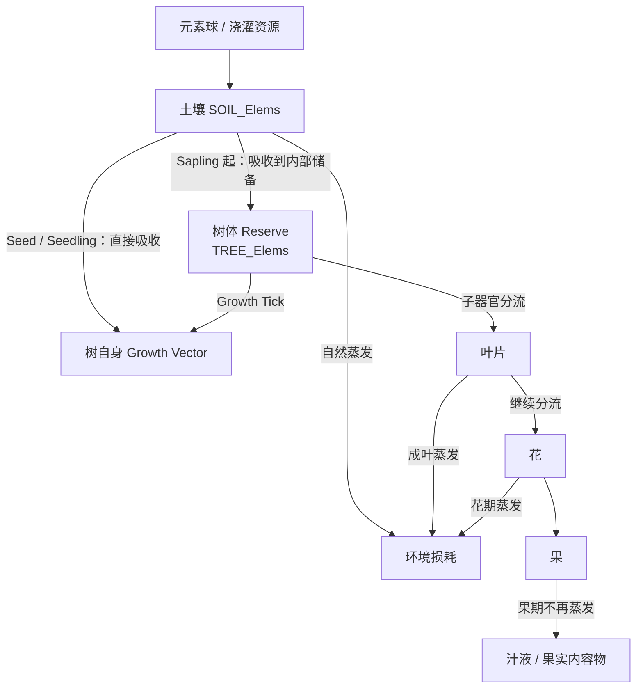

# 水瓜厨房 MVP：七元素养分与生长系统

本文件把根目录通用的 [植物养分—生长系统](../../docs/plants/nutrient-growth-system.md) 映射到千星奇域水瓜树。

本版本中：

```text
Nutrient        = 七元素力
Soil Reservoir  = 土壤七元素储备
Plant Reserve   = 树体内部七元素储备
RootPreference  = 根系对七元素的吸收偏好（0~1）
Affinity        = 七元素成长亲和 / 转换效率
Growth Vector   = 七元素生长度向量
```

具体每个生长结算周期内发生什么，以根目录 [Growth Tick](../../docs/plants/growth-tick.md) 为统一规则；本文件只定义水瓜树的器官关系、阶段、当前调试参数和体验目标。

---

## 1. 总体养分流


```mermaid
flowchart TD
    A[元素球 / 浇灌资源]
    --> B[土壤 SOIL_Elems]

    B -->|自然蒸发| X[环境损耗]
    B -->|Seed / Seedling：直接吸收| D[树自身 Growth Vector]
    B -->|Sapling 起：吸收到内部储备| C[树体 Reserve<br/>TREE_Elems]

    C -->|Growth Tick| D

    C -->|子器官分流| E[叶片]
    E -->|继续分流| F[花]
    F --> G[果]

    E -->|成叶蒸发| X
    F -->|花期蒸发| X
    G -->|果期不再蒸发| H[汁液 / 果实内容物]
```

玩家浇灌的是**土壤**，不是直接给树体写入元素。

土壤承担植物与外部世界之间的“养料接口”。从更广义的生长模型看，树本身可以被视为土壤的一个下游器官。

---

## 2. Growth Tick 与时间尺度

Growth Tick 现在只表示“一次生长结算事件”，不再把 Tick 自身当作固定自然时间单位。

自然规律统一使用：

```text
RatePerHour + dt
```

在线更新周期只决定反馈频率：

```text
CFG_GrowthUpdateIntervalSeconds
```

当前第一版倾向：

```text
CFG_GrowthUpdateIntervalSeconds = 60
```

即在线约每分钟结算一次。以后可以改成 30 秒或其他值，而不需要重新调整植物每小时的成长速度。

当前时间速率基线：

```text
SoilRetentionPerHour = 0.99
TreeGrowthRetentionPerHour = 0.99
```

含义分别是：

- 土壤在 1 小时后保留约 99% 当前元素；
- 树体在 1 小时内约拿出当前 Reserve 的 1% 用于生长代谢。

任意 dt 使用连续时间等价公式，例如：

```text
SOIL_Elems[i]
*= SoilRetentionPerHour ^ dtHours

Consumed[i]
=
TREE_Elems[i]
× (1 - TreeGrowthRetentionPerHour ^ dtHours)
```

当前基础生长链使用统一总吸收上限：

```text
CFG_MaxTotalAbsorbPerHour = 1.0
```

当前版本的 Seed / Seedling / Sapling 都使用同一个总吸收上限。Seed / Seedling 通过 GrowthThreshold 推进；Sapling 作为长期玩法阶段继续沿用同一吸收上限，不再通过 Stage 升级改变总吞吐。

当前结算量：

```text
MaxAbsorbThisUpdate
=
CFG_MaxTotalAbsorbPerHour × dtHours
```

在线与离线应尽量共享同一套公式。离线时直接按真实经过时间计算；只有遇到 Stage 升级、器官生成等离散事件时才分段处理。

Debug UI 需要提供“立即推进下一次 Growth Tick”的能力。Debug 强制 Tick 使用一个标准在线更新步长：

```text
dt = CFG_GrowthUpdateIntervalSeconds
```

这样可以在游戏内连续测试生长，而不必真实等待一分钟。

具体结算顺序见根目录 [Growth Tick](../../docs/plants/growth-tick.md)。

---

## 3. 土壤七元素储备

土壤保存：

```text
SOIL_Elems : float[7]
```

七元素顺序继续遵循：

```text
Fire / Hydro / Anemo / Electro / Dendro / Cryo / Geo
```

当前总容量：

```text
MaxSoilElementLoad = 100
```

### 3.0 元素球输入

元素球自身保存：

```text
BALL_Elems : float[7]
```

当前 MVP 只生成纯净元素球，即每个球只有一个元素维度大于 0，但接口仍保持完整七元素向量。

当前元素球数值基线：

```text
BallInitialAmount = random(8, 10)
BallHalfLife = 15 min
BallDestroyThreshold = 1
BallSpawnCheckInterval = 5 min
```

每 5 分钟最多尝试生成 1 个新球。生成概率读取当前场上所有未捕获元素球的元素总量：

```text
FieldBallTotal
=
Σ all active BALL_Elems

SpawnChance
=
1 / (1 + (FieldBallTotal / 28)^3)
```

这里不存在硬性的“最多 8 个球”上限；总元素量越高，继续生成的概率越低，目标是形成大概率约 8 个以内的软稳态。

`generate_elem_ball(InputElems)` 在以当前 Tree / 种植区为中心的圆环范围内随机生成元素球。圆环内径应避开 Soil 捕获区，避免出生即被土壤接收。

未被捕获的元素球：

- 玩家进入吸引范围后缓慢向玩家飘动；
- 根据所含元素显示颜色；
- 按真实经过时间使用 15 分钟半衰期连续衰减：

```text
BALL_Elems[i]
*= 0.5 ^ (dtMinutes / 15)
```

当：

```text
Σ BALL_Elems < 1
```

时销毁元素球。

登录时不额外生成“补偿球”，而是最多回放最近 30 分钟的正常刷新历史：

```text
SimulateWindow
=
min(actualOfflineElapsed, 30 min)
```

回放仍按每 5 分钟一次的正常生成检查处理，并根据每个球真实的 SpawnTime 计算登录时剩余元素量。

Soil 的感应区捕获带有 `ElementBall` 标签的实体时，直接执行：

```text
SOIL_Elems[i]
+= BALL_Elems[i]

Destroy ElementBall
```

不设置 Pending，不在捕获阶段做容量计算；`SOIL_Elems` 可以暂时超过容量。

### 3.1 Growth Tick 开头的容量归一化

每次 Soil Growth Tick 开始时：

```text
SoilTotal
=
Σ SOIL_Elems[i]
```

如果：

```text
SoilTotal <= MaxSoilElementLoad
```

则不处理。

如果：

```text
SoilTotal > MaxSoilElementLoad
```

计算：

```text
KeepRatio
=
MaxSoilElementLoad / SoilTotal

SOIL_Elems[i]
*= KeepRatio
```

例如：

```text
初始：
雷 50
水 30
草 20

捕获 +50 雷后：
雷 100
水 30
草 20
总量 150

下一 Tick：
KeepRatio = 100 / 150

结果：
雷 ≈ 66.67
水 = 20
草 ≈ 13.33
```

下一次再捕获 50 雷并经过下一 Tick，结果约为：

```text
雷 ≈ 77.78
水 ≈ 13.33
草 ≈ 8.89
```

因此单一元素连续浇入会逐步替换原有组成，并保留递推残留。

超出容量的：

```text
Overflow
=
SoilTotal - MaxSoilElementLoad
```

当前直接丢弃；未来可接入气候系统。

容量归一化完成后再继续：

```text
Soil evaporation
→ Tree absorption
```


### 3.2 土壤蒸发

土壤蒸发使用单位时间保留率，不再写成“每 Tick 固定减少 1%”。

当前基线：

```text
SoilRetentionPerHour = 0.99
```

任意结算周期：

```text
SOIL_Elems[i]
*= 0.99 ^ dtHours
```

第一版先把蒸发视为直接损耗。

未来这些逸散可以进入气候系统，但当前不实现，见 [气候系统占位](../../docs/plants/climate-system.md)。

---

## 3.3 Growth 驱动的亲和学习

水瓜树当前 Stage 的 Effective Affinity 只由本阶段已经形成的 `TREE_Growth[7]` 决定，不读取 `TREE_Elems[7]` 的当前储备比例。

当前配置：

```text
ExtraAffinity = 1
CFG_AffinityInherifanceRate = 0.5
```

计算：

```text
GrowthTotal = Σ TREE_Growth[i]

GrowthShare[i]
= TREE_Growth[i] / GrowthTotal

AffinityOffset[i]
= ExtraAffinity × GrowthShare[i]

TREE_EffectiveAffinity[i]
= TREE_BaseAffinity[i] + AffinityOffset[i]
```

当 `GrowthTotal = 0`：

```text
AffinityOffset[i] = 0
TREE_EffectiveAffinity[i] = TREE_BaseAffinity[i]
```

因此：

> Reserve 表示“当前体内还储存着什么”，Growth 表示“这些元素已经把植物长成了什么”。

只有 Growth 会塑造当前亲和。

### Seed / Seedling Stage 升级

Seed / Seedling 自身进入下一 Stage：

```text
TREE_EffectiveAffinity
→ 下一 Stage TREE_BaseAffinity

TREE_Growth
→ 清零
```

### Sapling 主干亲和循环

Sapling 不再继续升级到 Mature。当前主干 Growth 只用于自身亲和塑形和出芽竞争。

当前主干一轮 Growth 上限：

```text
SaplingTreeGrowthCycle = 100
```

当：

```text
Σ TREE_Growth >= 100
```

时：

```text
根据本轮 TREE_Growth[7] 的组成更新 / 固定 Tree Affinity
→ TREE_Growth 开启下一轮累计
→ Tree Stage 不变化
```

因此“主干长满”表示完成一次树体亲和塑形周期，不表示进入新的 Tree Stage。

### 叶芽与叶片亲和

新叶先经历 Bud 阶段。Bud 使用独立的：

```text
BUD_Growth[7]
```

并沿用既有父子器官亲和初始化：

```text
ParentOffset[i]
=
TREE_EffectiveAffinity[i]
-
TREE_BaseAffinity[i]

BUD_BaseAffinity[i]
=
CFG_LeafAffinity[i]
+
ParentOffset[i] × CFG_AffinityInherifanceRate
```

当前继承率为 0.5。

Bud 出现后，新产生的“主干自身 Growth”不再进入 TREE_Growth，而进入 BUD_Growth。Bud 的颜色 / 元素倾向直接读取这段实际 Growth 的组成。

当 Bud 累积满当前阈值 20 后：

```text
Σ BUD_Growth >= 20
→ 固定 Bud 当前 Effective Affinity
→ Bud 成为 Tender Leaf / 小叶
→ 新叶从该亲和起点继续自己的 Growth
```

如果玩家在 Bud 完成前掐掉嫩叶芽：

```text
TREE_Growth[i] += BUD_Growth[i]
Destroy Bud
```

即芽期已经形成的 Growth 完整退回主干，不产生额外损耗。

---

## 4. 树从土壤吸收

根系吸收由三层约束共同决定：

```text
RootPreference
→ 混合 Soil 中偏向吃什么

Affinity
→ 单元素通道能吃到多高
→ 吸收后转成 Growth 有多高效

Soil Supply
→ 实际有没有这么多元素可吃
```

当前 Tree RootPreference 已锁定：

```text
CFG_TreeRootPreference[7]
=
[0.80, 1.00, 0.85, 0.75, 1.00, 0.70, 0.90]
```

顺序仍为：

```text
Fire / Hydro / Anemo / Electro / Dendro / Cryo / Geo
```

RootPreference 每个分量严格位于 0～1。它不再与 Growth Affinity 使用同一组数值。

### 4.1 总吸收上限

当前基础生长链统一使用：

```text
CFG_MaxTotalAbsorbPerHour = 1.0
```

当前版本使用同一总吸收上限：

```text
Seed
Seedling
Sapling
```

Seed / Seedling 通过 GrowthThreshold 推进到下一阶段。Sapling 是当前版本的主要长期玩法阶段，不再继续推进到 Mature；Mature 的最终设计延后。

任意 dt：

```text
MaxTotalAbsorbThisUpdate
=
1.0 × dtHours
```

总实际吸收还必须满足：

```text
Σ AbsorbElems[i]
<= MaxTotalAbsorbThisUpdate

AbsorbElems[i]
<= SOIL_Elems[i]
```

### 4.2 单元素饱和

单元素基础吸收上限份额：

```text
SingleElementBaseCapShare = 0.30
```

某个元素的理论单通道上限：

```text
ElementCap[i]
=
CFG_MaxTotalAbsorbPerHour
× 0.30
× Affinity[i]
```

当前 Tree 基础 Affinity：

```text
[0.85, 1.15, 0.90, 0.75, 1.20, 0.70, 0.95]
```

因此理论单元素吸收上限 / h：

| 元素 | Cap / h |
| --- | ---: |
| Fire | 0.255 |
| Hydro | 0.345 |
| Anemo | 0.270 |
| Electro | 0.225 |
| Dendro | 0.360 |
| Cryo | 0.210 |
| Geo | 0.285 |

这里故意允许 Affinity 同时带来两层收益：

```text
高 Affinity
→ 对应元素通道上限更高
→ 同样元素转换 Growth 也更高效
```

这为后续“培养高亲和、高产量的特化品种”预留长期价值。

单元素即使供应无限，也不能直接填满 1.0/h；多种元素通道可以叠加，熟练玩家可以用主元素 + 辅助元素在“元素倾向”和“总生长速度”之间做配比。

Soil 中某元素实际供应不足时，实际吸收还会进一步低于该通道上限。因此早期只收一种随机元素球，不仅受到 30% 基准 Cap 限制，还会受到自然刷新供给不足的限制。

**尚未锁定：**

- ElementCap 最终读取当前 Stage 的 BaseAffinity 还是实时 EffectiveAffinity；
- 多元素在 RootPreference、各自 ElementCap 与 Soil 可用量之间的最终重分配算法。

实现阶段不得自行补这两个规则。

### 4.3 Seed / Seedling 与 Sapling 的状态边界

Seed 和 Seedling 没有 Tree Reserve：

```text
Seed / Seedling

Soil
→ Calculate_Absorption
→ 按 Growth Affinity 直接转成 TREE_Growth
```

进入 Sapling 后才开始拥有：

```text
TREE_Elems[7] / Reserve
```

后续才进入：

```text
Soil
→ Reserve
→ Growth metabolism
→ Tree / Leaf / Flower / Fruit 分流
```

因此 Reserve 是小树开始形成复杂器官后的内部缓冲，不参与 Seed / Seedling 的基础成长。

### 4.4 培养速度的结构性检查

普通随机七元素、能够吃满 1.0/h 时，当前 RootPreference 加权后的基础平均 Growth Affinity 约为：

```text
0.9504
```

所以满速普通 Growth 约：

```text
0.9504 Growth / hour
```

理论策略检查：

```text
普通随机七元素：
Absorb ≈ 1.0/h
Growth ≈ 0.9504/h

纯 Dendro：
Absorb cap = 0.36/h
Growth ≈ 0.432/h

Hydro + Dendro：
Absorb cap = 0.705/h
Growth ≈ 0.829/h

Hydro + Dendro + Geo：
Absorb cap ≈ 0.99/h
Growth ≈ 1.10/h
```

这意味着“只喂目标元素”很准但慢；懂配比的玩家可以用辅助元素补总吞吐，并可能比完全随机杂食更高效。这是有意保留的培养深度。

完整数值速查与推算见 [基础生长数值速查](growth-balance-baseline.md)。


---

## 5. Seed → Seedling → Sapling

正式 Tree Stage 之前，水瓜以半埋在土中的 Seed 状态存在。

当前早期阶段：

```text
Seed
→ Seedling
→ Sapling
→ Mature
```

Seed 不计入正式 Tree Stage 编号，但它和 Seedling 一样都直接从 Soil 吸收并形成 Growth，不再使用独立的 GerminationProgress / GerminationRate 计时器。

### 5.1 Seed → Seedling

Seed 没有 Reserve：

```text
Soil
→ Absorb
→ Growth Conversion
→ SEED_Growth[7]
```

当前阈值：

```text
SeedGrowthThreshold = 45
```

普通随机混合供给、满吸收时：

```text
AverageGrowthAffinity ≈ 0.9504
FullSpeedGrowth ≈ 0.9504 / h

45 / 0.9504
≈ 47.35 h
```

因此积极玩家第一次把 Soil 做到 80 以上并规律维护时，第三个自然日 / 超过约 48 小时再次上线，应已经看到发芽后的 Seedling。

Seed Growth 本身已经保存七元素组成，因此发芽前后的轻微颜色变化、粒子逸散等表现可以直接读取真实 Growth / Affinity，不再额外维护一套 Germination Exposure。

Stage 切换：

```text
Seed Growth 达到 45
→ 当前 EffectiveAffinity 固化为 Seedling BaseAffinity
→ Growth 清零
→ 进入 Seedling
```

### 5.2 Seedling → Sapling

Seedling 同样没有 Reserve：

```text
Soil
→ Absorb
→ Growth Conversion
→ TREE_Growth[7]
```

当前阈值：

```text
SeedlingGrowthThreshold = 90
```

普通随机混合供给、满吸收时：

```text
90 / 0.9504
≈ 94.70 h
```

因此两个早期阶段理论合计：

```text
≈ 142.0 h
≈ 5.92 days
```

真实随机、漏球和非满 Soil 会留出少量余量，使积极玩家自然落在“约一周进入 Sapling”的目标窗口。

### 5.3 Sapling：当前版本的主要长期阶段

进入 Sapling 后：

- 开始拥有 `TREE_Elems[7] / Reserve`；
- 开始进入 Tree Reserve → Growth 的代谢；
- 开始抽叶、开花、结果和长期亲和塑形；
- 总吸收上限仍为 1.0/h；
- 当前版本不再推进到 Mature，最终成株设计延后；
- 当前树冠上限为 3 片叶。

Sapling 的主要体验不再是“等待下一 Stage”，而是：

```text
维护 Soil / Reserve
→ 主干亲和逐轮塑形
→ 每日尝试出芽
→ 叶片竞争生长预算
→ 花 / 果生产
→ 玩家通过掐芽改变“扩张叶片”与“主干塑形”的取舍
```

### 5.4 每日 04:00 出芽检查

出芽是每日离散事件，不在每个 Growth Tick 中投概率。

当前统一使用服务器时间：

```text
DailyBudCheckAt = 04:00
```

每跨过一个 04:00 边界，先把上一事件边界到 04:00 之间的连续 Growth 结算完，再根据 04:00 当时的真实状态进行一次出芽判断。

如果已经存在 Active Bud，则当天不再投新的出芽概率。

当前概率：

| 当前已形成叶片数 | 04:00 出芽概率 |
| ---: | ---: |
| 0 | 0.80 |
| 1 | 0.40 |
| 2 | 0.01 |
| 3 | 0 |

因此：

- 0 → 1 叶是快速建立基础生产能力；
- 1 → 2 叶是几天内逐渐形成的正常扩张；
- 2 → 3 叶是长期低概率的旺盛状态；
- 3 叶是当前版本树冠上限，不再继续出芽。

如果 04:00 检查失败，当天不补投；下一次机会是下一个 04:00。

### 5.5 Bud Growth 路由与“掐芽催熟”

Tree Reserve 每次代谢产生本 Tick 的生长养分预算后，先向已经形成的叶片 / 下游器官分流；剩余的 Tree Own Budget 再按 Tree Affinity 转成“主干自身 GrowthGain”。

没有 Active Bud 时：

```text
Tree Own GrowthGain
→ TREE_Growth[7]
```

存在 Active Bud 时：

```text
Tree Own GrowthGain
→ BUD_Growth[7]

TREE_Growth 暂停增加
```

Bud 当前 Growth 阈值：

```text
BudGrowthThreshold = 20
```

玩家在芽未完成时采掉它：

```text
TREE_Growth[i] += BUD_Growth[i]
BUD_Growth = 0
Destroy Bud
```

因此“掐芽催熟”不依赖额外 Buff。玩家只是取消这次叶片扩张，把芽期投入完整退回主干，使主干更快完成自己的 100 Growth 亲和塑形周期。

如果不掐：

```text
Σ BUD_Growth >= 20
→ 固定 Bud Affinity
→ 成为新叶
→ 这 20 Growth 已经真正投入器官，不再回主干
```

### 5.6 叶片数量与主干预算

沿用旧版“子器官先分流、主干拿剩余”的设计。当前每片已形成叶片占用约 0.3 的 Tree Growth Nutrient Budget：

```text
0 叶：
Tree 1.0

1 叶：
Tree 0.7
Leaf A 0.3

2 叶：
Tree 0.4
Leaf A 0.3
Leaf B 0.3

3 叶：
Tree 0.1
Leaf A 0.3
Leaf B 0.3
Leaf C 0.3
```

这里的比例作用于“本 Tick 的生长养分预算”，不是从已经累计的 TREE_Growth 中持续扣值。

所以第三片叶虽然增加生产器官，但会让主干自身 Growth 几乎停止；这是当前设计的预期取舍。

有 Active Bud 时，Bud 只接管上表中的 Tree 份额，不会抢走已有 Leaf / Flower 已经分到的预算。

### 5.7 第一周与 Sapling 体验目标

```text
Day 0
→ 第一次进入
→ 积极玩家通常把 Soil 做到 80+
→ 休闲玩家可以直接做到 100

约 47h
→ Seedling
→ 第三个自然日上线时应已经看到发芽后的幼苗

再约 95h
→ Sapling

理论满速总计约 6 天
→ 真实体验约一周
→ 正式进入长期抽叶 / 花果玩法
```

进入 Sapling 以后，当前参数的第一轮平衡目标是：

- 第一片叶很快开始形成；
- 大约一周逐渐进入两叶主状态；
- 第三片叶在前几周只出现在少量植株上；
- 玩家掐芽可以明显提高主干亲和塑形速度，但会放弃叶片生产扩张；
- 当前版本不以进入 Mature 作为主要目标。


---

## 6. Sapling 起的树体内部储备、休眠与生长

Tree Reserve 从 Sapling 开始进入模型。Seed / Seedling 不拥有 Reserve。

树内部储备总量：

```text
TreeReserveTotal = Σ TREE_Elems[i]
```

树体颜色可以读取当前 Reserve 组成作为表现来源之一，因此进入 Sapling 后，植株本身能够持续显示当前内部营养倾向。

### 6.1 休眠迟滞

当前沿用已有基线：

```text
Growing:
TreeReserveTotal < 30
→ Dormant

Dormant:
TreeReserveTotal >= 80
→ Growing
```

Dormant：

- 仍允许继续从 Soil 吸收；
- 暂停正常 Growth Conversion；
- 不死亡；
- 达到恢复阈值后重新启动生长。

`30 / 80` 当前仍属于 Sapling 长期平衡需要复核的基线，不在本轮早期阶段数值中重新锁死。

### 6.2 Tree Reserve 生长代谢

当前基线：

```text
TreeGrowthRetentionPerHour = 0.99
```

任意结算周期：

```text
Consumed[i]
=
TREE_Elems[i]
× (1 - 0.99 ^ dtHours)
```

这些养分先进入子器官分流，再由剩余预算按完整 Growth Affinity 转换为 Tree Own GrowthGain。

当前叶片分流基线为每片 0.3；0 / 1 / 2 / 3 叶对应主干剩余 1.0 / 0.7 / 0.4 / 0.1。存在 Active Bud 时，Tree Own GrowthGain 改写入 BUD_Growth；否则写入 TREE_Growth。

Sapling 的 Reserve 上限、初始 Reserve、叶 / 花 / 果后续阈值与实际周产量仍需继续平衡。


---

## 7. 叶片

当前叶—花—果的玩家可见发育链：

```text
嫩叶芽 Bud
→ 小叶
→ 大叶·花苞
→ 大叶·鲜花
→ 大叶·幼果
→ 成叶·成果
```

内部仍可保留 Leaf 的 Tender / Thick / Mature 语义，但表现与花果状态按上面的连续链组织。Bud 是成为正式叶片之前的独立前置状态。

叶片**没有独立 Reserve**。

它每 Tick 从树体本次生长预算中获得养分，吸多少就当次用于：

- 向自己的子器官继续分流；
- 环境蒸发；
- 转换为 `LEAF_Growth[7]`。

### 7.1 嫩叶

Tender：

- 当前不设置环境损耗；
- 获得的有效养分可以快速转换为 Growth；
- 亲和仍处于连续学习状态；
- 颜色 / 形态可以随着 Growth 与 Effective Affinity 改变。

### 7.2 肥厚叶

Thick：

- 继续进行连续学习；
- 继续积累自己的 Growth Vector；
- 可以作为后续 Mature 前的过渡阶段；
- 具体蒸发参数在叶片 Spec 中确定。

### 7.3 成叶

Mature：

- 当前叶片自身保留率基线为 `0.6`；
- 即自身预算的约 `40%` 逸散到环境；
- 仍可继续承担下游花 / 果的供给；
- 自身 Growth 累积明显慢于嫩叶；
- 外观阶段稳定，但内部隐藏 Affinity 仍可作为后续系统数据存在。

例如一片成叶本 Tick 得到 10 单位养分，并带有一朵吸收 50% 预算的花：

```text
10
→ 花 5
→ 叶剩 5

叶自身：
5 × 0.6 = 3 用于 Growth
5 × 0.4 = 2 逸散到环境
```

### 7.4 叶片 Stage 升级

每次叶片进入下一 Stage：

```text
清空 LEAF_Growth[7]
当前 Effective Affinity
→ 固定为下一 Stage 的 Base Affinity
```

只保留**连续学习**。

不再额外设置“阶段跃迁时给某元素一次离散双倍奖励”。

### 7.5 叶片表型

进入新 Stage 时，根据该阶段固定下来的 Base Affinity 判断是否达到元素形态阈值。

```text
某元素 Affinity 达到表现阈值
→ 对应颜色 / 变种形态

未达到
→ 普通叶片形态
```

没有达到表现阈值并不意味着该元素亲和消失。

因此普通外观叶片仍可能携带隐藏的“遗传信息”。

多种元素同时超过阈值时如何选择视觉主形态，留到表现 Spec 确定。

---

## 8. 花与果

花和果是**同一个器官的两个 Stage**：

```text
Flower
→ Fruit
```

### 8.1 Flower Stage

花：

- 没有独立长期 Reserve；
- 从上游叶片本 Tick 的养分预算中优先分流；
- 具有环境蒸发；
- 持续进行 Affinity 学习；
- 持续累积自己的 Growth Vector；
- 不从已经累计好的 LEAF_Growth 中持续扣取 Growth。

花期累积的 Growth / Affinity 决定未来果实的：

- 果皮颜色；
- 基础形态 / 变种形态；
- Fruit Stage 的固定元素亲和。

可以理解为：

> 花在进入 Fruit Stage 后，花本身成为了果皮与外层形态。

### 8.2 Fruit Stage

进入 Fruit Stage 时：

- 固定 Affinity；
- 不再继续进行 Affinity 学习；
- 不再按花期规则向环境蒸发；
- 后续吸收重点用于累积汁液 / 果实内容物；
- 达到成熟条件后可采集。

因此：

```text
Flower 决定“果子长成什么样”
Fruit 决定“果子最终装了多少内容物”
```

当前花果体验节奏继续保持约 2 天。表现顺序为：

```text
大叶·花苞
→ 大叶·鲜花
→ 大叶·幼果
→ 成叶·成果
≈ 48h
```

各子阶段如何拆分这 48 小时尚未锁定。

---

## 9. 提前采摘与叶片分支

下游器官会改变上游器官的养分去向。

如果玩家提前摘掉花 / 果：

```text
原本流向花果的养分需求消失
→ 更多养分留在叶片
→ 叶片可以进入多汁成熟方向
```

因此“提前摘果后出现多汁叶”不作为孤立特殊规则，而是作为养分流变化产生的成熟分支。

具体触发条件和多汁叶数值留到叶—花—果联动 Spec 决定。

---

## 10. 亲和的长期意义

当前千星奇域版本只需要实现：

```text
Base Affinity
→ 连续学习
→ Stage 固定
→ 影响单元素吸收通道上限
→ 决定 Growth 转换效率
→ 决定外观 / 生长速度
```

完整游戏未来还会继续：

```text
成熟果实采摘
→ 锁定果实 Affinity
→ 作为种子
→ 下一代继承
```

形成隔代培养。

**千星奇域当前版本不实现重新播种和亲和遗传。**

遗传规则只保留为根目录通用植物系统的长期设计。

---

## 11. 当前体验目标

本系统的平衡目标不是让低频玩家“错过一天就停长”，也不是让长期挂机线性换取无限产量。

当前希望形成：

- 第一次进入的玩家通常会想尽可能多做一些事，正常目标是把 Soil 做到至少 80；休闲玩家可以直接浇满 100；
- 积极玩家第三个自然日 / 超过约 48 小时再次上线时，应已经看到发芽后的幼苗；
- 积极玩家持续规律维护约一周，应进入 Sapling，开始进入抽叶 / 开花阶段；
- 半休闲玩家形成“第一次浇透 → 第二次补水并看到发芽过程 → 第三次已发芽”的连续反馈；
- 每周一次玩家第一次浇满 100，一周后回来时应看到已经发芽并继续成长了一段时间的植物，同时 Soil 已明显需要再次维护；
- 完全不了解系统的新人把随机元素球都投入土壤，通常得到普通水瓜，但随机输入保留偶然形成 Hydro / Dendro 倾向、发现特殊水瓜的机会；
- 主动只供给单元素可以稳定定向，但受到单元素通道 Cap 和自然供给不足双重限制，总成长明显变慢；
- 有经验的玩家可以用目标元素 + 辅助元素补足吞吐，在性状与产量之间寻找更高效的配比。

成熟期仍保留以下待反推的周产量目标：

| 上线习惯 | 目标 |
| --- | ---: |
| 每天维护 | 约 4–6 个水瓜 / 周 |
| 每周 2–3 天 | 约 2–4 个水瓜 / 周 |
| 每周 1 天 | 约 2 个水瓜 / 周，且再次上线时 Soil 已明显需要维护 |

完整体验—数值速查见 [基础生长数值速查](growth-balance-baseline.md)。


---

## 12. 当前实现边界

第一轮可见闭环优先实现：

```text
元素球
→ Soil
→ Seed：直接吸收并形成 Growth
→ Seedling：直接吸收并形成 Growth
→ Sapling：开始拥有 Reserve
→ Tree Growth / 叶片 / 花果分流
→ 叶片阶段变化
→ 颜色变化
→ 采集
```

暂时不要求同时实现：

- 花 / 果完整链；
- 汁液成熟；
- 遗传；
- 气候反馈；
- 复杂多代育种。

这些内容已经在模型中预留接口，但应继续按 SDD Feature / Spec 分批实现。
