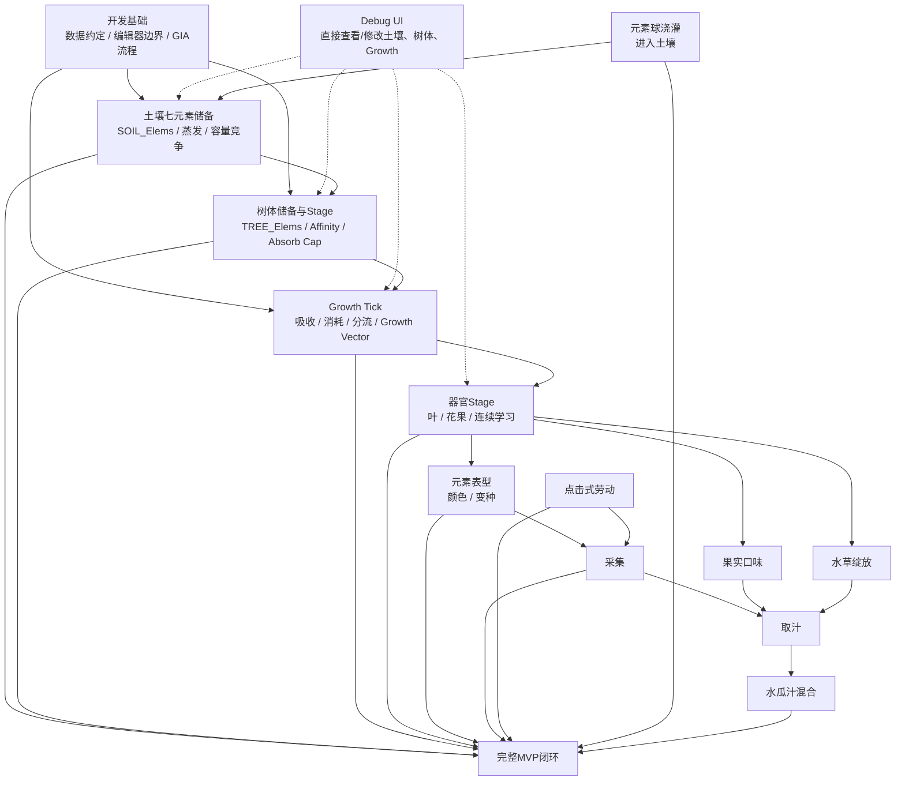

# 水瓜厨房 MVP：实现路线图与 Spec 工作流

本文件把当前 MVP 拆成可以逐项选择和实现的功能点，并规定从“选择功能”到“开始编码”的 SDD 工作流。

它回答两个问题：

1. **当前还有哪些功能需要实现？**
2. **选中一个功能后，怎样拆成流程块、文件和可验收的 Issue / Spec？**

本文件只组织已经进入当前设计范围的内容，不擅自补充尚未确定的玩法规则。具体数值和玩法语义仍以 `requirements.md`、`development-conventions.md`、`elemental-cultivation.md`、`interaction.md` 以及对应已确认 Issue 为准。

---

## 一、功能依赖总图



说明：

- 箭头表示**实现依赖或集成依赖**，不是强制开发顺序。
- 新版核心不再是“浇灌直接写 TREE_Elems”，而是“土壤储备 → 树体吸收 → Growth Tick → 器官生长”。
- Growth 是七元素向量，不再是单一标量。
- 一个 Feature 可以拆成多个简单 Flow Block；一个 Flow Block 也可以涉及多个源码、复合节点和编辑器绑定文件。
- 生长系统 source of truth：[`growth-system.md`](growth-system.md)。
- 通用 Tick 规则：[`docs/plants/growth-tick.md`](../../docs/plants/growth-tick.md)。

---

## 二、当前功能 Checklist

### F0 — 开发基础与数据约定

- [x] 七元素固定索引顺序已经确定。
- [x] `CFG`、树体七元素列表和锁定列表的数据方向已经确定。
- [x] 已验证 TypeScript → genshin-ts → `.gia` → 编辑器手动导入的服务器节点图流程。
- [x] 已确定“算法代码优先 + 编辑器手动绑定 + 必要时人工复合节点”的开发边界。
- [ ] 为后续正式节点图统一命名规则、文件组织和手动接入标记方式。
- [ ] 确定一个不会改变运行语义的“MANUAL: connect compound node ...”占位实现方式。

**状态：基础可用，仍有少量工程规范需要在实际功能开发中收敛。**

---

### F0-Debug — 开发调试 UI

目标：为早期垂直切片提供一个非玩家玩法 UI，直接观察和修改新版养分—生长系统关键状态。

需要至少覆盖：

- [ ] 显示 / 修改 `SOIL_Elems[7]`。
- [ ] 显示 / 修改 `TREE_Elems[7]` Reserve。
- [ ] 显示树 Stage、休眠 / 生长状态。
- [ ] 显示 / 修改 `TREE_Growth[7]`。
- [ ] 显示当前 `LastGrowthTickAt`、当前 UTC 和错过 Tick 数。
- [ ] 显示各叶片 Stage、Growth Vector、Base / Effective Affinity。
- [ ] 可以直接修改 Growth Vector，使树或叶片快速越过 Stage / 生成阈值。
- [ ] 可以直接修改测试亲和，用于验证吸收、Growth 转换与显色。
- [ ] UI 明确标记为 Debug，正式玩家界面不可见。

旧 `TREE_Locks` 可继续为实验图保留，但新版锁定语义尚未重新设计，不作为本 Debug UI 的正式验收项。

**用途：开发验证工具，不属于正式玩法 Feature。**

---

### F1 — 土壤与树体基础运行时状态

目标：建立新版养分流最小状态，使后续 Growth Tick 有明确 source / reserve / growth。

需要至少覆盖：

- [ ] `SOIL_Elems : float[7]`。
- [ ] `TREE_Elems : float[7]`，表示树体内部 Reserve。
- [ ] `TREE_Growth : float[7]`。
- [ ] Tree Stage：Seedling / Sapling / Mature。
- [ ] Base / Effective Affinity。
- [ ] `LastGrowthTickAt`。
- [ ] 初始值、合法性与保存 / 读取边界。
- [ ] 与关卡 `CFG` 的读取边界。

**预期实体：Soil / Plot、Watermelon Tree、Level / Stage Config。**

---

### F2 — Growth Tick 与离线补算

目标：实现统一的一小时级生长 Tick，把土壤蒸发、树体吸收、生长消耗、子器官分流、Growth Vector 和 Stage 判定串成可补算流程。

当前调试基线：

```text
GrowthTickInterval = 1h
SoilEvaporationRatePerTick = 1%
TreeGrowthConsumeRatePerTick = 1%
```

需要覆盖：

- [ ] F2.1 根据 UTC 初始化 / 读取 `LastGrowthTickAt`。
- [ ] F2.2 计算需要补算的 Tick 数。
- [ ] F2.3 土壤每 Tick 蒸发。
- [ ] F2.4 树按 Stage 的总吸收上限和 Affinity 从土壤吸取。
- [ ] F2.5 Tree Reserve 低于休眠阈值时暂停 Growth Conversion。
- [ ] F2.6 恢复阈值达到后继续生长。
- [ ] F2.7 每 Tick 从 Tree Reserve 中取出生长养分预算。
- [ ] F2.8 先分给子器官，再把剩余按完整 Affinity 转为 `TREE_Growth[7]`。
- [ ] F2.9 执行连续学习。
- [ ] F2.10 检查 Stage / 器官生成。
- [ ] F2.11 离线补算与在线 Tick 结果一致或有明确等价近似。

复杂数学与向量计算按需要拆独立复合节点，不把完整 Tick 内联成单张巨图。

根规则见 [Growth Tick](../../docs/plants/growth-tick.md)。

---

### F3 — 土壤浇灌与容量竞争

目标：玩家输入元素时修改的是土壤，而不是直接修改树体 Reserve。

需要覆盖：

- [ ] F3.1 输入元素索引与输入量。
- [ ] F3.2 `MaxSoilElementLoad = 100`。
- [ ] F3.3 输入导致超载时，按浇灌前旧土壤元素比例挤出。
- [ ] F3.4 同种旧元素也参与挤出。
- [ ] F3.5 挤出完成后再加入新输入。
- [ ] F3.6 保证结果总量不超过容量。
- [ ] F3.7 表格测试覆盖单元素、高混合、满容量、空土壤等边界。

例如：

```text
雷50 火30 水20 + 雷10
→ 先挤出 雷5 火3 水2
→ 再 + 雷10
→ 雷55 火27 水18
```

这使单一元素培养具有自然边际递减。

旧版“新输入受保护，只挤出其他元素”的规则废止。

---

### F4 — 元素球刷新、衰减与牵引浇灌

设计入口：GitHub Issue #1。

目标：把土壤浇灌资源变成世界中可观察、会自然蒸发、可由玩家选择并牵引的元素球。

需要覆盖：

- [ ] F4.1 元素球实体数据。
- [ ] F4.2 15 分钟半衰期衰减。
- [ ] F4.3 小于 1 时消失。
- [ ] F4.4 在线每 3～5 分钟自然生成一个 5～8 大小元素球。
- [ ] F4.5 不设硬上限，由生成率与寿命形成约 10 个的自然存量。
- [ ] F4.6 退出时保存场上仍存在的球。
- [ ] F4.7 登录时先按 UTC 时间更新已保存球。
- [ ] F4.8 只模拟登录前最后 45 分钟的离线生成事件。
- [ ] F4.9 玩家与元素球交互后进入牵引状态。
- [ ] F4.10 靠近树苗后自动吸附。
- [ ] F4.11 以吸附时剩余元素量提交给 F3，进入土壤储备。
- [ ] F4.12 元素种类第一版随机。

仍待后续 Spec 明确：

- 刷新位置 / 刷新点；
- 牵引移动方式与中断；
- 吸附半径和表现；
- 多人归属；
- 元素种类未来的针对性和故事性。

---

### F5 — 器官 Stage、生长与连续学习

目标：实现器官作为下游消费者的生长链，而不是旧版“一次性元素快照”。

需要覆盖：

- [ ] F5.1 器官拥有 Growth Vector。
- [ ] F5.2 器官拥有 Base / Effective Affinity。
- [ ] F5.3 未定型 Stage 执行连续学习。
- [ ] F5.4 Stage 升级时清空 Growth Vector。
- [ ] F5.5 Stage 升级时将当前 Effective Affinity 固定为下一 Stage Base Affinity。
- [ ] F5.6 提取时 `Affinity > 1` 按 1 封顶。
- [ ] F5.7 Growth 转换时使用完整 Affinity。
- [ ] F5.8 子器官优先从父器官本 Tick 生长预算中获得养分。
- [ ] F5.9 明确各 Stage 的环境损耗。

#### Tree Stage

- [ ] Seedling → Sapling → Mature。
- [ ] 每阶段 MaxAbsorbPerTick 不同。
- [ ] Stage 升级后不回退。
- [ ] Sapling 最多 2 个叶片位。
- [ ] Sapling 0/1/2 叶时树自身预算约为 1.0 / 0.7 / 0.4，每叶约 0.3。
- [ ] Seedling 普通玩家一周内进入 Sapling。
- [ ] Sapling 正常约 2～3 周进入 Mature；主动掰叶催长可以探索到约 1 周。

#### Leaf Stage

- [ ] Tender → Thick → Mature。
- [ ] Tender 无环境损耗。
- [ ] Mature 当前基线 60% 自身 Growth、40% 逸散环境。
- [ ] 普通 Sapling 每周约成熟 2 叶；勤劳约 4 叶；元素匹配可更高。
- [ ] Mature Leaf 可继续向 Flower 分流。

#### Flower / Fruit

- [ ] Flower 与 Fruit 是同一器官不同 Stage。
- [ ] Flower 学习 Affinity、存在蒸发并决定未来果皮形态。
- [ ] Fruit Stage 固定 Affinity，不再按花期方式蒸发。
- [ ] Fruit 后续主要累积汁液 / 内容物。

第一条可见闭环不要求一次实现完整 Flower / Fruit 链。

---

### F6 — 元素表型与显色

目标：让 Reserve / Growth / Affinity 的差异在树与器官外观上可观察。

需要覆盖：

- [ ] F6.1 树体可根据当前 `TREE_Elems` Reserve 表现主元素倾向。
- [ ] F6.2 Tender / Thick / Flower 等未定型阶段允许随 Growth / Effective Affinity 改变表现。
- [ ] F6.3 Stage 升级后使用固定 Base Affinity 判断当前形态。
- [ ] F6.4 某元素亲和达到 `VariantThreshold` 才进入对应元素颜色 / 变种。
- [ ] F6.5 未达到阈值保持普通器官形态，但隐藏 Affinity 继续保留。
- [ ] F6.6 多元素同时超过阈值时的视觉优先级留到表现 Spec。
- [ ] F6.7 编辑器材质继续使用基础素材 + 主题色 + 正片叠底。
- [ ] F6.8 第一轮 `ColorStrength = 1`。

---

### F7 — 果实六维口味

目标：从果实七元素快照计算六维隐藏口味。

需要覆盖：

- [ ] F7.1 基础口味向量。
- [ ] F7.2 七元素口味修正矩阵。
- [ ] F7.3 按元素强度线性累加。
- [ ] F7.4 六维结果 clamp 到 0～100。
- [ ] F7.5 不向玩家直接显示精确数值。
- [ ] F7.6 为后续水瓜汁和混合复用同一计算逻辑。

复合节点候选：

- [ ] `fruit_taste_calc` 或更通用的 `element_taste_calc`。

正式命名应在该功能 Spec 中确定。

---

### F8 — 水 + 草绽放

目标：实现 MVP 唯一元素反应。

需要覆盖：

- [ ] F8.1 触发条件：Hydro ≥ 25。
- [ ] F8.2 触发条件：Dendro ≥ 25。
- [ ] F8.3 Hydro + Dendro ≥ 60。
- [ ] F8.4 计算 `BloomStrength`。
- [ ] F8.5 保存 `Bloom` / `BloomStrength`。
- [ ] F8.6 应用绽放口味修正。
- [ ] F8.7 编辑器侧草种子性状体表现。

复合节点候选：

- [ ] `bloom_calc`
- [ ] `bloom_taste_modifier_calc`

是否合并由该功能 Spec 决定。

---

### F9 — 采集与果实取汁

目标：把已经具有元素、颜色、口味和绽放状态的果实转化成可继续制作的水瓜汁。

需要覆盖：

- [ ] F9.1 果实可采集。
- [ ] F9.2 采集后成为场景中的实际物品。
- [ ] F9.3 取汁交互。
- [ ] F9.4 水瓜汁继承果实七元素快照。
- [ ] F9.5 水瓜汁重新计算颜色、口味和绽放结果。
- [ ] F9.6 第一版不处理出汁率和加工损耗。

依赖点击劳动和搬运基础。

---

### F10 — 1～3 份等体积水瓜汁混合

目标：实现第一版唯一料理。

需要覆盖：

- [ ] F10.1 选择 1～3 份水瓜汁。
- [ ] F10.2 每种元素取算术平均。
- [ ] F10.3 从最终元素重新计算主元素颜色。
- [ ] F10.4 从最终元素重新计算口味。
- [ ] F10.5 从最终元素重新检测水草绽放。
- [ ] F10.6 相同最终元素组成得到相同基础结果。
- [ ] F10.7 第一版不支持自定义比例、糖、水、冰和其他配料。

---

### F11 — 点击式劳动基础

目标：提供上述玩法真正可操作所需的最小交互框架。

需要覆盖：

- [ ] F11.1 点击 / 选择可交互对象。
- [ ] F11.2 单一可执行行动时直接执行。
- [ ] F11.3 多个可执行行动时显示行动选择。
- [ ] F11.4 史莱姆自动移动到交互位置。
- [ ] F11.5 到达后开始劳动。
- [ ] F11.6 行动可中断。
- [ ] F11.7 按具体行动决定中断后保留还是重置进度。
- [ ] F11.8 世界物品拾取 / 搬运 / 放下。
- [ ] F11.9 一次搬运一个物品。
- [ ] F11.10 搬运重量影响移动速度。

不实现任务队列和自动化调度。

---

### F12 — 植物活性 / 休眠

该方向来自元素球与长期维护设计，目前只有目标，没有完整数值规则。

当前确定：

- [ ] 长期不浇灌不会让树死亡。
- [ ] 元素越少，绝对衰减自然越慢。
- [ ] 长期低元素状态下，树逐渐进入休眠 / 低速生长。
- [ ] 再次“浇透”后可以苏醒。

仍未确定：

- 休眠阈值；
- 苏醒阈值；
- 最低生长速度；
- 活性如何影响器官生成。

**状态：需要先做设计 Spec，不进入直接实现。**

---

### F13 — 完整 MVP 集成

目标：把已经独立验证的功能串成一次可玩的闭环。

- [ ] 元素资源出现。
- [ ] 玩家完成浇灌。
- [ ] 树体元素改变并随时间衰减。
- [ ] 新生器官形成快照。
- [ ] 玩家观察颜色 / 口味 / 绽放差异。
- [ ] 玩家采集果实并取汁。
- [ ] 玩家混合 1～3 份水瓜汁。
- [ ] 制作结果能够反向影响下一轮培养选择。
- [ ] 完成一次端到端人工验收。

---

## 三、暂不进入当前实现的内容

以下内容即使未来重要，也不应因为实现某个相邻功能而顺手加入：

- 第二种及之后的元素反应；
- 元素精确数值 UI；
- 多元素综合色；
- 茎秆、叶片料理；
- 草种子性状体独立 Item；
- 更复杂料理；
- 顾客经营；
- 自动化生产；
- 正式仓储与物流；
- 多人跨世界访问；
- 元素锁定能力的获得 / 解除玩法；
- 未经设计确认的器官再生周期。

---


## 四、最小可见闭环：土壤 → 生长 → 叶片 → 采集

新版第一条垂直切片不再依赖“器官生成时快照”，而是直接验证新的养分流。

### 4.1 闭环目标


第一条切片优先证明：

> **土壤元素能够被树吸收；树把内部储备转换成生长；嫩叶从树的生长预算中获得元素并继续成长；元素组成会影响颜色 / 形态；玩家可以采集叶片，然后树继续长出新的叶。**

### 4.2 最小 Feature 子集

#### F0-Debug-Min

- [ ] 查看 / 修改 `SOIL_Elems[7]`。
- [ ] 查看 / 修改 `TREE_Elems[7]`。
- [ ] 查看 / 修改 `TREE_Growth[7]`。
- [ ] 查看 Tree / Leaf Stage。
- [ ] 查看 Leaf Growth、Base / Effective Affinity。
- [ ] 手动推进一个 Growth Tick。
- [ ] 快速把 Growth 设置到阈值附近。

#### F1-Min

- [ ] Soil Reserve。
- [ ] Tree Reserve。
- [ ] Tree Growth Vector。
- [ ] Tree Stage。
- [ ] 基础 Affinity。

#### F2-Min

- [ ] 1h Growth Tick。
- [ ] 土壤 1% 蒸发。
- [ ] 树按 Stage 吸收。
- [ ] Tree Reserve 1% 生长预算。
- [ ] 子器官分流。
- [ ] Tree / Leaf Growth 转换。
- [ ] Stage 检查。

#### F3-Min

- [ ] Debug 或测试入口向土壤加入元素。
- [ ] 满容量时按比例挤出。
- [ ] 结果可以被下一 Tick 吸收。

#### F5-Min

第一条切片只要求：

- [ ] Seedling / Sapling 最小阶段链。
- [ ] Sapling 至少一个叶片位。
- [ ] Tender → Thick → Mature。
- [ ] Stage 升级清空 Growth。
- [ ] 连续学习与下一 Stage Base Affinity 固定。
- [ ] Mature Leaf 的 40% 环境损耗。
- [ ] 不要求花果链。

#### F6-Min

- [ ] 树体 Reserve 至少能产生一种可观察颜色反馈。
- [ ] 叶片达到某种亲和阈值时出现对应元素颜色。
- [ ] 未达到阈值保持普通叶片。
- [ ] 至少用两组元素环境验证不同结果。

#### F9-Harvest-Min + F11-Min

- [ ] 点击 Mature Leaf。
- [ ] 史莱姆自动移动到交互位置。
- [ ] 完成采集。
- [ ] 叶片从树上移除并生成场景素材。
- [ ] 叶位重新空出，使树后续能够继续生成嫩叶。

### 4.3 验收画面

```text
1. 进入世界
2. 打开 Debug UI
3. 设置土壤七元素组成
4. 手动或等待 Growth Tick
5. 观察树从土壤吸收并形成 TREE_Elems
6. 观察 TREE_Growth 增加
7. 树进入 Sapling / 获得叶位
8. 生成 Tender Leaf
9. 叶片从树获得元素并累积 LEAF_Growth
10. 叶片 Stage 变化
11. 叶片因亲和 / Growth 出现普通或元素颜色
12. 玩家点击 Mature Leaf
13. 史莱姆移动并采集
14. 场景出现叶片素材
15. 空叶位继续进入下一轮生长
```

额外必须验证：

```text
同样 Tick 数
+ 不同土壤元素组成
→ 不同吸收 / Growth / 叶片成长速度或形态
```

以及：

```text
保留叶片
→ Tree Growth 被分流

掰掉叶片
→ Tree 自身 Growth 明显加快
```

这将直接证明“玩家可以通过是否保留子器官改变主树成长速度”。

### 4.4 本切片不要求

- 元素球自然刷新；
- Flower / Fruit 完整链；
- 口味；
- 绽放；
- 取汁；
- 水瓜汁混合；
- 遗传；
- 气候反馈；
- 完整多人系统。

它只证明新版核心：

> **土壤养分 → 树体储备 → Growth Tick → 子器官分流 → 元素形态 → 采集 → 再生。**

---

# 五、从功能点到 Issue / Spec 的 SDD 流程


选中一个功能点后，**不要直接开始写代码**。


## 4.1 Feature

Feature 是玩家或系统层能够独立描述的一项能力，例如：

- “树体元素时间结算”
- “元素输入与容量竞争”
- “果实六维口味”
- “元素球离线恢复”

Feature 不要求只对应一张图。

---

## 4.2 Flow Block

一个 Feature 可以拆成多个 Flow Block。

Flow Block 应尽量满足：

- 单一入口；
- 单一职责；
- 输入输出明确；
- 可以独立测试；
- 可以用一句话描述。

例如“树体元素时间结算”可以拆成：

```text
初始化时间戳
经过时间计算
单元素衰减计算
七元素批量结算
最后更新时间写回
```

复杂流程优先拆块，而不是生成一张巨型节点图。

---

## 4.3 Files

一个 Flow Block 可以包含多个需要提交的文件。

可能包括：

```text
src/.../*.ts                  节点图源码
dist/.../*.gia                本地生成产物，通常不手工修改
docs/...                      手动绑定或设计说明
tests / fixtures              测试数据或验证样例
editor manual work            编辑器中的结构体、复合节点、资源和组件绑定
```

是否提交生成产物，以项目当时的版本控制策略为准；**Spec 必须列出预期产物，但不要因为“一流程一文件”的形式主义强行拆分。**

---

## 4.4 Complex Calculation / Compound Node

复杂数学公式优先独立成专用节点图：

```text
xxx_calc.ts
→ xxx_calc.gia
→ 编辑器手动导入
→ 打包为复合节点 xxx_calc
```

主流程只保留一个明确的手动接入点：

```text
MANUAL: connect compound node xxx_calc
```

文件名、导入图名和复合节点名保持一致。

---

# 六、GitHub Issue = SDD Spec

每次选择一个具体 Feature 开发时，先创建 Issue。Issue 是该次开发的 **Spec 与验收合同**。

如果 Feature 太大，可以拆成多个 Issue；如果多个 Flow Block 高度耦合，也可以放在同一个 Issue 中。判断标准是能否形成明确、可独立验收的开发边界。

## Issue 推荐结构

```markdown
# [Spec] Feature Name

## Context
为什么需要这个功能，它依赖什么现有设计。

## Goal
本次开发结束后必须成立的行为。

## Non-goals
明确这次不做什么，防止范围膨胀。

## Entities
### Entity A
- Responsibility
- Runtime Properties
- Editor Bindings

## Flow Blocks
### Flow A
- Trigger / Input
- Steps
- Output / Side Effects

### Flow B
...

## Files / Artifacts
- src/...
- compound_calc.ts
- expected .gia
- manual editor bindings

## Manual Editor Work
- 要创建 / 导入 / 绑定什么
- 要打包哪些复合节点
- 哪些 MANUAL 接入点需要人工连接

## Data / Invariants
- 数据结构
- 固定索引
- 范围
- 必须始终成立的条件

## Acceptance Criteria
- [ ] ...
- [ ] ...

## Test Plan
### Nominal
- ...

### Boundary
- ...

### Persistence / Offline
- ...

### Editor Integration
- ...

## Open Questions
仅记录真正仍未决定、且不阻塞本次开发的问题。
```

---

## 七、开发开始条件

只有当一个 Issue / Spec 至少明确以下内容后，才进入实际开发：

- [ ] Feature 的目标。
- [ ] 明确的 Non-goals。
- [ ] 涉及的实体和状态所有权。
- [ ] Flow Blocks。
- [ ] 预期源码 / 产物 / 编辑器工作。
- [ ] 手动复合节点接入点。
- [ ] 数据不变量和边界。
- [ ] Acceptance Criteria。
- [ ] Test Plan。
- [ ] 没有会改变当前实现方向的阻塞性 Open Question。

如果上述内容在开发过程中发生变化，应先更新 Issue，再修改实现。

---

## 八、当前推荐的可选择起点

当前适合直接进入 Spec 的功能：

- [ ] **F1 土壤与树体基础运行时状态**
- [ ] **F2 Growth Tick 与离线补算**
- [ ] **F3 土壤浇灌与容量竞争**
- [ ] **F6 元素表型与显色**
- [ ] **F7 果实六维口味**
- [ ] **F8 水 + 草绽放**
- [ ] **F11 点击式劳动基础**

已有独立设计 Issue、但仍需要继续拆 Spec 的功能：

- [ ] **F4 元素球刷新、衰减与牵引浇灌**

需要先补设计再进入实现的功能：

- [ ] **F5 器官 Stage、生长与连续学习**
- [ ] **F12 植物活性 / 休眠**

依赖较多、适合后期集成：

- [ ] **F9 采集与果实取汁**
- [ ] **F10 水瓜汁混合**
- [ ] **F13 完整 MVP 集成**

后续由开发者从本列表中选择一个功能点，再为该次具体开发创建对应 Issue / Spec。
