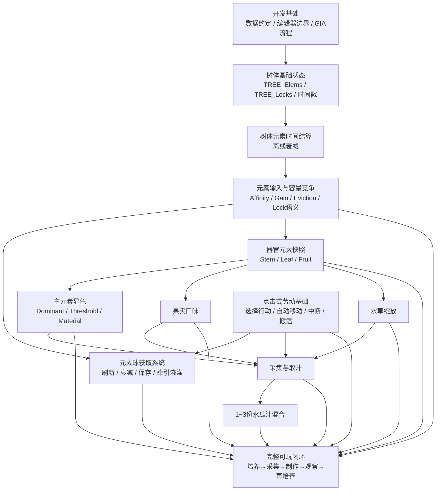
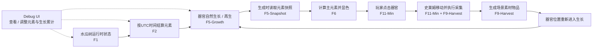
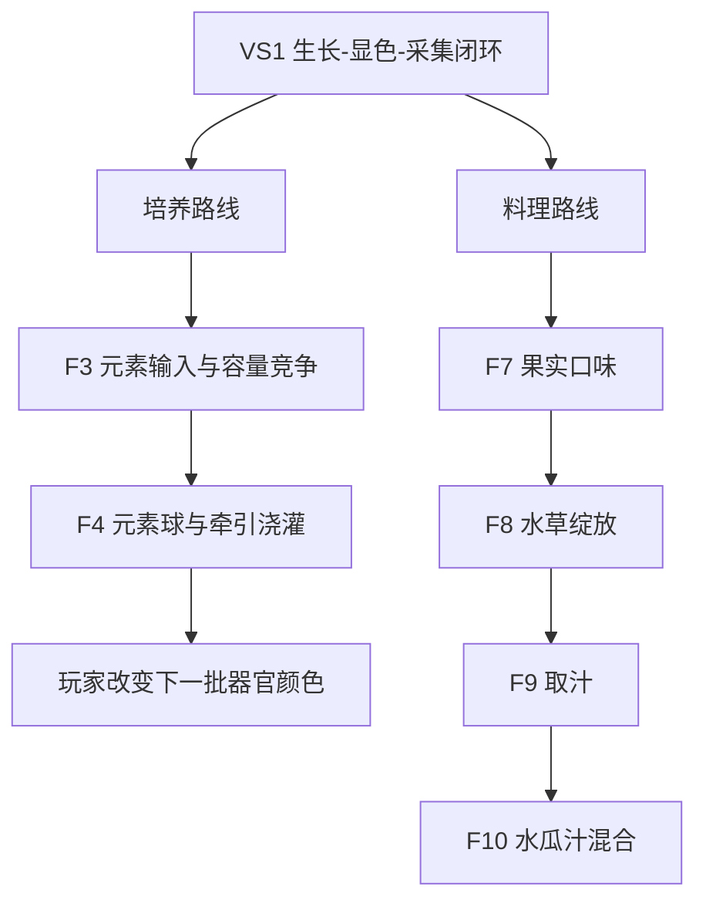

# 水瓜厨房 MVP：实现路线图与 Spec 工作流

本文件把当前 MVP 拆成可以逐项选择和实现的功能点，并规定从“选择功能”到“开始编码”的 SDD 工作流。

它回答两个问题：

1. **当前还有哪些功能需要实现？**
2. **选中一个功能后，怎样拆成流程块、文件和可验收的 Issue / Spec？**

本文件只组织已经进入当前设计范围的内容，不擅自补充尚未确定的玩法规则。具体数值和玩法语义仍以 `requirements.md`、`development-conventions.md`、`elemental-cultivation.md`、`interaction.md` 以及对应已确认 Issue 为准。

---

## 一、功能依赖总图



说明：

- 箭头表示**实现依赖或集成依赖**，不是强制的开发顺序。
- 可以先单独实现并验证某个纯计算功能，再在依赖完成后接入主流程。
- 一个功能点不是“一张节点图”的同义词。一个功能点可以拆成多个简单流程块。
- 一个流程块也不是“一份文件”的同义词。它可以同时需要 TypeScript、生成的 `.gia`、编辑器手动绑定说明、测试数据或其他配套文件。

---

## 二、当前功能 Checklist

### F0 — 开发基础与数据约定

- [x] 七元素固定索引顺序已经确定。
- [x] `CFG`、树体七元素列表和锁定列表的数据方向已经确定。
- [x] 已验证 TypeScript → genshin-ts → `.gia` → 编辑器手动导入的服务器节点图流程。
- [x] 已确定“算法代码优先 + 编辑器手动绑定 + 必要时人工复合节点”的开发边界。
- [ ] 为后续正式节点图统一命名规则、文件组织和手动接入标记方式。
- [ ] 确定一个不会改变运行语义的“MANUAL: connect compound node ...”占位实现方式。

**状态：基础可用，仍有少量工程规范需要在实际功能开发中收敛。**

---

### F0-Debug — 开发调试 UI

目标：为早期垂直切片提供一个**非玩家玩法 UI**，能够直接观察和修改关键运行时状态，以便快速验证元素、时间结算、器官生长和显色链路。

需要至少覆盖：

- [ ] 显示水瓜树当前七元素值 `TREE_Elems[7]`。
- [ ] 可以直接修改七种元素的当前值。
- [ ] 显示 `TREE_Locks[7]`，并允许在调试时切换锁定状态。
- [ ] 显示 `TREE_LastElementUpdateAt`、当前 UTC 时间和可用于核对的经过时间。
- [ ] 显示当前器官生长相关的累计值 / 进度。
- [ ] 可以直接修改器官生长累计值，使其接近或越过生成阈值，快速验证“生长 → 生成”流程。
- [ ] 调试 UI 修改的是测试运行状态，不把这些操作包装成正式玩家能力。
- [ ] 正式玩家界面不显示精确元素值；该 UI 必须能够在非调试场景中隐藏或禁用。

生长累计值的最终字段名、是按树统一累计还是按器官位分别累计，由 F5-Growth 的 Spec 决定；Debug UI 只要求能够观察和修改最终采用的那套运行时状态。

**用途：开发验证工具，不属于正式玩法 Feature。**

---

### F1 — 树体基础运行时状态

目标：让水瓜树拥有后续所有元素玩法可以依赖的最小状态。

需要至少覆盖：

- [ ] `TREE_Elems : float[7]`
- [ ] `TREE_Locks : bool[7]`
- [ ] `TREE_LastElementUpdateAt`
- [ ] 初始值建立与合法性检查。
- [ ] 与关卡 `CFG` 的读取边界。
- [ ] 保存 / 读取边界。

**预期实体：Watermelon Tree、Level / Stage Config。**

---

### F2 — 树体元素时间结算

目标：每次需要读取或修改树体元素前，先把元素状态结算到当前 UTC 时间。

候选流程块：

- [ ] F2.1 初始化时间戳。
- [ ] F2.2 计算经过时间。
- [ ] F2.3 单元素衰减计算。
- [ ] F2.4 遍历七元素并跳过锁定元素。
- [ ] F2.5 写回新元素值和最后更新时间。
- [ ] F2.6 把“初始化入口”和“衰减结算”拆成职责明确的小流程。

复合节点候选：

- [ ] `element_decay_calc`：复杂衰减公式独立成图，编辑器中打包为同名复合节点。

当前已有 genshin-ts 实验实现，但它只证明编译链和算法表达可行，**不视为正式功能完成**。

---

### F3 — 元素输入、容量竞争与锁定语义

目标：给树输入一种元素时，正确应用亲和、容量上限和其他元素的比例挤出。

需要覆盖：

- [ ] F3.1 输入元素索引与输入量。
- [ ] F3.2 输入前先执行 F2 时间结算。
- [ ] F3.3 `Gain = BaseElementInput × Affinity[element]`。
- [ ] F3.4 总容量上限 `100`。
- [ ] F3.5 新输入元素本次不参与挤出。
- [ ] F3.6 锁定元素不衰减、不被挤出、仍占容量。
- [ ] F3.7 其他未锁定元素按当前比例共同承担 overflow。
- [ ] F3.8 可挤出空间不足时，只接受剩余容量。
- [ ] F3.9 单元测试 / 表格测试覆盖边界情况。

注意：

- 本功能只实现“锁定后的数据行为”。
- **玩家如何获得、开启或解除锁定能力仍不在当前实现范围。**

---

### F4 — 元素球刷新、衰减与牵引浇灌

设计入口：GitHub Issue #1。

目标：把元素浇灌从抽象输入变成世界中可观察、会自然蒸发、可由玩家选择并牵引的资源。

需要覆盖：

- [ ] F4.1 元素球实体数据。
- [ ] F4.2 15 分钟半衰期衰减。
- [ ] F4.3 小于 1 时消失。
- [ ] F4.4 在线每 3～5 分钟自然生成一个 5～8 大小元素球。
- [ ] F4.5 不设硬上限，由生成率与寿命形成约 10 个的自然存量。
- [ ] F4.6 退出时保存场上仍存在的球。
- [ ] F4.7 登录时先按 UTC 时间更新已保存球。
- [ ] F4.8 只模拟登录前最后 45 分钟的离线生成事件。
- [ ] F4.9 玩家与元素球交互后进入牵引状态。
- [ ] F4.10 靠近树苗后自动吸附。
- [ ] F4.11 以吸附时剩余元素量提交给 F3。
- [ ] F4.12 元素种类第一版随机。

仍待后续 Spec 明确：

- 刷新位置 / 刷新点；
- 牵引移动方式与中断；
- 吸附半径和表现；
- 多人归属；
- 元素种类未来的针对性和故事性。

---

### F5 — 器官元素快照

目标：茎、叶、果实生成时读取当时树体元素，并形成之后不再随树变化的器官快照。

需要覆盖：

- [ ] F5.1 器官通用 `Elems : float[7]` 快照。
- [ ] F5.2 茎秆亲和变换。
- [ ] F5.3 叶片亲和变换。
- [ ] F5.4 果实亲和变换。
- [ ] F5.5 单项 clamp 到 0～100。
- [ ] F5.6 快照后树体变化不反向更新已有器官。

**当前阻塞：具体器官再生周期仍未设计。**

因此可以先实现和测试“给定树体状态 → 生成器官快照”的纯逻辑，但不能自行补完器官生命周期和刷新时序。

---

### F6 — 主元素显色

目标：根据器官元素快照得到唯一主元素，并驱动第一版视觉表现。

需要覆盖：

- [ ] F6.1 `DominantElement = argmax(Elems)`。
- [ ] F6.2 最高值低于 `ElementVisualThreshold = 10` 时保持基础色。
- [ ] F6.3 从全局主题色配置读取颜色。
- [ ] F6.4 第一版 `ColorStrength = 1`。
- [ ] F6.5 编辑器材质绑定：基础素材 + 主题色 + 正片叠底。
- [ ] F6.6 茎、叶、果实共用同一套判定逻辑。

编辑器工作与代码计算应保持分离。

---

### F7 — 果实六维口味

目标：从果实七元素快照计算六维隐藏口味。

需要覆盖：

- [ ] F7.1 基础口味向量。
- [ ] F7.2 七元素口味修正矩阵。
- [ ] F7.3 按元素强度线性累加。
- [ ] F7.4 六维结果 clamp 到 0～100。
- [ ] F7.5 不向玩家直接显示精确数值。
- [ ] F7.6 为后续水瓜汁和混合复用同一计算逻辑。

复合节点候选：

- [ ] `fruit_taste_calc` 或更通用的 `element_taste_calc`。

正式命名应在该功能 Spec 中确定。

---

### F8 — 水 + 草绽放

目标：实现 MVP 唯一元素反应。

需要覆盖：

- [ ] F8.1 触发条件：Hydro ≥ 25。
- [ ] F8.2 触发条件：Dendro ≥ 25。
- [ ] F8.3 Hydro + Dendro ≥ 60。
- [ ] F8.4 计算 `BloomStrength`。
- [ ] F8.5 保存 `Bloom` / `BloomStrength`。
- [ ] F8.6 应用绽放口味修正。
- [ ] F8.7 编辑器侧草种子性状体表现。

复合节点候选：

- [ ] `bloom_calc`
- [ ] `bloom_taste_modifier_calc`

是否合并由该功能 Spec 决定。

---

### F9 — 采集与果实取汁

目标：把已经具有元素、颜色、口味和绽放状态的果实转化成可继续制作的水瓜汁。

需要覆盖：

- [ ] F9.1 果实可采集。
- [ ] F9.2 采集后成为场景中的实际物品。
- [ ] F9.3 取汁交互。
- [ ] F9.4 水瓜汁继承果实七元素快照。
- [ ] F9.5 水瓜汁重新计算颜色、口味和绽放结果。
- [ ] F9.6 第一版不处理出汁率和加工损耗。

依赖点击劳动和搬运基础。

---

### F10 — 1～3 份等体积水瓜汁混合

目标：实现第一版唯一料理。

需要覆盖：

- [ ] F10.1 选择 1～3 份水瓜汁。
- [ ] F10.2 每种元素取算术平均。
- [ ] F10.3 从最终元素重新计算主元素颜色。
- [ ] F10.4 从最终元素重新计算口味。
- [ ] F10.5 从最终元素重新检测水草绽放。
- [ ] F10.6 相同最终元素组成得到相同基础结果。
- [ ] F10.7 第一版不支持自定义比例、糖、水、冰和其他配料。

---

### F11 — 点击式劳动基础

目标：提供上述玩法真正可操作所需的最小交互框架。

需要覆盖：

- [ ] F11.1 点击 / 选择可交互对象。
- [ ] F11.2 单一可执行行动时直接执行。
- [ ] F11.3 多个可执行行动时显示行动选择。
- [ ] F11.4 史莱姆自动移动到交互位置。
- [ ] F11.5 到达后开始劳动。
- [ ] F11.6 行动可中断。
- [ ] F11.7 按具体行动决定中断后保留还是重置进度。
- [ ] F11.8 世界物品拾取 / 搬运 / 放下。
- [ ] F11.9 一次搬运一个物品。
- [ ] F11.10 搬运重量影响移动速度。

不实现任务队列和自动化调度。

---

### F12 — 植物活性 / 休眠

该方向来自元素球与长期维护设计，目前只有目标，没有完整数值规则。

当前确定：

- [ ] 长期不浇灌不会让树死亡。
- [ ] 元素越少，绝对衰减自然越慢。
- [ ] 长期低元素状态下，树逐渐进入休眠 / 低速生长。
- [ ] 再次“浇透”后可以苏醒。

仍未确定：

- 休眠阈值；
- 苏醒阈值；
- 最低生长速度；
- 活性如何影响器官生成。

**状态：需要先做设计 Spec，不进入直接实现。**

---

### F13 — 完整 MVP 集成

目标：把已经独立验证的功能串成一次可玩的闭环。

- [ ] 元素资源出现。
- [ ] 玩家完成浇灌。
- [ ] 树体元素改变并随时间衰减。
- [ ] 新生器官形成快照。
- [ ] 玩家观察颜色 / 口味 / 绽放差异。
- [ ] 玩家采集果实并取汁。
- [ ] 玩家混合 1～3 份水瓜汁。
- [ ] 制作结果能够反向影响下一轮培养选择。
- [ ] 完成一次端到端人工验收。

---

## 三、暂不进入当前实现的内容

以下内容即使未来重要，也不应因为实现某个相邻功能而顺手加入：

- 第二种及之后的元素反应；
- 元素精确数值 UI；
- 多元素综合色；
- 茎秆、叶片料理；
- 草种子性状体独立 Item；
- 更复杂料理；
- 顾客经营；
- 自动化生产；
- 正式仓储与物流；
- 多人跨世界访问；
- 元素锁定能力的获得 / 解除玩法；
- 未经设计确认的器官再生周期。

---


## 三、最小可见闭环：生长 → 显色 → 采集

在完整“培养 → 采集 → 制作 → 再培养”闭环之前，先建立一个更小的垂直切片，用来尽快看到世界中的可玩反馈。

### 3.1 闭环目标



这条切片优先验证：

> **树会自己继续生长；新器官会继承当时的元素状态并呈现不同颜色；玩家能够通过点击让史莱姆过去采集；采完以后该位置重新进入生长。**

它是第一条“肉眼可见、可以重复操作”的世界玩法闭环，不要求同时完成元素球、口味、绽放、取汁和料理。

同时配套一个 **F0-Debug 调试 UI**。它不属于玩家闭环本身，而是贯穿 F1 / F2 / F5 的开发观测与注入入口，用于快速构造测试状态，避免每次为了验证颜色或生长都等待真实时间。

### 3.2 与完整元素培养的边界

仅靠 F1 + F2 + F5 + F6 + F9-Harvest + F11-Min，**还没有玩家主动改变树体元素的来源**。

F2 只负责衰减 / 时间结算，不会凭空增加元素。因此这条最小切片中：

- 树体元素状态可以先由编辑器 / 测试配置提供不同的初始值，用于验证完整数据链；
- 不把这种测试初值包装成正式玩法；
- 不在本切片中自行发明“自然元素累积”规则；
- 玩家真正通过资源改变树体元素，留到 F3 / F4 接入之后。

因此第一条切片准确验证的是：

```text
已有树体元素状态
→ 随时间结算
→ 器官生成时读取
→ 器官出现元素颜色
→ 玩家采集
→ 再生
```

加入 F3 / F4 后，才升级为真正的：

```text
玩家获得元素
→ 浇灌改变树体
→ 下一批器官变化
→ 玩家采集
→ 再决定下一轮培养
```

### 3.3 本切片需要从现有 Feature 中抽出的最小子集

#### F0-Debug-Min — 本切片调试 UI

- [ ] 直接显示七元素当前值。
- [ ] 可以直接把任一元素改成指定值。
- [ ] 可以查看 / 切换元素锁定状态。
- [ ] 显示最后元素更新时间与当前 UTC 时间。
- [ ] 显示当前用于器官生成的生长累计值 / 进度。
- [ ] 可以直接修改生长累计值。
- [ ] 修改后能够立即观察 F2、F5、F6 的响应。
- [ ] UI 明确标记为 Debug，不作为正式玩家界面设计依据。

这一工具的核心目的不是做完整 GM 面板，而是让第一条垂直切片可以被快速、可重复地人工验收。

#### F1-Min — 树体基础状态

- [ ] `TREE_Elems : float[7]`
- [ ] `TREE_Locks : bool[7]`
- [ ] `TREE_LastElementUpdateAt`
- [ ] 可以从测试 / 编辑器配置得到一个明确的初始七元素状态。
- [ ] 状态在器官生成与时间结算流程中可稳定读取。

#### F2-Min — 元素时间结算

- [ ] 初始化时间戳。
- [ ] 计算经过 UTC 时间。
- [ ] 未锁定元素执行衰减。
- [ ] 锁定元素跳过衰减。
- [ ] 更新 `TREE_LastElementUpdateAt`。
- [ ] 复杂单元素公式独立为 `element_decay_calc` 复合节点。

#### F5-Growth — 最小器官生长 / 再生

现有 F5 不能只理解成“元素快照”。要形成可见闭环，还必须补一个最小生命周期桥接层。

- [ ] 编辑器中预置至少一个可生成 / 挂接器官的位置。
- [ ] 空位置能够进入生长。
- [ ] 经过一个**可配置的测试生长时间**后生成器官。
- [ ] 器官被采集后，该位置重新进入生长。
- [ ] 生长时间在本路线图中不固定为正式平衡数值；具体数值由该功能 Spec 为测试目的确定。
- [ ] 不在本切片中扩展复杂生长阶段、多个成熟阶段或完整生态模拟。

#### F5-Snapshot — 器官元素快照

- [ ] 器官生成完成时读取当时的 `TREE_Elems`。
- [ ] 按器官亲和生成自己的 `Elems : float[7]`。
- [ ] 单项限制在 0～100。
- [ ] 生成后树体元素继续变化，不反向修改该器官。

第一条切片可以只选择**一种可采集器官**完成端到端链路，再把相同规则扩展到其他器官；具体先做叶片还是果实，由该功能 Spec 决定。

#### F6-Min — 主元素显色

- [ ] 计算主元素。
- [ ] 主元素低于阈值时保持基础色。
- [ ] 达到阈值时读取对应主题色。
- [ ] 编辑器完成材质 / 颜色绑定。
- [ ] 至少用两组不同测试元素状态验证出现肉眼可分辨的不同颜色。

#### F9-Harvest — 只做采集部分

本切片不进入取汁。

- [ ] 成熟器官可被采集。
- [ ] 采集完成后器官从树上移除。
- [ ] 生成对应的场景素材物品。
- [ ] 素材保留该器官需要继续携带的数据。
- [ ] 通知 / 暴露该器官位置重新进入生长。

不做：

- 取汁；
- 水瓜汁；
- 口味；
- 绽放料理结果；
- 混合。

#### F11-Min — 只做完成采集所需的点击劳动

- [ ] 点击可采集器官。
- [ ] 当前只有一个可执行行动时直接选择“采集”。
- [ ] 史莱姆自动移动到器官交互位置。
- [ ] 到达后执行采集。
- [ ] 采集结果成为场景物品。

本切片暂不要求：

- 多行动气泡选择；
- 正式搬运系统；
- 重量影响移动速度；
- 任务队列；
- 自动化；
- 与本闭环无关的复杂中断语义。

如果实现过程中发现“中断”是移动 / 采集基础框架不可分割的一部分，可以纳入对应 Spec，但不应为了完整实现 F11 而扩大本切片。

### 3.4 第一条闭环的验收画面

最小端到端验收应能够连续观察到：

```text
1. 进入世界
2. 打开 Debug UI，可以看到 TREE_Elems 与生长累计值
3. 通过 Debug UI 设置一组明确的树体元素状态
4. 时间结算后树体状态有效
5. 某个空器官位开始生长
6. 可通过 Debug UI 观察并按需调整生长累计值
7. 器官成熟并生成元素快照
8. 器官显示与主元素对应的颜色
9. 玩家点击器官
10. 史莱姆自动走到交互位置
11. 完成采集
12. 场景中出现素材物品
13. 原器官位重新进入生长
14. 下一轮器官再次成熟
```

另外必须能直接通过 Debug UI 更换测试树体元素状态，看到至少两种不同主元素颜色；也必须能够通过修改生长累计值快速触发至少一次器官生成，从而证明：

```text
Debug UI
→ TREE_Elems
→ Organ Snapshot
→ Dominant Element
→ Visual

Debug UI
→ Growth Accumulation
→ Organ Spawn
```

这一整条数据链已经工作。

### 3.5 本切片不证明什么

即使这条闭环完成，也**不能**宣称以下系统已经完成：

- 元素浇灌；
- 元素容量竞争；
- 元素球；
- 玩家主动改变树体元素；
- 完整器官生态和正式再生平衡；
- 口味；
- 绽放；
- 取汁；
- 水瓜汁混合；
- 植物休眠；
- 完整搬运与劳动系统。

它只证明第一条最小世界循环：

> **生长 → 元素表现 → 点击采集 → 再生。**

### 3.6 后续最自然的扩展

在这条切片成立之后，下一层可以有两条独立扩展路线：



其中“培养路线”会把第一条可见闭环升级成真正的培养反馈闭环；“料理路线”则把采集到的素材继续向制作结果延伸。

---

# 四、从功能点到 Issue / Spec 的 SDD 流程

选中一个功能点后，**不要直接开始写代码**。


## 4.1 Feature

Feature 是玩家或系统层能够独立描述的一项能力，例如：

- “树体元素时间结算”
- “元素输入与容量竞争”
- “果实六维口味”
- “元素球离线恢复”

Feature 不要求只对应一张图。

---

## 4.2 Flow Block

一个 Feature 可以拆成多个 Flow Block。

Flow Block 应尽量满足：

- 单一入口；
- 单一职责；
- 输入输出明确；
- 可以独立测试；
- 可以用一句话描述。

例如“树体元素时间结算”可以拆成：

```text
初始化时间戳
经过时间计算
单元素衰减计算
七元素批量结算
最后更新时间写回
```

复杂流程优先拆块，而不是生成一张巨型节点图。

---

## 4.3 Files

一个 Flow Block 可以包含多个需要提交的文件。

可能包括：

```text
src/.../*.ts                  节点图源码
dist/.../*.gia                本地生成产物，通常不手工修改
docs/...                      手动绑定或设计说明
tests / fixtures              测试数据或验证样例
editor manual work            编辑器中的结构体、复合节点、资源和组件绑定
```

是否提交生成产物，以项目当时的版本控制策略为准；**Spec 必须列出预期产物，但不要因为“一流程一文件”的形式主义强行拆分。**

---

## 4.4 Complex Calculation / Compound Node

复杂数学公式优先独立成专用节点图：

```text
xxx_calc.ts
→ xxx_calc.gia
→ 编辑器手动导入
→ 打包为复合节点 xxx_calc
```

主流程只保留一个明确的手动接入点：

```text
MANUAL: connect compound node xxx_calc
```

文件名、导入图名和复合节点名保持一致。

---

# 五、GitHub Issue = SDD Spec

每次选择一个具体 Feature 开发时，先创建 Issue。Issue 是该次开发的 **Spec 与验收合同**。

如果 Feature 太大，可以拆成多个 Issue；如果多个 Flow Block 高度耦合，也可以放在同一个 Issue 中。判断标准是能否形成明确、可独立验收的开发边界。

## Issue 推荐结构

```markdown
# [Spec] Feature Name

## Context
为什么需要这个功能，它依赖什么现有设计。

## Goal
本次开发结束后必须成立的行为。

## Non-goals
明确这次不做什么，防止范围膨胀。

## Entities
### Entity A
- Responsibility
- Runtime Properties
- Editor Bindings

## Flow Blocks
### Flow A
- Trigger / Input
- Steps
- Output / Side Effects

### Flow B
...

## Files / Artifacts
- src/...
- compound_calc.ts
- expected .gia
- manual editor bindings

## Manual Editor Work
- 要创建 / 导入 / 绑定什么
- 要打包哪些复合节点
- 哪些 MANUAL 接入点需要人工连接

## Data / Invariants
- 数据结构
- 固定索引
- 范围
- 必须始终成立的条件

## Acceptance Criteria
- [ ] ...
- [ ] ...

## Test Plan
### Nominal
- ...

### Boundary
- ...

### Persistence / Offline
- ...

### Editor Integration
- ...

## Open Questions
仅记录真正仍未决定、且不阻塞本次开发的问题。
```

---

## 六、开发开始条件

只有当一个 Issue / Spec 至少明确以下内容后，才进入实际开发：

- [ ] Feature 的目标。
- [ ] 明确的 Non-goals。
- [ ] 涉及的实体和状态所有权。
- [ ] Flow Blocks。
- [ ] 预期源码 / 产物 / 编辑器工作。
- [ ] 手动复合节点接入点。
- [ ] 数据不变量和边界。
- [ ] Acceptance Criteria。
- [ ] Test Plan。
- [ ] 没有会改变当前实现方向的阻塞性 Open Question。

如果上述内容在开发过程中发生变化，应先更新 Issue，再修改实现。

---

## 七、当前推荐的可选择起点

当前适合直接进入 Spec 的功能：

- [ ] **F1 树体基础运行时状态**
- [ ] **F2 树体元素时间结算**
- [ ] **F3 元素输入、容量竞争与锁定语义**
- [ ] **F6 主元素显色**
- [ ] **F7 果实六维口味**
- [ ] **F8 水 + 草绽放**
- [ ] **F11 点击式劳动基础**

已有独立设计 Issue、但仍需要继续拆 Spec 的功能：

- [ ] **F4 元素球刷新、衰减与牵引浇灌**

需要先补设计再进入实现的功能：

- [ ] **F5 器官元素快照的生命周期接入部分**
- [ ] **F12 植物活性 / 休眠**

依赖较多、适合后期集成：

- [ ] **F9 采集与果实取汁**
- [ ] **F10 水瓜汁混合**
- [ ] **F13 完整 MVP 集成**

后续由开发者从本列表中选择一个功能点，再为该次具体开发创建对应 Issue / Spec。
