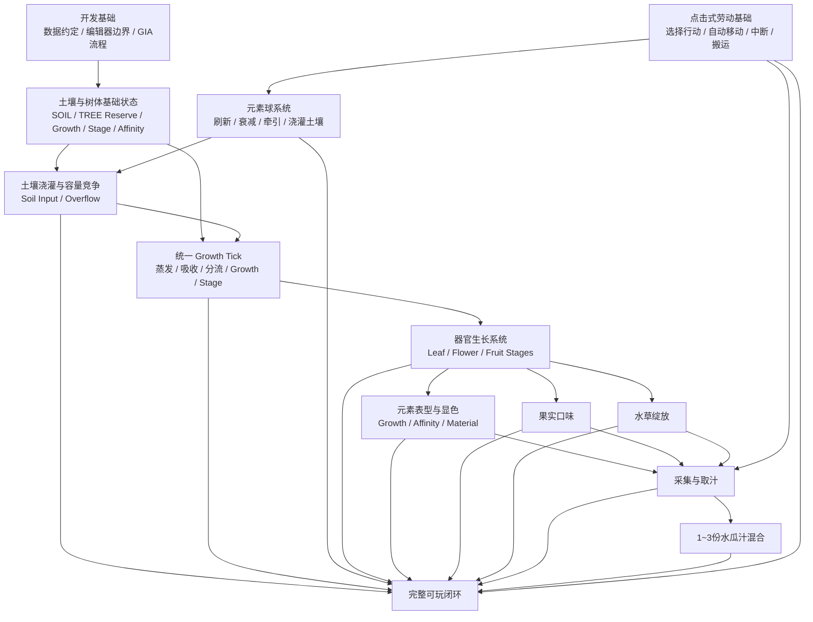
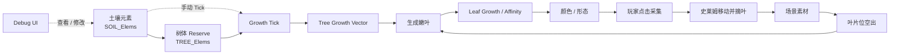
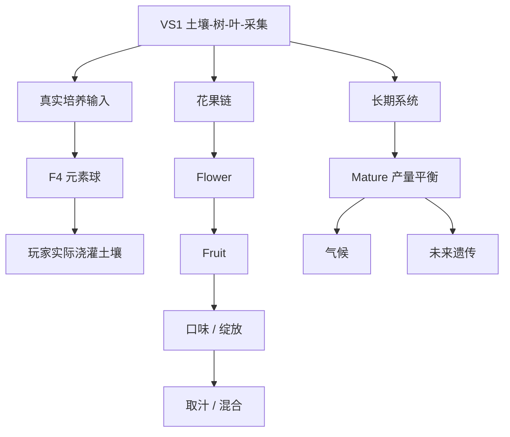

# 水瓜厨房 MVP：实现路线图与 Spec 工作流

本文件把当前 MVP 拆成可以逐项选择和实现的功能点，并规定从“选择功能”到“开始编码”的 SDD 工作流。

它回答两个问题：

1. **当前还有哪些功能需要实现？**
2. **选中一个功能后，怎样拆成流程块、文件和可验收的 Issue / Spec？**

本文件只组织已经进入当前设计范围的内容，不擅自补充尚未确定的玩法规则。具体数值和玩法语义仍以 `requirements.md`、`development-conventions.md`、`elemental-cultivation.md`、`interaction.md` 以及对应已确认 Issue 为准。

---

## 一、功能依赖总图



说明：

- 箭头表示**实现依赖或集成依赖**，不是强制的开发顺序。
- 旧的“浇灌直接写树体 / 树体连续衰减 / 器官一次性快照”已经被土壤—Reserve—Growth Tick 模型替代。
- 一个功能点可以拆成多个简单 Flow Block；一个 Flow Block 也可以需要多份源码、复合节点、编辑器绑定和测试文件。
- 通用养分规则见根目录 `docs/plants/nutrient-growth-system.md` 与 `docs/plants/growth-tick.md`；千星奇域映射见 `growth-system.md`。

---

## 二、当前功能 Checklist

### F0 — 开发基础与数据约定

- [x] 七元素固定索引顺序已经确定。
- [x] `CFG`、树体七元素列表和锁定列表的数据方向已经确定。
- [x] 已验证 TypeScript → genshin-ts → `.gia` → 编辑器手动导入的服务器节点图流程。
- [x] 已确定“算法代码优先 + 编辑器手动绑定 + 必要时人工复合节点”的开发边界。
- [ ] 为后续正式节点图统一命名规则、文件组织和手动接入标记方式。
- [ ] 确定一个不会改变运行语义的“MANUAL: connect compound node ...”占位实现方式。

**状态：基础可用，仍有少量工程规范需要在实际功能开发中收敛。**

---

### F0-Debug — 开发调试 UI

目标：为早期垂直切片提供一个**非玩家玩法 UI**，能够直接观察和修改关键运行时状态，并手动推进 Growth Tick。

需要至少覆盖：

- [ ] 显示 / 修改 `SOIL_Elems[7]`。
- [ ] 显示 / 修改 `TREE_Elems[7]`。
- [ ] 显示 `TREE_Stage`。
- [ ] 显示 / 修改 `TREE_Growth[7]`。
- [ ] 显示 Tree Base / Effective Affinity。
- [ ] 显示最后 Growth Tick 时间、当前 UTC 时间和待补算 Tick 数。
- [ ] 提供“执行一次 Growth Tick”的调试入口。
- [ ] 对当前叶片显示 Stage、Growth Vector、Base / Effective Affinity。
- [ ] 能够直接调整关键 Growth 值以跨越 Stage / 器官生成阈值。
- [ ] Debug UI 修改的是测试运行状态，不包装成正式玩家能力。
- [ ] 非调试场景可以隐藏或禁用。

花 / 果加入实现后，再把对应器官状态接入同一调试 UI，不在第一条叶片闭环中预先实现。

**用途：开发验证工具，不属于正式玩法 Feature。**

---

### F1 — 土壤与树体基础运行时状态

目标：建立 Growth Tick 所需的最小持久状态。

需要至少覆盖：

- [ ] `SOIL_Elems : float[7]`。
- [ ] `TREE_Elems : float[7]`，语义为树体内部 Reserve。
- [ ] `TREE_Growth : float[7]`。
- [ ] `TREE_Stage`：Seedling / Sapling / Mature。
- [ ] Tree Base Affinity / Effective Affinity。
- [ ] `LastGrowthTickAt`。
- [ ] 状态初始化、读取、保存边界。
- [ ] Debug UI 可直接观察和修改上述关键状态。

**预期实体：Soil / Plot、Watermelon Tree、Level / Stage Config。**

---

### F2 — 统一 Growth Tick 与 UTC 离线补算

目标：建立土壤、树体和后续器官共用的离散生长结算节奏。

当前基线：

```text
GrowthTickInterval ≈ 1 hour
SoilEvaporationRatePerTick = 1%
TreeGrowthConsumeRatePerTick = 1%
```

候选流程块：

- [ ] F2.1 根据 UTC 时间确定应执行的 Tick 数。
- [ ] F2.2 土壤元素自然蒸发。
- [ ] F2.3 根据 Tree Stage、土壤组成和 Tree Affinity 计算吸收。
- [ ] F2.4 写入 Tree Reserve。
- [ ] F2.5 判断 Growing / Dormant。
- [ ] F2.6 从 Tree Reserve 提取本 Tick 生长预算。
- [ ] F2.7 先向子器官分流，再把剩余预算转换为 `TREE_Growth[7]`。
- [ ] F2.8 连续学习 Effective Affinity。
- [ ] F2.9 检查 Stage / 器官生成条件。
- [ ] F2.10 更新 `LastGrowthTickAt`。
- [ ] F2.11 离线进入时批量补算或使用经 Spec 验证的等价近似。

复杂流程不得全部塞进单一节点图；实际开发时按上述职责继续拆 Flow Block / Spec。

---

### F3 — 土壤浇灌与容量竞争

目标：所有外部元素输入先进入土壤，再由 F2 的 Growth Tick 吸收到树体。

需要覆盖：

- [ ] F3.1 土壤总容量基线 100。
- [ ] F3.2 输入一种元素到 `SOIL_Elems`。
- [ ] F3.3 超出容量时，按**输入前旧土壤的元素比例**挤出整个旧储备。
- [ ] F3.4 与本次输入同种的旧元素同样参与挤出。
- [ ] F3.5 完成挤出后再加入新元素。
- [ ] F3.6 单元素持续培养呈现自然边际递减。
- [ ] F3.7 边界测试覆盖空土、未满、刚好满、超量输入和单元素极端。

旧版“新输入受保护，只挤出其他元素”的规则不再使用。

旧“元素锁定”能力在新模型中的作用位置尚未重新设计，**不进入本 Feature**。

---

### F4 — 元素球刷新、衰减与牵引浇灌

设计入口：GitHub Issue #1。

目标：把土壤元素输入变成世界中可观察、会自然蒸发、可由玩家选择并牵引的资源。

需要覆盖：

- [ ] F4.1 元素球实体数据。
- [ ] F4.2 15 分钟半衰期衰减。
- [ ] F4.3 小于 1 时消失。
- [ ] F4.4 在线每 3～5 分钟自然生成一个 5～8 大小元素球。
- [ ] F4.5 不设硬上限，由生成率与寿命形成约 10 个的自然存量。
- [ ] F4.6 退出时保存场上仍存在的球。
- [ ] F4.7 登录时按 UTC 时间更新已保存球。
- [ ] F4.8 只模拟登录前最后 45 分钟的离线生成事件。
- [ ] F4.9 玩家与元素球交互后进入牵引状态。
- [ ] F4.10 靠近土壤 / 树苗浇灌区域后自动吸附。
- [ ] F4.11 以吸附时剩余元素量提交给 F3，写入土壤。
- [ ] F4.12 元素种类第一版随机。

仍待后续 Spec 明确：刷新位置、牵引移动与中断、吸附范围、多人归属、元素种类未来的针对性与故事性。

---

### F5 — 器官生长、Stage 与养分分流

目标：把树体 Growth 和子器官建立成可持续运行的生长链。

#### F5-Tree — 树体 Stage

- [ ] Seedling → Sapling → Mature。
- [ ] 每个 Stage 有独立 Growth Vector。
- [ ] 升级 Stage 时清空 Growth。
- [ ] 升级时固定当前 Effective Affinity 为下一 Stage 的 Base Affinity。
- [ ] 每个 Stage 使用不同 `MaxAbsorbPerTick`。
- [ ] Mature 生成器官后只扣 Growth，不回退 Stage。

体验目标：

- Seedling：普通玩家一周内进入 Sapling。
- Sapling：正常约 2～3 周进入 Mature。
- 玩家主动摘叶减少分流并持续催长时，可以探索出约 1 周进入 Mature 的快速路线。

#### F5-Leaf — 叶片

- [ ] Sapling 最多 2 个叶片位。
- [ ] 0 叶时树自身获得 1.0 生长预算。
- [ ] 1 叶时约为 Tree 0.7 / Leaf 0.3。
- [ ] 2 叶时约为 Tree 0.4 / Leaf A 0.3 / Leaf B 0.3。
- [ ] Tender → Thick → Mature。
- [ ] 叶片没有独立 Reserve，吸多少当 Tick 用多少。
- [ ] Tender 当前无环境损耗。
- [ ] Mature 当前自身保留率基线 0.6，约 0.4 逸散到环境。
- [ ] 叶片继续把一部分预算供给下游花 / 果。
- [ ] 每次 Stage 升级清空 Leaf Growth，并固定当前 Effective Affinity。
- [ ] 普通 Sapling 每周约成熟 2 片叶；勤劳玩家约 4 片；正确元素可进一步提高。

#### F5-FlowerFruit — 花 / 果

这部分已经有模型，但不要求进入第一条可见闭环。

- [ ] Flower 与 Fruit 是同一器官的两个 Stage。
- [ ] Flower 持续学习 Affinity，并存在蒸发。
- [ ] Flower 阶段决定未来果皮颜色 / 形态和 Fruit Stage 基准亲和。
- [ ] 进入 Fruit 后固定 Affinity，不再继续学习。
- [ ] Fruit 不再按花期规则蒸发，改为累积汁液 / 内容物。
- [ ] 提前移除花 / 果会改变叶片后续养分去向，并为多汁叶分支留下机制接口。

---

### F6 — 元素表型、颜色与隐藏亲和

目标：让 Growth Vector / 固定亲和产生玩家可观察的外观差异，同时保留未显性的隐藏培养信息。

需要覆盖：

- [ ] 未成熟器官可随着连续学习和 Growth 构成改变表现。
- [ ] Stage 切换时，当前 Effective Affinity 固定为下一 Stage 的 Base Affinity。
- [ ] 某元素 Affinity 达到表现阈值时，可以进入对应颜色 / 变种形态。
- [ ] 未达到阈值时保持普通形态，但隐藏 Affinity 仍然保留。
- [ ] 多元素同时超过阈值时的视觉选择规则由表现 Spec 决定。
- [ ] 颜色资源仍使用既定七元素主题色和编辑器材质绑定。
- [ ] Debug UI 能同时观察 Growth Vector、Base Affinity、Effective Affinity 与最终表型。

旧版“一次性 OrganElement 快照 → argmax → 永久颜色”的规则不再作为所有器官的通用模型。

---

### F7 — 果实六维口味

目标：从果实七元素快照计算六维隐藏口味。

需要覆盖：

- [ ] F7.1 基础口味向量。
- [ ] F7.2 七元素口味修正矩阵。
- [ ] F7.3 按元素强度线性累加。
- [ ] F7.4 六维结果 clamp 到 0～100。
- [ ] F7.5 不向玩家直接显示精确数值。
- [ ] F7.6 为后续水瓜汁和混合复用同一计算逻辑。

复合节点候选：

- [ ] `fruit_taste_calc` 或更通用的 `element_taste_calc`。

正式命名应在该功能 Spec 中确定。

---

### F8 — 水 + 草绽放

目标：实现 MVP 唯一元素反应。

需要覆盖：

- [ ] F8.1 触发条件：Hydro ≥ 25。
- [ ] F8.2 触发条件：Dendro ≥ 25。
- [ ] F8.3 Hydro + Dendro ≥ 60。
- [ ] F8.4 计算 `BloomStrength`。
- [ ] F8.5 保存 `Bloom` / `BloomStrength`。
- [ ] F8.6 应用绽放口味修正。
- [ ] F8.7 编辑器侧草种子性状体表现。

复合节点候选：

- [ ] `bloom_calc`
- [ ] `bloom_taste_modifier_calc`

是否合并由该功能 Spec 决定。

---

### F9 — 采集与果实取汁

目标：把已经具有元素、颜色、口味和绽放状态的果实转化成可继续制作的水瓜汁。

需要覆盖：

- [ ] F9.1 果实可采集。
- [ ] F9.2 采集后成为场景中的实际物品。
- [ ] F9.3 取汁交互。
- [ ] F9.4 水瓜汁继承果实七元素快照。
- [ ] F9.5 水瓜汁重新计算颜色、口味和绽放结果。
- [ ] F9.6 第一版不处理出汁率和加工损耗。

依赖点击劳动和搬运基础。

---

### F10 — 1～3 份等体积水瓜汁混合

目标：实现第一版唯一料理。

需要覆盖：

- [ ] F10.1 选择 1～3 份水瓜汁。
- [ ] F10.2 每种元素取算术平均。
- [ ] F10.3 从最终元素重新计算主元素颜色。
- [ ] F10.4 从最终元素重新计算口味。
- [ ] F10.5 从最终元素重新检测水草绽放。
- [ ] F10.6 相同最终元素组成得到相同基础结果。
- [ ] F10.7 第一版不支持自定义比例、糖、水、冰和其他配料。

---

### F11 — 点击式劳动基础

目标：提供上述玩法真正可操作所需的最小交互框架。

需要覆盖：

- [ ] F11.1 点击 / 选择可交互对象。
- [ ] F11.2 单一可执行行动时直接执行。
- [ ] F11.3 多个可执行行动时显示行动选择。
- [ ] F11.4 史莱姆自动移动到交互位置。
- [ ] F11.5 到达后开始劳动。
- [ ] F11.6 行动可中断。
- [ ] F11.7 按具体行动决定中断后保留还是重置进度。
- [ ] F11.8 世界物品拾取 / 搬运 / 放下。
- [ ] F11.9 一次搬运一个物品。
- [ ] F11.10 搬运重量影响移动速度。

不实现任务队列和自动化调度。

---

### F12 — 植物活性 / 休眠

目标：让树在内部 Reserve 不足时停止正常生长，但仍能继续吸收并在恢复后苏醒。

当前基础规则已经确定：

- [ ] `TreeReserveTotal = Σ TREE_Elems`。
- [ ] Growing 状态下，`TreeReserveTotal < 30` → Dormant。
- [ ] Dormant 状态仍允许从土壤吸收。
- [ ] Dormant 状态暂停正常 Growth Conversion。
- [ ] `TreeReserveTotal >= 80` → 恢复 Growing。
- [ ] 长期不浇灌不会让树死亡。
- [ ] 使用 30 / 80 两个阈值形成迟滞，避免临界值反复抖动。
- [ ] 最终阈值仍允许通过 Debug UI 调整。

休眠的视觉表现、音效和更细的低速成长表现可以后续追加，不阻塞基础逻辑实现。

---

### F13 — 完整 MVP 集成

目标：把已经独立验证的功能串成完整培养与料理闭环。

- [ ] 元素资源出现并进入土壤。
- [ ] 土壤执行容量竞争与蒸发。
- [ ] 树按 Stage / Affinity 从土壤吸收形成 Reserve。
- [ ] Growth Tick 把 Reserve 转换成 Growth，并向子器官分流。
- [ ] 叶 / 花 / 果按各自 Stage 生长并形成不同形态。
- [ ] 玩家能够观察元素带来的颜色 / 生长速度 / 形态差异。
- [ ] 玩家采集器官和果实。
- [ ] 果实进入取汁与水瓜汁混合。
- [ ] 制作结果能够反向影响下一轮培养选择。
- [ ] 完成一次端到端人工验收。

---

## 三、暂不进入当前实现的内容

以下内容即使未来重要，也不应因为实现某个相邻功能而顺手加入：

- 第二种及之后的元素反应；
- 元素精确数值 UI；
- 多元素综合色；
- 茎秆、叶片料理；
- 草种子性状体独立 Item；
- 更复杂料理；
- 顾客经营；
- 自动化生产；
- 正式仓储与物流；
- 多人跨世界访问；
- 元素锁定能力的获得 / 解除玩法；
- 亲和遗传、重新播种与多代育种；
- 气候系统对环境逸散的进一步反馈；
- Flower / Fruit 之外尚未设计的复杂器官链。

---


## 四、最小可见闭环：土壤 → 生长 → 显色 → 采集

第一条垂直切片不再使用测试 TREE_Elems 直接跳过培养链，而是尽量覆盖新的最小真实数据流。

### 4.1 闭环目标



这条切片优先验证：

> **土壤能供给树；树按 Tick 生长；树会生成叶片；叶片会根据真实养分与亲和变化成长和变色；玩家可以摘下叶片；叶片位重新进入生长。**

### 4.2 当前最小 Feature 组合

```text
F0-Debug
+ F1
+ F2 的最小 Growth Tick
+ F3 的调试土壤输入
+ F5-Tree / F5-Leaf
+ F6
+ F9-Harvest 的叶片采集子集
+ F11-Min
```

F4 元素球不是第一条垂直切片的前置条件。测试阶段可以通过 Debug UI 直接修改土壤元素，等基础生长闭环稳定后再接真实元素球浇灌。

### 4.3 第一条闭环暂时只做叶片

第一条端到端链优先选择叶片，而不是同时做茎、花、果。

需要看到：

- [ ] Seedling / Sapling 的树体 Stage 可运行。
- [ ] 土壤元素被树按 Stage 上限与 Affinity 吸收。
- [ ] Tree Reserve 以 1% / Tick 的基线产生生长预算。
- [ ] Tree Growth Vector 累积并触发 Stage / 叶片生成。
- [ ] Sapling 最多出现 2 个叶片位。
- [ ] 叶片获得约 0.3 的分流预算。
- [ ] 叶片经历 Tender → Thick → Mature。
- [ ] 叶片 Effective Affinity 持续学习。
- [ ] Stage 升级固定亲和并清空 Growth。
- [ ] 叶片表现可以随培养方向产生差异。
- [ ] 玩家点击成熟可采叶片。
- [ ] 史莱姆移动并完成摘叶。
- [ ] 生成场景素材。
- [ ] 叶片位空出后，树后续可以再次生成叶片。

### 4.4 Debug UI 在本切片中的职责

第一条切片必须能通过 Debug UI 快速完成：

```text
修改 SOIL_Elems
查看 TREE_Elems
查看 / 修改 TREE_Growth
查看 TREE_Stage
查看叶片 Stage / Growth / Affinity
执行单次 Growth Tick
跨越阈值
观察颜色 / Stage / 器官生成变化
```

Debug UI 是测试入口，不属于玩家正式玩法。

### 4.5 验收画面

最小端到端验收：

```text
1. 进入世界，打开 Debug UI
2. 给土壤设置一组明确的七元素组成
3. 手动执行 / 等待 Growth Tick
4. 观察土壤减少、树体 Reserve 增加
5. 观察 Tree Growth Vector 累积
6. Tree Stage 正确升级，升级时 Growth 清空
7. Sapling 开始生成嫩叶
8. 叶片从树体分得养分并累积自己的 Growth
9. 叶片阶段变化，亲和和颜色产生可观察变化
10. 玩家点击成熟可采叶片
11. 史莱姆自动移动并完成采集
12. 场景中出现叶片素材
13. 叶片位空出
14. 后续 Growth Tick 再次推进新叶生成
```

至少还要用两组明显不同的土壤元素组成，证明：

```text
SOIL_Elems
→ TREE_Elems
→ Growth / Affinity
→ Leaf Growth / Affinity
→ Visual
```

整条链成立。

### 4.6 本切片不要求

- 元素球真实刷新与牵引；
- 花 / 果；
- 果实口味；
- 绽放；
- 取汁；
- 水瓜汁混合；
- 气候反馈；
- 遗传；
- Mature 阶段完整产量平衡；
- 正式多器官生态。

### 4.7 后续扩展



---

# 五、从功能点到 Issue / Spec 的 SDD 流程


选中一个功能点后，**不要直接开始写代码**。


## 5.1 Feature

Feature 是玩家或系统层能够独立描述的一项能力，例如：

- “Growth Tick 与离线补算”
- “土壤浇灌与容量竞争”
- “果实六维口味”
- “元素球离线恢复”

Feature 不要求只对应一张图。

---

## 5.2 Flow Block

一个 Feature 可以拆成多个 Flow Block。

Flow Block 应尽量满足：

- 单一入口；
- 单一职责；
- 输入输出明确；
- 可以独立测试；
- 可以用一句话描述。

例如“Growth Tick 与离线补算”可以拆成：

```text
计算错过 Tick 数
土壤蒸发
树体按 Stage 吸收
生成本 Tick 生长预算
向子器官分流
Growth Vector 转换
连续学习
Stage / 器官生成判定
更新时间戳
```

复杂流程优先拆块，而不是生成一张巨型节点图。

---

## 5.3 Files

一个 Flow Block 可以包含多个需要提交的文件。

可能包括：

```text
src/.../*.ts                  节点图源码
dist/.../*.gia                本地生成产物，通常不手工修改
docs/...                      手动绑定或设计说明
tests / fixtures              测试数据或验证样例
editor manual work            编辑器中的结构体、复合节点、资源和组件绑定
```

是否提交生成产物，以项目当时的版本控制策略为准；**Spec 必须列出预期产物，但不要因为“一流程一文件”的形式主义强行拆分。**

---

## 5.4 Complex Calculation / Compound Node

复杂数学公式优先独立成专用节点图：

```text
xxx_calc.ts
→ xxx_calc.gia
→ 编辑器手动导入
→ 打包为复合节点 xxx_calc
```

主流程只保留一个明确的手动接入点：

```text
MANUAL: connect compound node xxx_calc
```

文件名、导入图名和复合节点名保持一致。

---

# 六、GitHub Issue = SDD Spec

每次选择一个具体 Feature 开发时，先创建 Issue。Issue 是该次开发的 **Spec 与验收合同**。

如果 Feature 太大，可以拆成多个 Issue；如果多个 Flow Block 高度耦合，也可以放在同一个 Issue 中。判断标准是能否形成明确、可独立验收的开发边界。

## Issue 推荐结构

```markdown
# [Spec] Feature Name

## Context
为什么需要这个功能，它依赖什么现有设计。

## Goal
本次开发结束后必须成立的行为。

## Non-goals
明确这次不做什么，防止范围膨胀。

## Entities
### Entity A
- Responsibility
- Runtime Properties
- Editor Bindings

## Flow Blocks
### Flow A
- Trigger / Input
- Steps
- Output / Side Effects

### Flow B
...

## Files / Artifacts
- src/...
- compound_calc.ts
- expected .gia
- manual editor bindings

## Manual Editor Work
- 要创建 / 导入 / 绑定什么
- 要打包哪些复合节点
- 哪些 MANUAL 接入点需要人工连接

## Data / Invariants
- 数据结构
- 固定索引
- 范围
- 必须始终成立的条件

## Acceptance Criteria
- [ ] ...
- [ ] ...

## Test Plan
### Nominal
- ...

### Boundary
- ...

### Persistence / Offline
- ...

### Editor Integration
- ...

## Open Questions
仅记录真正仍未决定、且不阻塞本次开发的问题。
```

---

## 七、开发开始条件

只有当一个 Issue / Spec 至少明确以下内容后，才进入实际开发：

- [ ] Feature 的目标。
- [ ] 明确的 Non-goals。
- [ ] 涉及的实体和状态所有权。
- [ ] Flow Blocks。
- [ ] 预期源码 / 产物 / 编辑器工作。
- [ ] 手动复合节点接入点。
- [ ] 数据不变量和边界。
- [ ] Acceptance Criteria。
- [ ] Test Plan。
- [ ] 没有会改变当前实现方向的阻塞性 Open Question。

如果上述内容在开发过程中发生变化，应先更新 Issue，再修改实现。

---

## 八、当前推荐的可选择起点

为了尽快得到第一条可见闭环，当前优先顺序改为：

- [ ] **F1 土壤与树体基础运行时状态**
- [ ] **F0-Debug 开发调试 UI**
- [ ] **F2 统一 Growth Tick 的最小版本**
- [ ] **F3 土壤浇灌与容量竞争**
- [ ] **F5-Tree / F5-Leaf**
- [ ] **F6 元素表型与显色**
- [ ] **F11-Min 点击采集所需劳动**
- [ ] **F9-Harvest 叶片采集子集**

已有设计入口、但不阻塞第一条垂直切片：

- [ ] **F4 元素球刷新、衰减与牵引浇灌**

第一条闭环之后再进入：

- [ ] **F5-FlowerFruit**
- [ ] **F7 果实六维口味**
- [ ] **F8 水 + 草绽放**
- [ ] **F9 取汁**
- [ ] **F10 水瓜汁混合**
- [ ] **F12 长期休眠 / 生长平衡深化**
- [ ] **F13 完整 MVP 集成**

后续仍由开发者选择具体 Feature，再按“实体 → Flow Blocks → Files → Issue / Spec → 开发 → 验收”的流程推进。
