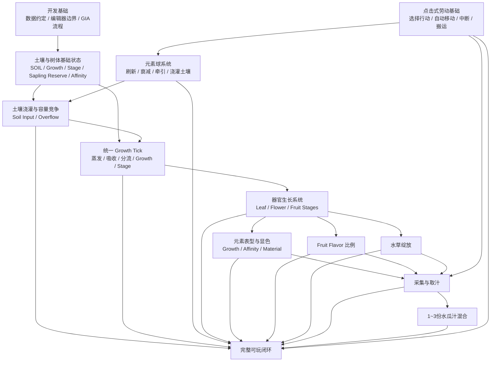
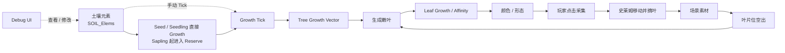
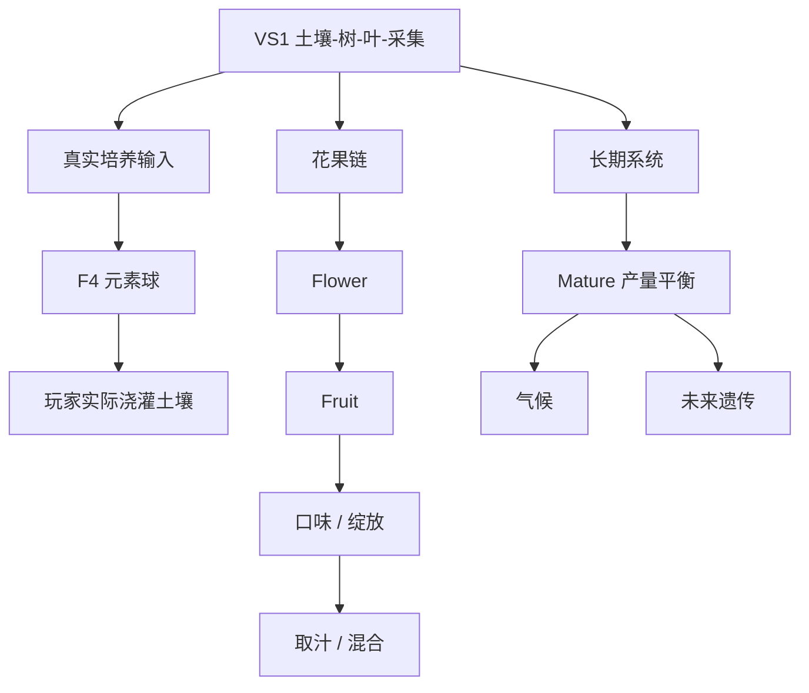

# 水瓜厨房 MVP：实现路线图与 Spec 工作流

本文件把当前 MVP 拆成可以逐项选择和实现的功能点，并规定从“选择功能”到“开始编码”的 SDD 工作流。

它回答两个问题：

1. **当前还有哪些功能需要实现？**
2. **选中一个功能后，怎样拆成流程块、文件和可验收的 Issue / Spec？**

本文件只组织已经进入当前设计范围的内容，不擅自补充尚未确定的玩法规则。具体数值和玩法语义仍以 `requirements.md`、`development-conventions.md`、`elemental-cultivation.md`、`interaction.md` 以及对应已确认 Issue 为准。

---

## 一、功能依赖总图


```mermaid
flowchart TD
    A[开发基础<br/>数据约定 / 编辑器边界 / GIA流程]

    B[土壤与树体基础状态<br/>SOIL / Growth / Stage / Sapling Reserve / Affinity]
    C[土壤浇灌与容量竞争<br/>Soil Input / Overflow]
    D[统一 Growth Tick<br/>蒸发 / 吸收 / 分流 / Growth / Stage]

    E[元素球系统<br/>刷新 / 衰减 / 牵引 / 浇灌土壤]
    F[器官生长系统<br/>Leaf / Flower / Fruit Stages]
    G[元素表型与显色<br/>Growth / Affinity / Material]

    H[Fruit Flavor 比例]
    I[水草绽放]
    J[采集与取汁]
    K[1~3份水瓜汁混合]

    L[点击式劳动基础<br/>选择行动 / 自动移动 / 中断 / 搬运]
    M[完整可玩闭环]

    A --> B
    B --> C
    B --> D
    C --> D
    E --> C

    D --> F
    F --> G
    F --> H
    F --> I

    G --> J
    H --> J
    I --> J

    J --> K

    L --> E
    L --> J

    C --> M
    D --> M
    E --> M
    F --> M
    G --> M
    H --> M
    I --> M
    J --> M
    K --> M
    L --> M
```

说明：

- 箭头表示**实现依赖或集成依赖**，不是强制的开发顺序。
- 旧的“浇灌直接写树体 / 树体连续衰减 / 器官一次性快照”已经被土壤—Reserve—Growth Tick 模型替代。
- 一个功能点可以拆成多个简单 Flow Block；一个 Flow Block 也可以需要多份源码、复合节点、编辑器绑定和测试文件。
- 通用养分规则见根目录 `docs/plants/nutrient-growth-system.md` 与 `docs/plants/growth-tick.md`；千星奇域映射见 `growth-system.md`。

---

## 二、当前功能 Checklist

### F0 — 开发基础与数据约定

- [x] 七元素固定索引顺序已经确定。
- [x] `CFG`、树体七元素列表和锁定列表的数据方向已经确定。
- [x] 已验证 TypeScript → genshin-ts → `.gia` → 编辑器手动导入的服务器节点图流程。
- [x] 已确定“算法代码优先 + 编辑器手动绑定 + 必要时人工复合节点”的开发边界。
- [ ] 为后续正式节点图统一命名规则、文件组织和手动接入标记方式。
- [ ] 确定一个不会改变运行语义的“MANUAL: connect compound node ...”占位实现方式。

**状态：基础可用，仍有少量工程规范需要在实际功能开发中收敛。**

---

### F0-Debug — 开发调试 UI

目标：为早期垂直切片提供一个**非玩家玩法 UI**，能够直接观察和修改关键运行时状态，并手动推进 Growth Tick。

需要至少覆盖：

- [ ] 显示 / 修改 `SOIL_Elems[7]`。
- [ ] 显示 / 修改 `TREE_Elems[7]`。
- [ ] 显示 `TREE_Stage`。
- [ ] 显示 / 修改 `TREE_Growth[7]`。
- [ ] 显示 Tree Base / Effective Affinity。
- [ ] 显示最后 Growth Tick 时间、当前服务器时间和待补算 Tick 数。
- [ ] 提供“执行一次 Growth Tick”的调试入口。
- [ ] 对当前叶片显示 Stage、Growth Vector、Base / Effective Affinity。
- [ ] 能够直接调整关键 Growth 值以跨越 Stage / 器官生成阈值。
- [ ] Debug UI 修改的是测试运行状态，不包装成正式玩家能力。
- [ ] 非调试场景可以隐藏或禁用。

花 / 果加入实现后，再把对应器官状态接入同一调试 UI，不在第一条叶片闭环中预先实现。

**用途：开发验证工具，不属于正式玩法 Feature。**

---

### F1 — 土壤与树体基础运行时状态

目标：建立 Growth Tick 所需的最小持久状态。

需要至少覆盖：

- [ ] `SOIL_Elems : float[7]`。
- [ ] `TREE_Elems : float[7]`，语义为 Sapling 起的树体内部 Reserve；Seed / Seedling 不使用 Reserve。
- [ ] `TREE_Growth : float[7]`。
- [ ] Seed 前置状态 + `TREE_Stage`：Seedling / Sapling；Mature 最终设计延后。
- [ ] Tree Base Affinity / Effective Affinity。
- [ ] `LastGrowthTickAt`。
- [ ] 状态初始化、读取、保存边界。
- [ ] Debug UI 可直接观察和修改上述关键状态。

**预期实体：Soil / Plot、Watermelon Tree、Level / Stage Config。**

---

### F2 — 统一 Growth Tick 与服务器时间离线补算

目标：建立土壤、树体和后续器官共用的离散生长结算节奏。

当前基线：

```text
GrowthUpdateIntervalSeconds = 60
SoilRetentionPerHour = 0.99
TreeGrowthRetentionPerHour = 0.99   # Sapling 起
MaxTotalAbsorbPerHour = 1.0
```

Tick 只负责结算，实际变化全部使用真实 `dt`。

候选流程块：

- [ ] F2.1 根据 UTC 时间确定应执行的 Tick 数。
- [ ] F2.2 土壤元素自然蒸发。
- [ ] F2.3 根据 Soil、RootPreference、1.0/h 总上限和单元素 Cap 计算吸收。
- [ ] F2.4 Seed / Seedling：吸收结果直接转换为 Growth。
- [ ] F2.5 Sapling 起：吸收结果写入 Tree Reserve。
- [ ] F2.6 Sapling 起判断 Growing / Dormant，并从 Reserve 提取生长预算。
- [ ] F2.7 先向已存在 Leaf / 当前生殖器官按阶段 sink 分流，再把 Tree 剩余预算转换为 Tree Own GrowthGain。
- [ ] F2.8 无 Active Bud 时写入 `TREE_Growth[7]`；有 Active Bud 时写入 `BUD_Growth[7]`。
- [ ] F2.9 连续学习 Effective Affinity；Seed / Seedling 检查 Stage，Sapling 检查主干100 Growth周期和 Bud=20。
- [ ] F2.10 跨服务器时间 04:00 时，先结算此前连续 Growth，再基于真实 LeafCount / Bud 状态做一次出芽检查。
- [ ] F2.11 更新 `LastGrowthTickAt` 与每日 Bud 检查状态。
- [ ] F2.12 离线进入时按事件边界分段回放，不逐分钟模拟，也不把整个离线区间错误压成一次最终随机计算。

复杂流程不得全部塞进单一节点图；实际开发时按上述职责继续拆 Flow Block / Spec。

---

### F3 — 土壤浇灌与容量竞争

目标：所有外部元素输入先进入土壤，再由 F2 的 Growth Tick 吸收到树体。

需要覆盖：

- [ ] F3.1 土壤总容量基线 100。
- [ ] F3.2 元素球捕获时直接累加到 `SOIL_Elems`，允许临时超过 100。
- [ ] F3.3 下一 Soil Growth Tick 开头计算 `SoilTotal`。
- [ ] F3.4 若 `SoilTotal > 100`，对当前全部七元素统一乘 `100 / SoilTotal`。
- [ ] F3.5 新旧元素没有优先级；连续加入单元素形成递推残留和逐步替换。
- [ ] F3.6 Overflow 当前直接丢弃，未来可接气候系统。
- [ ] F3.7 边界测试覆盖空土、未满、刚好满、超量输入和单元素极端。

旧版“新输入优先 / 挤出旧 Soil”规则已经废弃。

旧“元素锁定”能力在新模型中的作用位置尚未重新设计，**不进入本 Feature**。

---

### F4 — 元素球刷新、衰减与牵引浇灌

设计入口：GitHub Issue #1。

目标：把土壤元素输入变成世界中可观察、会自然蒸发、可由玩家选择并牵引的资源。

需要覆盖：

- [ ] F4.1 元素球实体数据；当前纯元素球初始量随机 8～10。
- [ ] F4.2 15 分钟半衰期连续衰减。
- [ ] F4.3 总量小于 1 时消失。
- [ ] F4.4 每 5 分钟最多尝试生成 1 个新球。
- [ ] F4.5 生成概率：`1 / (1 + (FieldBallTotal / 28)^3)`。
- [ ] F4.6 不设硬球数上限；目标是让场上总元素压力自然形成大概率约 8 球以内的软稳态。
- [ ] F4.7 登录时最多回放最近 30 分钟的正常刷新历史，并按真实 SpawnTime / age 计算衰减。
- [ ] F4.8 短时间重登只补算真实离线时间，不重复获得完整 30 分钟窗口。
- [ ] F4.9 玩家与元素球交互后进入牵引状态。
- [ ] F4.10 靠近土壤 / 树苗浇灌区域后自动吸附。
- [ ] F4.11 以吸附时剩余元素量提交给 F3，写入土壤。
- [ ] F4.12 元素种类第一版随机。

仍待后续 Spec 明确：刷新位置、牵引移动与中断、吸附范围、多人归属、元素种类未来的针对性与故事性。

---

### F5 — 器官生长、Stage 与养分分流

目标：把树体 Growth 和子器官建立成可持续运行的生长链。

#### F5-Tree — Seed / Seedling / Sapling

- [ ] Seed → Seedling → Sapling；Sapling 是当前版本长期玩法阶段，Mature 延后。
- [ ] Seed / Seedling 没有 Reserve，直接 Soil → Absorb → Growth。
- [ ] Sapling 起开始拥有 Tree Reserve。
- [ ] Seed / Seedling 升级时清空 Growth，并固定当前 Effective Affinity 为下一 Stage Base。
- [ ] 所有当前阶段统一使用 `MaxTotalAbsorbPerHour = 1.0`。
- [ ] Seed → Seedling 的 GrowthThreshold = 45。
- [ ] Seedling → Sapling 的 GrowthThreshold = 90。
- [ ] Sapling 主干 Growth 周期 = 100；满值只更新 / 固定自身 Affinity，不升级 Stage。
- [ ] 每日服务器时间 04:00 检查一次出芽：0叶0.80 / 1叶0.40 / 2叶0.01 / 3叶0。
- [ ] Active Bud 使用 `BUD_Growth[7]`；阈值 = 20。
- [ ] Bud 存在时，Tree Own GrowthGain 全部写入 Bud，Tree Growth 暂停增长。
- [ ] 玩家掐芽时，Bud Growth 完整合并回 Tree Growth。
- [ ] Bud 正常到 20 后，以此刻 Tree 的当前亲和按标准父子器官继承规则生成 SmallLeaf；SmallLeaf 出生后拥有独立 Affinity。
- [ ] 当前最多 3 叶。

体验目标：

- 积极玩家约 47h 后看到 Seedling，第三个自然日上线时已有明确发芽反馈。
- 再约 95h 进入 Sapling；真实体验约一周进入主要长期玩法。
- Sapling 后约第1天常见第一芽，第3天左右形成第一片叶，第6～7天逐渐进入两叶主状态。
- 第三叶在前几周只属于少量旺盛植株。
- 玩家掐芽不是获得额外加速 Buff，而是把 Bud Growth 退回主干，更快完成主干100 Growth亲和塑形周期。

#### F5-Leaf — 叶片与开花前生命周期

- [ ] 当前 Sapling 最多 3 片叶。
- [ ] 0 叶时 Tree 1.0。
- [ ] 1 叶时 Tree 0.7 / Leaf 0.3。
- [ ] 2 叶时 Tree 0.4 / Leaf A 0.3 / Leaf B 0.3。
- [ ] 3 叶时 Tree 0.1 / 三片 Leaf 各0.3；主干几乎停止是预期结果。
- [ ] Bud=20 后生成 SmallLeaf，并在出生瞬间从当前 Tree 一次性继承标准父子器官 Affinity；之后不实时跟随 Tree。
- [ ] SmallLeaf 约 12h → LargeLeaf；再约 12h → FlowerBud；再约 24h → bloom boundary。
- [ ] SmallLeaf / LargeLeaf / FlowerBud 由统一 settlement 按 elapsed time 推进，不建立三个独立 Timer。
- [ ] 离线首次跨越 bloom boundary 时，该器官停在刚开始的 Flower，让玩家登录后看到花期；不建立 scheduler framework。
- [ ] Leaf 没有独立 Reserve，继续从 Tree 的本 Tick Growth Nutrient Budget 取自己的份额。
- [ ] Leaf 在未锁定阶段根据自己的 Growth 独立塑形 Affinity；SmallLeaf 出生后 Tree 的变化不回写。
- [ ] 嫩叶当前无环境损耗；成叶自身保留率 baseline 仍为 0.6，约 0.4 可逸散到环境。
- [ ] 颜色 / 形态继续读取 Growth / Effective Affinity；视觉细节由表现 Spec 处理。

#### F5-FlowerFruit — Flower / Green Fruit / Mature Fruit

这部分已形成当前 Sapling 后半段生命周期合同，但仍不要求塞进第一条叶片垂直切片。

- [ ] Flower / Fruit 是同一个生殖器官的连续 Growth 轴。
- [ ] Flower 使用 Growth 0→30；正常供给下约 12h 达到 30 是体验目标，不建立 FlowerTimer。
- [ ] Flower 从父级 Leaf 本 Tick Growth Nutrient Budget 中分流，当前 sink baseline ≈50%，并继续塑形 Affinity。
- [ ] Growth 到 30：Flower 凋谢并形成 Fruit；当前 Affinity 在此锁定。
- [ ] Fruit 从同一 Growth 轴 30 继续到 100；30≤Growth<100 为 Green Fruit，Growth≥100 为 Mature Fruit。
- [ ] Green Fruit sink 目标为 80–90%，保留实现时校准区间；Mature Fruit sink baseline ≈20%。
- [ ] Fruit 形成后不再塑形 Affinity，开始累计 `FruitElementAmount[7]`。
- [ ] `FlavorRatio[e] = FruitElementAmount[e] / ΣFruitElementAmount`；总量为 0 时尚未形成 Flavor，ratio 只派生、不重复持久化。
- [ ] Mature Fruit 到 100 后仍继续低效率累计元素，因此 FlavorRatio 仍可变化；100 只锁物理成熟。
- [ ] Fruit 形成后随时可采摘；Green Fruit 是独立料理材料，不是失败状态。
- [ ] Green Fruit 外观从青绿 / 柔软逐步过渡到 Mature Fruit 的深褐木质果壳；内部由混沌元素粘液过渡到“果壳 → 光滑内膜 → 果肉膜 → 清澈水瓜水”。
- [ ] Mature Fruit 可用少量亮晶晶逸散表达仍在富集；本 Feature 不实现通用 shader / VFX framework。
- [ ] 成熟后催化 / 精炼 / 老种子等只保留未来语义插口，不定义状态或公式。

---

### F6 — 元素表型、颜色与隐藏亲和

目标：让 Growth Vector / 固定亲和产生玩家可观察的外观差异，同时保留未显性的隐藏培养信息。

需要覆盖：

- [ ] 未成熟器官可随着连续学习和 Growth 构成改变表现。
- [ ] Seed / Seedling 与仍在学习的 Leaf 阶段继续遵守既有 Affinity 固化语义；生殖器官例外是 Flower Growth=30 时直接锁定 Affinity，Fruit 30→100 不再塑形。
- [ ] 某元素 Affinity 达到表现阈值时，可以进入对应颜色 / 变种形态。
- [ ] 未达到阈值时保持普通形态，但隐藏 Affinity 仍然保留。
- [ ] 多元素同时超过阈值时的视觉选择规则由表现 Spec 决定。
- [ ] 颜色资源仍使用既定七元素主题色和编辑器材质绑定。
- [ ] Debug UI 能同时观察 Growth Vector、Base Affinity、Effective Affinity 与最终表型。

旧版“一次性 OrganElement 快照 → argmax → 永久颜色”的规则不再作为所有器官的通用模型。

---

### F7 — Fruit Flavor Ratio

目标：让果实结果后的七元素实际累计量直接成为 v0 Flavor 的事实源，不引入第二套味道转换。

需要覆盖：

- [ ] F7.1 持久化 `FruitElementAmount[7]`，只累计 Fruit 形成以后实际进入果实的七元素量。
- [ ] F7.2 `ΣFruitElementAmount = 0` 时，Flavor 尚未形成。
- [ ] F7.3 总量大于 0 时派生 `FlavorRatio[e] = FruitElementAmount[e] / ΣFruitElementAmount`。
- [ ] F7.4 不额外持久化重复 `FlavorRatio` 向量，除非后续实现出现明确必要性。
- [ ] F7.5 Growth=100 后仍允许元素继续累计，因此 FlavorRatio 可以继续变化。
- [ ] F7.6 本 Feature 不实现六维 Taste、Affinity→Flavor efficiency、Flavor decay / cap、催化或精炼。

当前不建立通用 Flavor conversion pipeline。未来具体料理如何解释这个比例，在对应 Feature 重新形成 Spec。

---

### F8 — 水 + 草绽放

目标：实现 MVP 唯一元素反应。

需要覆盖：

- [ ] F8.1 触发条件：Hydro ≥ 25。
- [ ] F8.2 触发条件：Dendro ≥ 25。
- [ ] F8.3 Hydro + Dendro ≥ 60。
- [ ] F8.4 计算 `BloomStrength`。
- [ ] F8.5 保存 `Bloom` / `BloomStrength`。
- [ ] F8.6 应用绽放口味修正。
- [ ] F8.7 编辑器侧草种子性状体表现。

复合节点候选：

- [ ] `bloom_calc`
- [ ] `bloom_taste_modifier_calc`

是否合并由该功能 Spec 决定。

---

### F9 — 采集与果实取汁

目标：把已经具有元素、颜色、口味和绽放状态的果实转化成可继续制作的水瓜汁。

需要覆盖：

- [ ] F9.1 果实可采集。
- [ ] F9.2 采集后成为场景中的实际物品。
- [ ] F9.3 取汁交互。
- [ ] F9.4 水瓜汁继承果实七元素快照。
- [ ] F9.5 水瓜汁重新计算颜色、口味和绽放结果。
- [ ] F9.6 第一版不处理出汁率和加工损耗。

依赖点击劳动和搬运基础。

---

### F10 — 1～3 份等体积水瓜汁混合

目标：实现第一版唯一料理。

需要覆盖：

- [ ] F10.1 选择 1～3 份水瓜汁。
- [ ] F10.2 每种元素取算术平均。
- [ ] F10.3 从最终元素重新计算主元素颜色。
- [ ] F10.4 从最终元素重新计算口味。
- [ ] F10.5 从最终元素重新检测水草绽放。
- [ ] F10.6 相同最终元素组成得到相同基础结果。
- [ ] F10.7 第一版不支持自定义比例、糖、水、冰和其他配料。

---

### F11 — 点击式劳动基础

目标：提供上述玩法真正可操作所需的最小交互框架。

需要覆盖：

- [ ] F11.1 点击 / 选择可交互对象。
- [ ] F11.2 单一可执行行动时直接执行。
- [ ] F11.3 多个可执行行动时显示行动选择。
- [ ] F11.4 史莱姆自动移动到交互位置。
- [ ] F11.5 到达后开始劳动。
- [ ] F11.6 行动可中断。
- [ ] F11.7 按具体行动决定中断后保留还是重置进度。
- [ ] F11.8 世界物品拾取 / 搬运 / 放下。
- [ ] F11.9 一次搬运一个物品。
- [ ] F11.10 搬运重量影响移动速度。

不实现任务队列和自动化调度。

---

### F12 — 植物活性 / 休眠

目标：让树在内部 Reserve 不足时停止正常生长，但仍能继续吸收并在恢复后苏醒。

当前基础规则已经确定：

- [ ] `TreeReserveTotal = Σ TREE_Elems`。
- [ ] Growing 状态下，`TreeReserveTotal < 30` → Dormant。
- [ ] Dormant 状态仍允许从土壤吸收。
- [ ] Dormant 状态暂停正常 Growth Conversion。
- [ ] `TreeReserveTotal >= 80` → 恢复 Growing。
- [ ] 长期不浇灌不会让树死亡。
- [ ] 使用 30 / 80 两个阈值形成迟滞，避免临界值反复抖动。
- [ ] 最终阈值仍允许通过 Debug UI 调整。

休眠的视觉表现、音效和更细的低速成长表现可以后续追加，不阻塞基础逻辑实现。

---

### F13 — 完整 MVP 集成

目标：把已经独立验证的功能串成完整培养与料理闭环。

- [ ] 元素资源出现并进入土壤。
- [ ] 土壤执行容量竞争与蒸发。
- [ ] 树按 RootPreference、总吸收上限和单元素 Cap 从 Soil 吸收。
- [ ] Seed / Seedling 直接把吸收结果转换为 Growth；Sapling 起才进入 Reserve → Growth / 子器官分流。
- [ ] 叶 / 花 / 果按各自 Stage 生长并形成不同形态。
- [ ] 玩家能够观察元素带来的颜色 / 生长速度 / 形态差异。
- [ ] 玩家采集器官和果实。
- [ ] 果实进入取汁与水瓜汁混合。
- [ ] 制作结果能够反向影响下一轮培养选择。
- [ ] 完成一次端到端人工验收。

---

## 三、暂不进入当前实现的内容

以下内容即使未来重要，也不应因为实现某个相邻功能而顺手加入：

- 第二种及之后的元素反应；
- 元素精确数值 UI；
- 多元素综合色；
- 茎秆、叶片料理；
- 草种子性状体独立 Item；
- 更复杂料理；
- 顾客经营；
- 自动化生产；
- 正式仓储与物流；
- 多人跨世界访问；
- 元素锁定能力的获得 / 解除玩法；
- 亲和遗传、重新播种与多代育种；
- 气候系统对环境逸散的进一步反馈；
- Flower / Fruit 之外尚未设计的复杂器官链。

---


## 四、最小可见闭环：土壤 → 生长 → 显色 → 采集

第一条垂直切片不再使用测试 TREE_Elems 直接跳过培养链，而是尽量覆盖新的最小真实数据流。

### 4.1 闭环目标


```mermaid
flowchart LR
    X[Debug UI]
    -.查看 / 修改.-> A
    -.手动 Tick.-> C

    A[土壤元素<br/>SOIL_Elems]
    --> B[Seed / Seedling 直接 Growth<br/>Sapling 起进入 Reserve]
    --> C[Growth Tick]
    --> D[Tree Growth Vector]
    --> E[生成嫩叶]
    --> F[Leaf Growth / Affinity]
    --> G[颜色 / 形态]
    --> H[玩家点击采集]
    --> I[史莱姆移动并摘叶]
    --> J[场景素材]
    --> K[叶片位空出]
    --> E
```

这条切片优先验证：

> **土壤能供给树；树按 Tick 生长；树会生成叶片；叶片会根据真实养分与亲和变化成长和变色；玩家可以摘下叶片；叶片位重新进入生长。**

### 4.2 当前最小 Feature 组合

```text
F0-Debug
+ F1
+ F2 的最小 Growth Tick
+ F3 的调试土壤输入
+ F5-Tree / F5-Leaf
+ F6
+ F9-Harvest 的叶片采集子集
+ F11-Min
```

F4 元素球不是第一条垂直切片的前置条件。测试阶段可以通过 Debug UI 直接修改土壤元素，等基础生长闭环稳定后再接真实元素球浇灌。

### 4.3 第一条闭环暂时只做叶片

第一条端到端链优先选择叶片，而不是同时做茎、花、果。

需要看到：

- [ ] Seed / Seedling / Sapling 的阶段链可运行。
- [ ] 土壤元素按 RootPreference、1.0/h 总上限和单元素 Cap 被吸收。
- [ ] Seed / Seedling 直接形成 Growth；Sapling 起 Tree Reserve 按 0.99/h retention 产生生长预算。
- [ ] Tree Growth Vector 累积并触发 Stage / 叶片生成。
- [ ] Sapling 当前最多出现 3 片叶；大多数长期处于2叶，少量进入3叶。
- [ ] 每片叶获得约 0.3 的分流预算；3叶时 Tree 仅保留约0.1。
- [ ] 叶片前半段按 SmallLeaf → LargeLeaf → FlowerBud 的已确认 elapsed-time boundary 推进；第一条切片仍可在进入 Flower runtime 前收口。
- [ ] 叶片 Effective Affinity 持续学习。
- [ ] 按各阶段合同处理 Affinity：Leaf 学习阶段独立塑形；Flower→Fruit 在 Growth=30 锁定；不要用一个通用规则覆盖所有阶段。
- [ ] 叶片表现可以随培养方向产生差异。
- [ ] 玩家点击成熟可采叶片。
- [ ] 史莱姆移动并完成摘叶。
- [ ] 生成场景素材。
- [ ] 叶片位空出后，树后续可以再次生成叶片。

### 4.4 Debug UI 在本切片中的职责

第一条切片必须能通过 Debug UI 快速完成：

```text
修改 SOIL_Elems
查看 TREE_Elems
查看 / 修改 TREE_Growth
查看 TREE_Stage
查看叶片 Stage / Growth / Affinity
执行单次 Growth Tick
跨越阈值
观察颜色 / Stage / 器官生成变化
```

Debug UI 是测试入口，不属于玩家正式玩法。

### 4.5 验收画面

最小端到端验收：

```text
1. 进入世界，打开 Debug UI
2. 给土壤设置一组明确的七元素组成
3. 手动执行 / 等待 Growth Tick
4. 在 Seed / Seedling 阶段观察土壤减少、Tree Growth 直接增加；进入 Sapling 后观察 Tree Reserve
5. 观察 Tree Growth Vector 累积
6. Seed / Tree Stage 正确升级，升级时 Growth 清空
7. Sapling 开始生成嫩叶
8. 叶片从树体分得养分并累积自己的 Growth
9. 叶片阶段变化，亲和和颜色产生可观察变化
10. 玩家点击成熟可采叶片
11. 史莱姆自动移动并完成采集
12. 场景中出现叶片素材
13. 叶片位空出
14. 后续 Growth Tick 再次推进新叶生成
```

至少还要用两组明显不同的土壤元素组成，证明：

```text
SOIL_Elems
→ TREE_Elems
→ Growth / Affinity
→ Leaf Growth / Affinity
→ Visual
```

整条链成立。

### 4.6 本切片不要求

- 元素球真实刷新与牵引；
- 花 / 果；
- 果实口味；
- 绽放；
- 取汁；
- 水瓜汁混合；
- 气候反馈；
- 遗传；
- Mature 最终设计；
- 正式多器官生态。

### 4.7 后续扩展


```mermaid
flowchart TD
    A[VS1 土壤-树-叶-采集]

    A --> B[真实培养输入]
    B --> B1[F4 元素球]
    B1 --> B2[玩家实际浇灌土壤]

    A --> C[花果链]
    C --> C1[Flower]
    C1 --> C2[Fruit]
    C2 --> C3[口味 / 绽放]
    C3 --> C4[取汁 / 混合]

    A --> D[长期系统]
    D --> D1[Mature 产量平衡]
    D1 --> D2[气候]
    D1 --> D3[未来遗传]
```

---

# 五、从功能点到 Issue / Spec 的 SDD 流程


选中一个功能点后，**不要直接开始写代码**。


```mermaid
flowchart LR
    A[从 Checklist 选择一个 Feature]
    --> B[确认实体与职责]
    --> C[拆成简单流程块]
    --> D[列出每个流程块需要的文件]
    --> E[识别复合计算图与手动编辑器绑定]
    --> F[创建 GitHub Issue = SDD Spec]
    --> G[确认边界 / 期望 / 测试目标]
    --> H[开始实际开发]
    --> I[按 Spec 验收]
    --> J[更新 Checklist]
```

## 5.1 Feature

Feature 是玩家或系统层能够独立描述的一项能力，例如：

- “Growth Tick 与离线补算”
- “土壤浇灌与容量竞争”
- “果实六维口味”
- “元素球离线恢复”

Feature 不要求只对应一张图。

---

## 5.2 Flow Block

一个 Feature 可以拆成多个 Flow Block。

Flow Block 应尽量满足：

- 单一入口；
- 单一职责；
- 输入输出明确；
- 可以独立测试；
- 可以用一句话描述。

例如“Growth Tick 与离线补算”可以拆成：

```text
计算错过 Tick 数
土壤蒸发
树体按 RootPreference / Cap 吸收
生成本 Tick 生长预算
向子器官分流
Growth Vector 转换
连续学习
Stage / 器官生成判定
更新时间戳
```

复杂流程优先拆块，而不是生成一张巨型节点图。

---

## 5.3 Files

一个 Flow Block 可以包含多个需要提交的文件。

可能包括：

```text
src/.../*.ts                  节点图源码
dist/.../*.gia                本地生成产物，通常不手工修改
docs/...                      手动绑定或设计说明
tests / fixtures              测试数据或验证样例
editor manual work            编辑器中的结构体、复合节点、资源和组件绑定
```

是否提交生成产物，以项目当时的版本控制策略为准；**Spec 必须列出预期产物，但不要因为“一流程一文件”的形式主义强行拆分。**

---

## 5.4 Complex Calculation / Compound Node

复杂数学公式优先独立成专用节点图：

```text
xxx_calc.ts
→ xxx_calc.gia
→ 编辑器手动导入
→ 打包为复合节点 xxx_calc
```

主流程只保留一个明确的手动接入点：

```text
MANUAL: connect compound node xxx_calc
```

文件名、导入图名和复合节点名保持一致。

---

# 六、GitHub Issue = SDD Spec

每次选择一个具体 Feature 开发时，先创建 Issue。Issue 是该次开发的 **Spec 与验收合同**。

如果 Feature 太大，可以拆成多个 Issue；如果多个 Flow Block 高度耦合，也可以放在同一个 Issue 中。判断标准是能否形成明确、可独立验收的开发边界。

## Issue 推荐结构

```markdown
# [Spec] Feature Name

## Context
为什么需要这个功能，它依赖什么现有设计。

## Goal
本次开发结束后必须成立的行为。

## Non-goals
明确这次不做什么，防止范围膨胀。

## Entities
### Entity A
- Responsibility
- Runtime Properties
- Editor Bindings

## Flow Blocks
### Flow A
- Trigger / Input
- Steps
- Output / Side Effects

### Flow B
...

## Files / Artifacts
- src/...
- compound_calc.ts
- expected .gia
- manual editor bindings

## Manual Editor Work
- 要创建 / 导入 / 绑定什么
- 要打包哪些复合节点
- 哪些 MANUAL 接入点需要人工连接

## Data / Invariants
- 数据结构
- 固定索引
- 范围
- 必须始终成立的条件

## Acceptance Criteria
- [ ] ...
- [ ] ...

## Test Plan
### Nominal
- ...

### Boundary
- ...

### Persistence / Offline
- ...

### Editor Integration
- ...

## Open Questions
仅记录真正仍未决定、且不阻塞本次开发的问题。
```

---

## 七、开发开始条件

只有当一个 Issue / Spec 至少明确以下内容后，才进入实际开发：

- [ ] Feature 的目标。
- [ ] 明确的 Non-goals。
- [ ] 涉及的实体和状态所有权。
- [ ] Flow Blocks。
- [ ] 预期源码 / 产物 / 编辑器工作。
- [ ] 手动复合节点接入点。
- [ ] 数据不变量和边界。
- [ ] Acceptance Criteria。
- [ ] Test Plan。
- [ ] 没有会改变当前实现方向的阻塞性 Open Question。

如果上述内容在开发过程中发生变化，应先更新 Issue，再修改实现。

---

## 八、当前推荐的可选择起点

为了尽快得到第一条可见闭环，当前优先顺序改为：

- [ ] **F1 土壤与树体基础运行时状态**
- [ ] **F0-Debug 开发调试 UI**
- [ ] **F2 统一 Growth Tick 的最小版本**
- [ ] **F3 土壤浇灌与容量竞争**
- [ ] **F5-Tree / F5-Leaf**
- [ ] **F6 元素表型与显色**
- [ ] **F11-Min 点击采集所需劳动**
- [ ] **F9-Harvest 叶片采集子集**

已有设计入口、但不阻塞第一条垂直切片：

- [ ] **F4 元素球刷新、衰减与牵引浇灌**

第一条闭环之后再进入：

- [ ] **F5-FlowerFruit**
- [ ] **F7 Fruit Flavor Ratio**
- [ ] **F8 水 + 草绽放**
- [ ] **F9 取汁**
- [ ] **F10 水瓜汁混合**
- [ ] **F12 长期休眠 / 生长平衡深化**
- [ ] **F13 完整 MVP 集成**

后续仍由开发者选择具体 Feature，再按“实体 → Flow Blocks → Files → Issue / Spec → 开发 → 验收”的流程推进。
