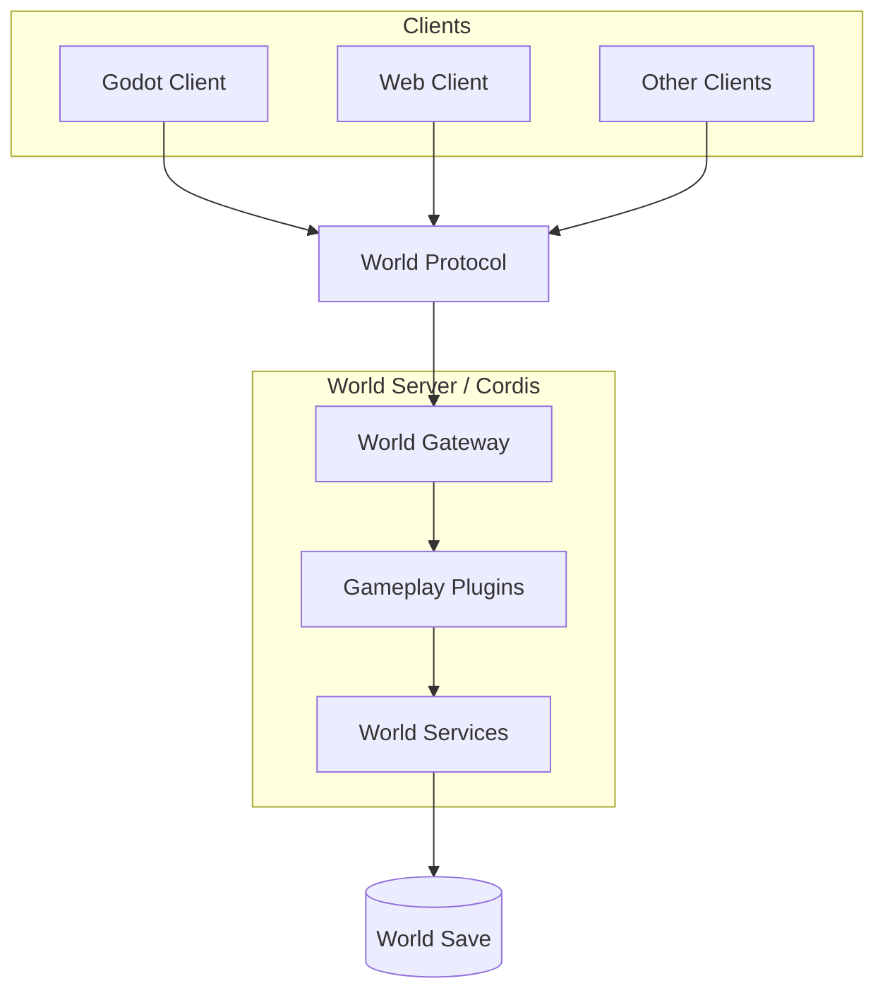

# Architecture

## Overview

游戏采用独立的世界服务架构。

一个世界对应一个由 Cordis 驱动的 World Server。Godot、Web 和其他客户端通过统一的 World Protocol 与世界交互。

World Server 是世界状态的唯一权威来源。Gameplay 以 Cordis 插件组织，世界状态独立持久化。单机模式与远程服务器使用相同架构，单机游戏只是在本地启动一个 World Server。

## Principles

- 一个世界对应一个独立的 World Server。
- World Server 持有世界的权威状态。
- 客户端只通过 World Protocol 操作世界。
- Gameplay 通过 Cordis 插件组织。
- 世界数据与客户端表现分离。
- 单机与远程世界使用相同的服务端模型。
- 时间推进以世界时间、事件和计划任务为基础，不依赖高频固定 tick。

## Further specifications

- [World Runtime](./world-runtime.md)
- [World Protocol](./world-protocol.md)
- [World Model](./world-model.md)
- [Content System](./content-system.md)
