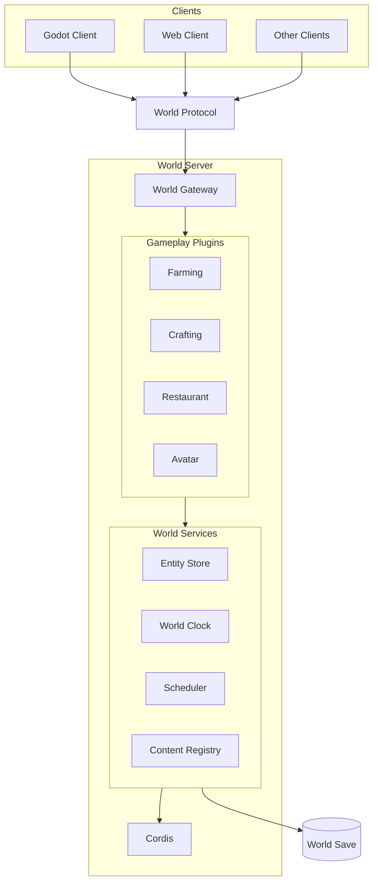
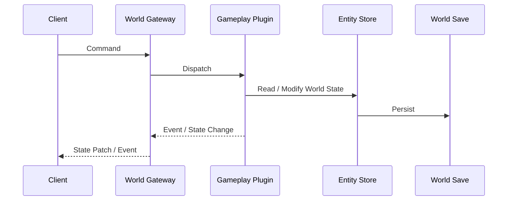
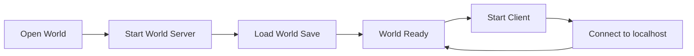

# Architecture

## Overview

游戏采用独立的世界服务架构。

一个世界对应一个由 Cordis 驱动的 World Server。世界中的实体、时间、生产状态、玩家状态和其他持久化数据都由 World Server 管理。Godot、Web 以及未来可能增加的客户端通过统一协议连接世界服务。

单机游戏启动一个本地 World Server，再由客户端连接该服务。远程服务器使用相同的世界服务，只改变连接地址。

## World

World Server 是世界状态的唯一权威来源。

客户端不直接修改世界数据。所有会改变世界的操作都作为 command 发送给 World Server，由对应的游戏系统验证并执行。

一个单机世界可以对应：

- 一个 World Server 进程
- 一个 Cordis Context
- 一份独立的世界存档

客户端关闭后，世界仍以存档中的状态为准。重新打开世界时，World Server 从存档恢复状态。

## Clients

客户端负责输入、交互和表现。

Godot 客户端可以提供完整的场景、角色控制和视觉交互。Web 客户端可以提供较轻量的状态查看、管理和重复操作。

不同客户端操作的是同一个世界。

客户端只依赖 World Protocol，不直接依赖具体的 Gameplay Plugin 或 Cordis Service。

## World Protocol

World Protocol 是客户端与 World Server 之间的边界。

协议主要包含两类数据：

- Command：客户端请求世界执行操作
- State / Event：服务端向客户端发送状态和世界事件

HTTP 可以用于连接、初始数据和普通查询，WebSocket 用于持续的 command、event 和状态更新。

具体协议格式单独定义。

## Data Flow

一次世界操作的基本数据流如下：

例如玩家给水瓜浇水时：

1. 客户端发送浇水 command。
2. World Gateway 将 command 交给对应的游戏系统。
3. Farming 系统读取并修改水瓜实体。
4. 世界状态写入存储。
5. 服务端向连接中的客户端发送状态变化。

客户端不需要知道 Farming 内部如何计算结果。

## World Services

World Services 提供多个游戏系统共同依赖的基础能力。

### Entity Store

保存世界中的实体及其状态。

植物、玩家、物品、容器和其他世界对象都属于世界实体。具体实体结构不在本架构文档中规定。

### World Clock

维护世界时间。

游戏中的生长、加工和其他与时间相关的机制以世界时间为依据。

### Scheduler

管理未来需要发生的任务和事件。

游戏以计划任务和状态变化为主要时间推进方式，不要求使用持续高频 tick 驱动所有系统。

### Content Registry

保存当前世界已经加载的内容定义，包括植物、物品和其他可注册内容。

具体的内容注册、插件定义和扩展方式单独说明。

## Gameplay Plugins

具体游戏规则通过 Cordis 插件组织。

例如：

- Farming
- Crafting
- Restaurant
- Avatar

插件使用 World Services 读取和修改世界数据，并可以依赖其他服务或插件提供的能力。

具体植物等内容也可以通过插件注册到 Content Registry。相关机制单独定义。

## Persistence

世界存档与客户端分离。

World Server 负责持久化世界数据。MVP 可以使用本地存储实现，例如 SQLite 和资源目录。

上层 Gameplay Plugin 通过 World Services 访问数据，不直接依赖具体的持久化实现。

## Single-player

单机模式下，打开世界等同于启动一个本地 World Server。

Godot 或其他桌面启动器负责启动本地服务进程，并连接本机地址。

Web 客户端本身只负责连接已经运行的 World Server。

## Scope

本文只定义世界服务、客户端、基础服务和数据流之间的关系。

以下内容独立维护：

- World Protocol
- Entity 与 Component 数据模型
- Content Registry
- Gameplay Plugin 结构
- 内容插件与植物注册
- 时间与 Scheduler
- 世界存档格式
- 自动化系统
- 多人连接与权限
- Mod 与第三方内容扩展
